# Dramatica-Informed Writing Assistant Master Plan

## 1. Project Overview

The product vision is a local-first writing assistant that helps a writer inspect structural coherence without taking over authorship. It is Dramatica-informed, uses the Narrative Context Protocol (NCP) as the structural backbone, and focuses on Story Check diagnostics, throughline classification, writer-focused diagnostic questions, and out-of-scope refusals.

The product is analysis-only. It must never write, rewrite, continue, imitate, or improve story prose.

Current app architecture is FastAPI plus React with local Ollama inference. The current baseline model is `qwen3:8b` through `backend/analysis_engine.py -> Ollama -> qwen3:8b`. The future model target is `dramatica-analyst:8b` through the same app path after a non-smoke fine-tune passes evaluation.

The MVP goal is a usable local app that can create/load a project, edit and save scenes, store bible/storyform context, run Story Check, show normalized analysis results, and support a bounded Organize My Idea (OMI) planning workflow. Fine-tuning is a separate track. The MVP does not require a fine-tuned model.

## 2. Product Boundaries

Hard prohibitions:

- No prose generation.
- No rewriting.
- No continuation.
- No style imitation.
- No prose improvement.

Standard refusal message:

`I can analyze structure and ask diagnostic questions, but I cannot write or rewrite story prose.`

Story-truth boundary:

- Owner-approved truth: durable project memory and training truth after explicit approval.
- Raw model output: candidate analysis only; never durable truth by default.
- NotebookLM candidate output: aggregation aid only; not training truth.
- External datasets: task scaffolding only unless provenance, license, and owner/human review permit a specific use.
- Retrieved definitions: reference context, not story-specific truth.
- Insufficient evidence: required when evidence does not support a confident structural claim.

Dramatica/NCP boundary:

- No full Dramatica verifier parity claim.
- No automatic CIPS, dynamics, or Relationship Story proof.
- No generic relationship as Relationship Story proof.
- No generic theme as Dramatica Issue/Variation proof.
- Positive IC, RS, CIPS, or dynamics training remains owner-gated.

## 3. Current Repo State

Inspected workspace: `/home/tjrpirateking/projects/WritingAssistantApplication`.

Repo/Git:

- Git has been initialized/repaired in this workspace.
- Current branch: `main`.
- Remote: `origin https://github.com/telesjr90/writingassistant`.
- First safe local baseline commit exists: `25ef64d chore: initialize safe project baseline`.
- No push has been performed yet. The next repository step is to push the safe baseline to GitHub.
- Safe repository metadata now exists: `.gitignore`, `README.md`, `LICENSE`, `.env.example`, `backend/requirements.txt`, `training/reports/git_setup_report.md`, and `training/reports/pre_commit_safety_audit_report.md`.

Backend:

- `backend/main.py` defines FastAPI routes:
  - `GET /api/projects/{project_name}/scenes`
  - `GET /api/projects/{project_name}/scenes/{scene_id}`
  - `PUT /api/projects/{project_name}/scenes/{scene_id}`
  - `GET /api/projects/{project_name}/bible`
  - `POST /api/projects/{project_name}/story-check/{scene_id}`
  - `GET /api/projects/{project_name}/storyform-context`
- `backend/analysis_engine.py` calls Ollama chat at `OLLAMA_CHAT_URL`, defaults `OLLAMA_MODEL` to `qwen3:8b`, requests JSON, and normalizes Story Check output.
- `backend/prompts/story_check.txt` contains rich Story Check JSON instructions and explicit no-prose rules.
- `backend/project_manager.py` stores projects under `projects/{project_name}` with `bible.json`, `storyform.json`, and `scenes/{scene_id}.md`.
- `backend/storyform.py` validates NCP-style storyforms against the schema embedded in `docs/repo_knowledge.md`.

Frontend:

- `frontend/package.json` uses React 19, Vite 8, Axios, and TipTap dependencies.
- `frontend/src/App.jsx` composes `ProjectNav`, `Editor`, and `AnalysisSidebar`.
- `frontend/src/api.js` hard-codes `PROJECT_ID = 'example'`.
- Components found: `ProjectNav.jsx`, `Editor.jsx`, `AnalysisSidebar.jsx`.

Project storage:

- `projects/example/bible.json` contains Elena/Whispering Woods sample material.
- `projects/example/storyform.json` contains Quest for the Ember Crown/Mara material.
- This confirms a sample-project mismatch: Elena bible vs Ember Crown storyform.

Tests/evaluation:

- `tests/` exists with tests for analysis engine, project manager, storyform, and dataset validation.
- Training/evaluation scripts exist under `training/scripts/`, including validation, manifest update, external dataset conversion, RunPod bundle preparation, and Unsloth training.

Setup/config status:

- `training/configs/qwen25_7b_qlora.yaml` exists and targets `Qwen/Qwen2.5-7B-Instruct`.
- Cloud/local profiles also exist: `cloud_qwen25_7b_2048_main.yaml`, `cloud_qwen25_7b_4096_storycheck.yaml`, and `runpod_a6000_cloud.yaml`.
- `training/reports/plan_md_update_report.md` is not present in this workspace despite prior task context.
- `training/reports/phase_2_3_integration_status.md` is not present.
- `backend/requirements.txt` exists as the simple backend dependency manifest. It is intentionally separate from `training/requirements-unsloth.txt` and may still need future validation as implementation evolves.

Dataset/training:

- `training/data/dataset_manifest.json` exists and reports readiness blocked with 149 eligible records counted toward the 500-record gate.
- `training/reports/training_script_readiness_report.md` reports environment checks pass, but full training is blocked by dataset gate and 4GB local VRAM for primary 7B QLoRA.

Book folder status:

- Repo-local `docs/books/dcc`: missing in this workspace.
- Repo-local `docs/books/projecthm`: missing in this workspace.
- Repo-local `docs/books/thggalaxy`: missing in this workspace.
- WSL-mounted `/mnt/e/WritingAssistantApplication/docs/books/dcc`: verified present with Book 1 source/packet/review artifacts.
- WSL-mounted `/mnt/e/WritingAssistantApplication/docs/books/projecthm`: verified present with Book 2 source/packet/review artifacts.
- WSL-mounted `/mnt/e/WritingAssistantApplication/docs/books/thggalaxy`: verified present with Book 3 packet/review artifacts. Expected `book_003.excerpt_map.md`/source-style file naming is not present in the observed list; the folder uses hyphenated exported filenames such as `book-003-master-candidate-packet-txt.md`.

## 4. Accepted Owner Decisions and Follow-Up Tasks

Accepted constraints:

- Canonical repository name: `telesjr90/writingassistant`.
- Product working name: Dramatica-Informed Writing Assistant.
- License boundary: MIT for app source code only. Training data, book sources, packet evidence, model artifacts, and datasets are excluded pending separate provenance/license review.
- Git setup: local Git is initialized/repaired on `main`, `origin` points to `https://github.com/telesjr90/writingassistant`, and the first safe local baseline commit is `25ef64d chore: initialize safe project baseline`. Pushing that baseline to GitHub remains TODO.
- Python dependency strategy: use simple requirements files now. `backend/requirements.txt` exists and remains separate from `training/requirements-unsloth.txt`; revisit `pyproject.toml`/`uv` later if the implementation needs it.
- Node target: `>=22.12.0 <23`. Package metadata changes are deferred.
- Example fixture: replace the Elena/Ember Crown mismatch later with one clean aligned fixture, preferably public-domain or owner-created.
- OMI is part of the App MVP, but bounded to analysis/planning only. It must not generate story prose, continue a story, rewrite text, or silently promote ideas/model output/NotebookLM output into durable project truth. Minimum design fields are `raw_idea`, `candidates`, `owner_decision`, `destination`, `provenance`, and `status`.
- Durable memory promotion requires explicit owner approval, destination choice, attached evidence/provenance, and final confirmation.
- No-prose enforcement must run before model call and after model output.
- Mock mode should return deterministic fixture JSON for `story_check`, `throughline_classification`, `writer_questions`, and `out_of_scope_refusal`.
- Prose-generation and autonomous-agent reference repos remain documentation-only. NCP may inform structure.
- Revise or create a qwen25 cloud smoke config before RunPod smoke.
- Books 4-5 are conditional only after cross-book coverage review.
- Keep raw book source text outside Git. Store only safe derived metadata/review artifacts in repo.
- IC/RS positive examples require owner-approved exact evidence per record. Target at least 15-20 strong IC and 15-20 strong RS examples, preferably 30+ each.
- Book evidence approval uses a consolidated owner-review worksheet with candidate answer, excerpt IDs, evidence, weak/contradicting evidence, confidence, owner decision, and final training status.

Remaining setup/verification tasks:

- Push the safe local baseline commit to GitHub.
- Keep backend requirements validated as runtime dependencies evolve, without merging them into `training/requirements-unsloth.txt`.
- Declare the Node target in package metadata.
- Replace the sample fixture.
- Define the OMI MVP schema and lifecycle before runtime implementation. Do not assume OMI endpoints currently exist.
- Run Book 1-3 cross-book coverage review before deciding whether Books 4-5 are needed.

## 5. Architecture Target

Target folder structure:

```text
backend/
  main.py
  analysis_engine.py
  project_manager.py
  storyform.py
  prompts/
frontend/
  src/
projects/
  {project_id}/
    project.json
    bible.json
    storyform.json
    owner_memory.json
    scenes/
docs/
  master_plan.md
  roadmap/
training/
  configs/
  data/
  reports/
  schemas/
  scripts/
tests/
```

Local project storage should preserve source text, owner-approved story truth, candidate model observations, and promotion state separately. A candidate analysis may be saved for review, but it must not overwrite owner-approved truth without explicit owner action.

App-2 project file model status: `docs/roadmap/project_file_model.md` defines the target MVP project structure and separates owner-approved truth, Story Check analysis artifacts, OMI candidates, NotebookLM candidates, and retrieved reference definitions. It is a design spec only; no runtime migration or project file changes have been performed.

Analysis modes:

- `ANALYSIS_MODE=mock`: deterministic fixtures for UI and test development.
- `ANALYSIS_MODE=ollama_baseline`: local Ollama using `qwen3:8b`.
- `ANALYSIS_MODE=dramatica_analyst_future`: local Ollama using `dramatica-analyst:8b` after model-swap gates pass.

Backend responsibilities:

- Project CRUD and safe path handling.
- Storyform/bible/scene loading and saving.
- Story Check request orchestration.
- Model response parsing and schema normalization.
- Runtime no-prose enforcement.

Frontend responsibilities:

- Local project navigation.
- Scene editor and save state.
- Storyform/bible context views.
- Analysis sidebar with rich Story Check rendering.
- Clear display of insufficient evidence and refusal outcomes.

Ollama responsibilities:

- Host baseline and future GGUF models.
- Return JSON-only analysis output.
- Keep generation temperature low and bounded.

NCP/storyform responsibilities:

- Store structural context in a schema-valid form.
- Preserve OS/MC/IC/RS separation.
- Preserve unresolved fields instead of filling them with guesses.

Project Knowledge / owner-approved truth rules:

- Durable project memory requires owner approval.
- Raw model, NotebookLM, and external outputs are candidate-only.
- Retrieved definitions can support interpretation but cannot establish story truth.

## 6. MVP Scope

The MVP includes:

- Local project creation/loading.
- Scene writing/editing/saving by the user.
- Bible/storyform context storage.
- Story Check request/response flow.
- Rich Story Check schema support.
- Analysis sidebar.
- No-prose guardrails.
- Mock mode.
- qwen3/Ollama baseline mode.
- Evaluation fixtures.
- Organize My Idea (OMI) as an owner-controlled planning feature.

OMI MVP boundary:

- OMI is analysis/planning only.
- OMI must not generate story prose.
- OMI must not continue, rewrite, imitate, polish, or improve story text.
- OMI must not silently promote raw ideas, candidates, model output, or NotebookLM output into durable project truth.
- OMI outputs remain candidate planning material until the owner explicitly approves destination and promotion.
- OMI must track `raw_idea`, `candidates`, `owner_decision`, `destination`, `provenance`, and `status`.
- Suggested statuses are `draft`, `candidate`, `owner_review`, `approved`, `rejected`, `promoted`, and `archived`.
- Suggested destinations are `planning_notes`, `project_bible_candidate`, `storyform_context_candidate`, `scene_prompt_context_candidate`, `template_starter_candidate`, and `discard`.
- These fields, statuses, and destinations are design targets until implementation tasks create storage, API, and UI surfaces.

The MVP does not require a fine-tuned model.

MVP completion requires:

- Story Check works in deterministic mock mode.
- Story Check works in qwen3/Ollama baseline mode.
- Runtime no-prose guardrails protect Story Check and OMI-relevant request paths.
- OMI can capture a raw idea.
- OMI can create or display structured candidate planning material without generating story prose.
- OMI can track owner decision, destination, provenance, and status.
- OMI cannot promote output into bible, storyform, planning notes, or other durable project truth without explicit owner approval.

## 6.1 App MVP Phases

### Phase 0 - Repo baseline and source-of-truth sync

- DONE: Git initialized/repaired.
- DONE: safe metadata created.
- DONE: first safe local baseline commit created: `25ef64d chore: initialize safe project baseline`.
- TODO: push safe baseline to GitHub.
- TODO: keep master plan and roadmap synced after status changes.

### Phase 1 - App architecture audit and project model decisions

- Status: App-1 architecture audit and App-2 project file model are complete. App-3 NCP compatibility subset is next, followed by OMI-001 schema/lifecycle and sample project alignment work.
- Architecture audit report.
- Source-of-truth cleanup.
- NCP/storyform MVP subset.
- Project storage model.
- OMI MVP design schema.
- Sample project alignment decision.

### Phase 2 - Backend safety and schema foundation

- Runtime no-prose guardrails.
- Refusal response schema.
- Story Check normalizer.
- Minimal-to-rich compatibility.
- Insufficient-evidence handling.
- Analysis mode config.

### Phase 3 - Mock and baseline Story Check

- Mock analysis mode.
- Story Check route tests.
- Ollama baseline mode.
- qwen3 baseline verification.
- Evaluation fixtures.

### Phase 4 - Frontend MVP diagnostics

- Rich diagnostics sidebar.
- Mock/baseline mode visibility.
- Error and malformed-output display.
- Scene editor dirty-state handling.
- Empty scene behavior.

### Phase 5 - OMI MVP implementation

- OMI storage design.
- OMI candidate lifecycle.
- OMI owner decision flow.
- OMI destination handling.
- OMI provenance/status display.
- OMI must not write story prose or mutate owner-approved truth automatically.

### Phase 6 - MVP hardening

- Project navigation reliability.
- Save/reload testing.
- App smoke tests.
- Documentation cleanup.
- Manual local run checklist.

## 7. Training-Independent App Roadmap

Suggested future labels: `app`, `backend`, `frontend`, `storage`, `ncp`, `story-check`, `guardrails`, `evaluation`, `docs`, `blocked`, `decision-needed`.

| Task | Goal | Inputs | Output files/behavior | Acceptance criteria | Tests/validation | Blocked by | Labels |
| --- | --- | --- | --- | --- | --- | --- | --- |
| App-0 plan/source-of-truth | Establish this plan as the execution source. | `docs/plan.md`, current repo state. | `docs/master_plan.md`, roadmap docs. | Plan files exist and reflect verified state. | Markdown review, pytest. | None. | docs |
| App-1 architecture audit | Confirm runtime paths and gaps. | Backend/frontend/tests. | Audit notes or issues. | Routes, storage, model path, and UI surfaces documented. | `python -m pytest tests -q`. | None. | app, docs |
| App-2 project file model | Define durable local project schema. | Current `projects/example`, NCP schema. | `project.json`, storage spec, migration plan. | Elena/Ember mismatch documented and isolated for separate sample-alignment work. | Project manager tests. | Product naming/sample decision. | storage |
| App-3 NCP compatibility subset | Decide supported NCP fields for MVP. | `docs/repo_knowledge.md`, `storyform.py`. | MVP storyform subset spec. | Required OS/MC/IC/RS fields validated. | Storyform fixture tests. | NCP subset decision. | ncp |
| App-4 scene editor hardening | Make editor reliable for repeated local use. | React editor state. | Save/load UX, dirty state, errors. | No data loss on save/load. | Frontend manual smoke. | Project model. | frontend |
| App-5 bible/storyform read/write layer | Add editable context storage safely. | Backend project manager, frontend context. | APIs and UI for context read/write. | Owner-approved truth stays distinct from candidates. | Backend tests. | Project model. | backend, storage |
| App-6 Story Check rich schema parser | Normalize rich model output. | `story_check.schema.json`, parser. | Parser supports full schema. | Invalid output becomes safe fallback. | Analysis engine tests. | None. | story-check |
| App-7 mock analysis mode | Enable deterministic UI/eval development. | Schema fixtures. | `ANALYSIS_MODE=mock`. | Same request returns stable mock JSON. | Unit tests. | Mode decision. | backend |
| App-8 Ollama baseline mode | Formalize qwen3 baseline path. | Current Ollama integration. | `ANALYSIS_MODE=ollama_baseline`, config docs. | Uses `qwen3:8b` without code edits. | Local smoke if Ollama available. | Config decision. | backend |
| App-9 analysis parser/normalizer | Protect UI from malformed output. | Parser, schemas. | Normalized analysis object. | UI never receives unbounded prose as suggestions. | Parser tests. | App-6. | guardrails |
| App-10 no-prose runtime guard | Enforce analysis-only boundary. | Refusal message, prompt, parser. | Input/output guard. | Prose requests refuse with standard message. | Guardrail tests. | Enforcement policy. | guardrails |
| App-11 Story Check sidebar UI | Render rich diagnostics. | `AnalysisSidebar.jsx`, schema. | Throughline, drift, consistency, warnings, questions. | All schema fields visible without prose drafting. | Browser smoke/manual. | App-6. | frontend |
| App-12 evaluation fixtures | Add app-level fixtures. | Existing tests, eval schemas. | Fixture JSON and expected normalized output. | Covers valid, malformed, refusal, insufficient evidence. | Pytest. | App-6. | evaluation |
| App-13 baseline evaluation harness | Track qwen3 baseline quality. | Ollama, eval fixtures. | Script/report for baseline runs. | Counts JSON validity, schema compliance, refusal violations. | Eval script run. | App-8, App-12. | evaluation |
| OMI-001 define OMI MVP schema and lifecycle | Bound OMI as owner-controlled planning. | Product boundary, project storage model. | Schema/lifecycle spec for raw idea, candidates, owner decision, destination, provenance, status. | No prose, no silent promotion, candidate-first behavior is explicit. | Markdown review. | Phase 1. | app, docs, omi |
| OMI-002 design OMI storage model | Keep candidates separate from approved truth. | Project storage model. | Storage design for OMI items and promotion records. | Candidate material cannot overwrite bible/storyform/project truth by default. | Design review. | OMI-001. | storage, omi |
| OMI-003 implement OMI candidate creation flow | Capture raw idea and structured candidates. | OMI schema/storage design. | Backend/UI flow, when implemented. | Outputs are structured planning candidates only, not story prose. | Unit/UI tests. | Phase 2, OMI-002. | backend, frontend, omi |
| OMI-004 implement owner decision and destination selection | Require owner action before promotion. | OMI lifecycle. | Owner decision and destination controls. | Destination is explicit before promotion. | Tests/manual smoke. | OMI-003. | frontend, storage, omi |
| OMI-005 prevent promotion without explicit owner approval | Enforce durable truth boundary. | Guardrails, storage model. | Approval gate. | Promotion fails unless owner approval, destination, provenance, and status are present. | Guardrail/storage tests. | OMI-004. | guardrails, omi |
| OMI-006 OMI UI for raw idea, candidates, status, provenance, destination | Make lifecycle visible. | OMI flow. | OMI panel/view, when implemented. | Candidate vs approved/promoted state is visible. | Browser smoke. | OMI-003, OMI-004. | frontend, omi |
| OMI-007 OMI tests for no-prose and no-silent-promotion behavior | Verify OMI boundaries. | OMI implementation. | Test coverage. | No prose generation path and no silent promotion path pass. | Pytest/UI tests. | OMI-003 to OMI-005. | tests, guardrails, omi |

## 8. Packet/Dataset Roadmap

Short-story packet workflow:

- Owner packet creation with provenance, source scene, bible, storyform context, approvals, unresolved fields, and allowed tasks.
- Candidate storyform review.
- Owner decision application.
- Review JSONL conversion.
- Validation.
- Promotion only after schema, provenance, owner approval, no-prose, and evidence checks pass.
- Manifest update only after promotion.

Packets 003-008:

- `training/reports/packet_003_to_008_owner_decision_review.md` exists.
- The report recommends conservative approvals for selected OS/MC labels and keeps IC, RS, CIPS, and dynamics unresolved by default.
- It explicitly says records should become review candidates first, not directly eligible for training.

Packets 009-020:

- `training/data/micro_storyforms/packet_009.owner.md` through `packet_020.owner.md` exist.
- The next roadmap step is to run the same E/F/G/H/I workflow only where source provenance, owner approval, and evidence spans support it.

E/F/G/H/I workflow:

- E: source scene preflight.
- F: Dramatica retrieval/context support.
- G: factual/candidate fill.
- H: candidate storyform review.
- I: owner decision application.

Dataset rules:

- Convert only to review JSONL first.
- Promote only after validation.
- Promotion requires explicit owner approval, chosen destination, attached evidence/provenance, and final confirmation.
- Update `dataset_manifest.json` only after validated promotion.
- Full training remains blocked until at least 500 `eligible_for_training` records pass the manifest gate.
- Never promote unreviewed, draft, blocked, eval-only, review-candidate, unresolved-source, or external-license-unreviewed records.
- Positive IC/RS records require exact owner-approved evidence per record; target at least 15-20 strong IC and 15-20 strong RS examples, preferably 30+ each.

Target task mix:

- Story Check diagnostics: 40-45%.
- Throughline classification: 25-30%.
- Writer questions: 20-25%.
- Out-of-scope refusals: 5-10%.

## 9. Book-Backed NotebookLM Roadmap

Verified status:

- Book 1 completed: verified from `/mnt/e/WritingAssistantApplication/docs/books/dcc`.
- Book 2 completed: verified from `/mnt/e/WritingAssistantApplication/docs/books/projecthm`.
- Book 3 completed: verified from `/mnt/e/WritingAssistantApplication/docs/books/thggalaxy`.

Repo-local caveat: `docs/books/dcc`, `docs/books/projecthm`, and `docs/books/thggalaxy` are missing in this workspace, so repo-relative verification is incomplete. The WSL-mounted owner-provided paths contain the observed workflow artifacts.

Next step after Book 3: cross-book review.

Books 4-5 are conditional after cross-book review. Books 6+ are blocked in this phase.

NotebookLM output is candidate only. A book-level master packet is context, not direct training truth. Approved excerpt-backed evidence is preferred for SFT review candidates.

Raw book source text must stay outside Git. Only safe derived metadata and review artifacts should be stored in the repo.

Book evidence approval should use a consolidated owner-review worksheet containing candidate answer, excerpt IDs, evidence, weak/contradicting evidence, confidence, owner decision, and final training status.

Expected file pattern:

- `book_00X.source.txt`
- `book_00X.excerpt_map.md`
- `book_00X.master_candidate_packet.txt`
- `book_00X.excerpt_001.owner.md`
- `book_00X.excerpt_001.compare.md`
- `book_00X.consolidated_owner_review_packet.md`
- `book_00X.owner_review_worksheet.md`

Observed file naming uses hyphenated exported Markdown names such as `book-001-master-candidate-packet-txt.md`, `book-002-owner-review-worksheet-md.md`, and `book-003-consolidated-owner-review-packet-md.md`.

Post-Book-3 cross-book review criteria:

- IC coverage.
- RS coverage.
- MC/IC contrast.
- Dynamics.
- CIPS.
- Throughline classification.
- Insufficient-evidence behavior.

## 10. External Dataset Research Roadmap

Possible uses:

- Refusals.
- JSON/schema following.
- Malformed-output repair.
- Task routing.
- Insufficient-evidence behavior.
- Event/causal diagnostics.
- Writer diagnostic questions.

Forbidden direct uses unless human/owner reviewed:

- Positive OS/MC/IC/RS truth.
- CIPS truth.
- Full storyform truth.
- Dramatica dynamics truth.

Dataset registry requirements:

- Name.
- URL.
- License.
- Source type.
- Annotation type.
- Allowed task use.
- Disallowed task use.
- Provenance status.
- Review status.

The app source license decision does not license external datasets, book sources, packet evidence, training data, or model artifacts. Those remain excluded pending separate provenance/license review.

## 11. RunPod Fine-Tuning Roadmap

RunPod readiness:

- Training scripts and configs exist.
- `training/configs/qwen25_7b_qlora.yaml` exists.
- Cloud config profiles exist, but should be reviewed against the current RunPod machine before training.
- Revise or create a cloud smoke config before RunPod smoke.
- Local 4GB VRAM is blocked for full primary 7B QLoRA.

Execution steps:

1. Sync repo to RunPod.
2. Install/check environment.
3. Run smoke training only with `smoke_only_not_final_model: true`.
4. Enforce full dataset gate.
5. Run full QLoRA fine-tune only after gate passes.
6. Export GGUF artifacts.
7. Copy artifacts back.
8. Import into Ollama.
9. Run production evaluation.
10. Swap backend model default only after a non-smoke model passes evaluation.

## 12. Fine-Tuning Configuration

- Primary model: `Qwen/Qwen2.5-7B-Instruct`.
- Fallback model: `Qwen/Qwen3-4B-Instruct-2507`.
- Framework: Unsloth QLoRA.
- Quantization: 4-bit NF4.
- Sequence length: 2048 for classification/questions.
- Sequence length: 4096 for Story Check when needed.
- LoRA rank: r=16.
- Alpha: 32.
- Dropout: 0.05.
- Target modules: `q_proj`, `k_proj`, `v_proj`, `o_proj`, `gate_proj`, `up_proj`, `down_proj`.
- Learning rate: 1e-4 to 2e-4.
- Epochs: 2-3 with early stopping.
- Effective batch: 32-64 via gradient accumulation.
- Eval cadence: every 100-250 steps.
- Export: `q4_k_m` and `q8_0`.
- Final Ollama name: `dramatica-analyst:8b`.
- Never export or deploy a smoke-only model as production.

## 13. Evaluation Roadmap

Targets:

- JSON validity >= 99%.
- Schema compliance >= 98%.
- Throughline macro-F1 >= 85% if the eval set supports it.
- OS/MC/IC/RS confusion tracking.
- No-prose violation rate = 0%.
- Evidence span relevance human review.
- Change vs Steadfast tracking.
- Insufficient-evidence calibration.
- FastAPI/Ollama compatibility.

If the eval set is too small, report counts honestly and do not overstate percentages.

## 14. Deployment/Ollama Model-Swap Roadmap

Requirements:

- GGUF artifacts.
- Modelfile.
- Ollama import.
- `q4_k_m` for app use.
- `q8_0` for quality testing.
- Backend config/model default swap gate.
- Rollback to `qwen3:8b` baseline.
- Clear smoke vs non-smoke artifact distinction.

The backend default should not change from `qwen3:8b` until `dramatica-analyst:8b` is a non-smoke artifact with passed evaluation and rollback instructions.

## 15. Blocked/Future Tasks

- OMI is included in the App MVP as a bounded, analysis-only, owner-controlled planning workflow. Implementation remains TODO and must follow the schema/lifecycle design before any API/UI work.
- Full storyform questionnaire later.
- Full NCP authoring UI later.
- Advanced Dramatica verifier claims blocked.
- CIPS/dynamics positive training owner-gated.
- Weak IC/RS positive training blocked unless owner-approved.
- Dramatron-style generation blocked/non-goal.
- Worldbuilding later.
- NovelClaw-style memory banks later.
- Books 4-5 conditional.
- Books 6+ blocked.

## 16. Risk Register Summary

Top risks are overclaiming Dramatica truth, prose-generation leakage, weak IC/RS/CIPS training, dataset gate failure, local VRAM limits, sample data mismatch, OMI candidate output being mistaken for truth, and treating NotebookLM candidates as truth. See `docs/roadmap/risk_register.md`.

## 17. Decision Log Summary

Current decisions preserve analysis-only scope, local-first architecture, qwen3 baseline mode, future `dramatica-analyst:8b`, conservative packet promotion, and book-backed output as candidate-only. See `docs/roadmap/decision_log.md`.

## 18. Task Backlog Summary

The backlog is split into app MVP, packet/dataset, book-backed review, external dataset research, RunPod fine-tuning, evaluation, deployment, and blocked/future groups. See `docs/roadmap/task_backlog.md`.

## 19. Mermaid Gantt / Timeline

```mermaid
gantt
    title Relative Execution Roadmap
    dateFormat  X
    axisFormat  Phase %s
    section App MVP
    Phase 0 repo baseline/source sync :done, p0, 0, 1
    Phase 1 architecture/model decisions :p1, after p0, 1
    Phase 2 backend guardrails/schema :p2, after p1, 1
    Phase 3 mock/baseline Story Check :p3, after p2, 1
    Phase 4 frontend diagnostics     :p4, after p3, 1
    Phase 5 bounded OMI MVP          :p5, after p4, 1
    Phase 6 MVP hardening            :p6, after p5, 1
    section Dataset
    Short-story packet completion    :packets, 1, 5
    Book-backed cross-book review    :books, 2, 3
    External dataset research        :external, 2, 3
    Dataset conversion/promotion     :promotion, 4, 4
    section Training
    RunPod smoke                     :smoke, 7, 1
    Full fine-tune                   :train, 8, 2
    Export/eval/model swap           :deploy, 10, 2
```



## 20. Verification Checklist

```bash
cd ~/projects/WritingAssistantApplication
source .venv-unsloth-clean/bin/activate
python -m pytest tests -q
```

Additional documentation checks:

```bash
test -f docs/master_plan.md
test -f docs/roadmap/task_backlog.md
test -f docs/roadmap/decision_log.md
test -f docs/roadmap/risk_register.md
test -f docs/roadmap/phase_map.md
test -f docs/roadmap/tooling_decisions.md
test -f docs/roadmap/open_questions.md
test -f training/reports/master_plan_creation_report.md
```
