# Dramatica-Informed Writing Assistant Master Plan

## 1. Project Overview

The product vision is a local-first writing assistant that helps a writer focus on writing by identifying, organizing, connecting, and annotating story knowledge from the writer's own text without taking over authorship. The working product name can remain Dramatica-Informed Writing Assistant, but the near-term roadmap is no longer Dramatica-first. Dramatica/NCP analysis moves to a later advanced analysis layer.

The next implementation priority after the MVP foundation is the pre-Dramatica Project Workspace Foundation. The app should first become a usable writing-project workspace: create projects, select projects from a library, create projects through OMI-guided idea capture, organize chapters/scenes/notes/materials, and let the writer store and edit owner-authored prose. After that foundation is usable, Writer Assistant Core can add OMI-centered candidate review and promotion, story knowledge extraction, evidence spans, annotations, character/location/object/organization tracking, scene/event/timeline tracking, relationship and plot-thread tracking, open questions, continuity issues, contradiction detection, and project memory/canon review.

The product is analysis-only. It must never write, rewrite, continue, imitate, polish, or improve story prose. The app may store, edit, and organize prose only when the prose is owner-authored.

Current app architecture is FastAPI plus React with local Ollama inference. The current baseline model is `qwen3:8b` through `backend/analysis_engine.py -> Ollama -> qwen3:8b`. Live model use remains optional/manual for the new core direction. A future `dramatica-analyst:8b` model remains allowed only as a later advanced analysis layer after data gates, evidence gates, and model evaluation pass.

The MVP goal remains a usable local app that can create/load a project, edit and save scenes, store bible/storyform context, run Story Check, show normalized analysis results, and support a bounded Organize My Idea (OMI) planning workflow. Fine-tuning is a separate track. The MVP does not require a fine-tuned model, and the Writer Assistant Core does not depend on Dramatica fine-tuning.

MVP completion is gated by the formal matrix in `docs/roadmap/mvp_completion_test_matrix.md`. Optional analysis extractors are now reclassified as future Writer Assistant Core implementation research, not an MVP blocker and not dependencies to install now.

## 1.1 Pre-Dramatica Project Workspace Foundation

The roadmap priority order is now:

1. Project creation and project workspace.
2. Chapter, scene, note, and material storage/editing.
3. Automatic or manual candidate extraction from owner-authored material.
4. Owner approval plus project memory/canon pages.
5. Later Dramatica-specific analysis, advanced extractors, fine-tuning, RunPod, and Books 4-5.

The Project Workspace Foundation should provide:

- Project creation from scratch.
- Project selector/library.
- OMI-guided project creation and idea capture.
- Chapter, scene, note, and project-material organization.
- User-authored prose editor and save/reload workflow.
- Project overview, chapters/scenes, notes/materials, OMI ideas/candidates, and approved memory/canon pages.
- Clear labels separating pending candidates from approved project truth.

Product layers must remain separate:

- Layer A: user-authored prose storage and editing. The writer can create, edit, save, and organize their own prose. Owner-authored content must not be misclassified as an AI prose-generation request.
- Layer B: AI-assisted analysis of user-authored material. The AI/app may analyze owner-authored prose and project materials, but analysis output stays candidate-only unless the owner approves it.
- Layer C: candidate extraction. Characters, locations/settings, timeline events, important objects, plot threads, unresolved questions, chapter/scene summaries for navigation, continuity/consistency flags, and possible contradictions may be extracted as candidates with evidence/provenance where practical.
- Layer D: owner approval. The owner may approve, reject, revise, archive, merge, split, or mark candidates uncertain. Pending and rejected candidates are not canon.
- Layer E: approved project memory/canon. Approved information becomes project-local memory/canon only through explicit owner-controlled promotion and should be visible in project-specific pages.
- Layer F: future Dramatica-specific analysis. Storyform, throughline, IC/RS, CIPS/dynamics, and fine-tuned analyst work comes later.

This foundation comes before Dramatica-specific implementation, fine-tuning, advanced extractor dependency work, graph/timeline visualization, relationship-network automation, RunPod work, or Books 4-5 promotion.

## 1.2 Writer Assistant Core Direction

After the Project Workspace Foundation is usable, the next product direction is Writer Assistant Core, not Dramatica-first analysis. The core app should help the writer identify, organize, connect, annotate, and review story knowledge already present in owner-authored project text.

Near-term story knowledge categories:

- Characters, aliases, nicknames, organizations, locations, objects, and items.
- Scenes, events/actions, timelines, and causality notes.
- Relationships, plot threads, open questions, continuity issues, and contradictions.
- Annotations, provenance, and evidence spans tied to project-local sources.

OMI is the central review and promotion system for this direction. Extracted story knowledge must enter OMI as candidate records before any owner-approved promotion into durable project memory, canon, bible, storyform, or other project truth. Extracted candidates cannot mutate `bible.json`, `storyform.json`, scenes, `project.json`, owner memory, future project memory, or canon without explicit owner approval, destination, evidence/provenance, and final confirmation.

Future extraction tooling must wrap around the app's own Writer Assistant Core pipeline as replaceable adapters. Tool output is never authoritative by itself: owner-authored chapter/scene/note text flows through an extraction orchestrator, tool-specific adapters, normalized CORE candidate schemas, evidence/provenance attachment, OMI candidate records, owner review, promotion records, future apply-promotion, and only then `memory/*.json` canon records.

Dramatica remains valuable as a later advanced analysis layer for storyform analysis, throughline classification, CIPS/dynamics, RS/IC analysis, and possible fine-tuned analyst models. It is no longer the next implementation priority.

## 2. Product Boundaries

Hard prohibitions:

- No prose generation.
- No rewriting.
- No continuation.
- No style imitation.
- No prose improvement.

Standard refusal message:

`I can analyze structure and ask diagnostic questions, but I cannot write or rewrite story prose.`

Story-truth boundary:

- Owner-approved truth: durable project memory and training truth after explicit approval.
- Raw model output: candidate analysis only; never durable truth by default.
- NotebookLM candidate output: aggregation aid only; not training truth.
- External datasets: task scaffolding only unless provenance, license, and owner/human review permit a specific use.
- Retrieved definitions: reference context, not story-specific truth.
- Insufficient evidence: required when evidence does not support a confident structural claim.

Dramatica/NCP boundary:

- No full Dramatica verifier parity claim.
- No automatic CIPS, dynamics, or Relationship Story proof.
- No generic relationship as Relationship Story proof.
- No generic theme as Dramatica Issue/Variation proof.
- Positive IC, RS, CIPS, or dynamics training remains owner-gated.

## 3. Current Repo State

Inspected workspace: `/home/tjrpirateking/projects/WritingAssistantApplication`.

Repo/Git:

- Git has been initialized/repaired in this workspace.
- Current branch: `main`.
- Remote: `origin https://github.com/telesjr90/writingassistant`.
- First safe local baseline commit exists: `25ef64d chore: initialize safe project baseline`.
- No push has been performed yet. Remote publication remains a separate owner-approved step after local repo hygiene is clean.
- Safe repository metadata now exists: `.gitignore`, `README.md`, `LICENSE`, `.env.example`, `backend/requirements.txt`, `training/reports/git_setup_report.md`, and `training/reports/pre_commit_safety_audit_report.md`.

Backend:

- `backend/main.py` defines FastAPI routes:
  - `GET /api/projects/{project_name}/scenes`
  - `GET /api/projects/{project_name}/scenes/{scene_id}`
  - `PUT /api/projects/{project_name}/scenes/{scene_id}`
  - `GET /api/projects/{project_name}/bible`
  - `PUT /api/projects/{project_name}/bible`
  - `GET /api/projects/{project_name}/storyform`
  - `PUT /api/projects/{project_name}/storyform`
  - `POST /api/projects/{project_name}/story-check/{scene_id}`
  - `GET /api/projects/{project_name}/storyform-context`
  - `GET /api/projects/{project_name}/omi`
  - `POST /api/projects/{project_name}/omi/ideas`
  - `GET /api/projects/{project_name}/omi/ideas/{idea_id}`
  - `POST /api/projects/{project_name}/omi/candidates`
  - `GET /api/projects/{project_name}/omi/candidates/{candidate_id}`
- `backend/analysis_engine.py` calls Ollama chat at `{OLLAMA_BASE_URL}/api/chat`, defaults `OLLAMA_BASE_URL` to `http://localhost:11434`, defaults `OLLAMA_MODEL` to `qwen3:8b`, requests JSON, and normalizes Story Check output.
- `backend/prompts/story_check.txt` contains rich Story Check JSON instructions and explicit no-prose rules.
- `backend/project_manager.py` stores projects under `projects/{project_name}` with `bible.json`, `storyform.json`, and `scenes/{scene_id}.md`.
- `backend/storyform.py` validates NCP-style storyforms against the schema embedded in `docs/repo_knowledge.md`.

Frontend:

- `frontend/package.json` uses React 19, Vite 8, Axios, and TipTap dependencies.
- `frontend/src/App.jsx` composes `ProjectNav`, `Editor`, and `AnalysisSidebar`.
- `frontend/src/App.jsx` tracks scene dirty state against the last saved content and confirms before discarding unsaved edits on scene switch or unload.
- `frontend/src/components/ProjectContext.jsx` provides owner-editable bible/storyform JSON panels with explicit save actions and validation/error states.
- `frontend/src/components/AnalysisSidebar.jsx` renders normalized rich Story Check diagnostics as candidate analysis sections, with raw JSON preserved in a collapsed advanced view.
- `frontend/src/components/OMIPanel.jsx` captures owner-authored raw ideas and structured candidate planning records, supports owner review controls, and can create promotion-readiness audit records without any prose-generation controls or durable truth mutation.
- `frontend/src/api.js` hard-codes `PROJECT_ID = 'example'`.
- Components found: `ProjectNav.jsx`, `Editor.jsx`, `AnalysisSidebar.jsx`.

Project storage:

- `projects/example/project.json` exists locally as public-domain sample fixture metadata.
- `projects/example/bible.json`, `projects/example/storyform.json`, and `projects/example/scenes/scene_001.md` have been locally aligned from `/mnt/e/WritingAssistantApplication/docs/public_domain_scene_002.txt`.
- `/mnt/e/WritingAssistantApplication/docs/owner_sample_input.md` is reserved for future OMI raw idea/candidate-planning tests and is not project truth for `projects/example`.
- The previous Elena bible vs Ember Crown storyform mismatch, and the later owner-idea/source mix-up, have been corrected in the local ignored fixture. Storyform validation passes; MC, IC, RS, CIPS, and dynamics remain unresolved rather than guessed.

Tests/evaluation:

- `tests/` exists with tests for analysis engine, project manager, storyform, and dataset validation.
- Training/evaluation scripts exist under `training/scripts/`, including validation, manifest update, external dataset conversion, RunPod bundle preparation, and Unsloth training.

Setup/config status:

- `training/configs/qwen25_7b_qlora.yaml` exists and targets `Qwen/Qwen2.5-7B-Instruct`.
- Cloud/local profiles also exist: `cloud_qwen25_7b_2048_main.yaml`, `cloud_qwen25_7b_4096_storycheck.yaml`, and `runpod_a6000_cloud.yaml`.
- `training/reports/plan_md_update_report.md` is not present in this workspace despite prior task context.
- `training/reports/phase_2_3_integration_status.md` is not present.
- `backend/requirements.txt` exists as the simple backend dependency manifest. It is intentionally separate from `training/requirements-unsloth.txt` and may still need future validation as implementation evolves.

Dataset/training:

- `training/data/dataset_manifest.json` exists and reports readiness blocked with 149 eligible records counted toward the 500-record gate.
- `training/reports/training_script_readiness_report.md` reports environment checks pass, but full training is blocked by dataset gate and 4GB local VRAM for primary 7B QLoRA.
- Fine-tuning prep is paused at a clean stopping point after documentation-only prep work: dataset gate audit complete, Book 1-3 cross-book coverage matrix complete, owner decision extraction worksheet complete, owner answers implemented, and Book 1-3 review JSONL mapping dry-run complete. Local reports are `training/reports/dataset_gate_audit_report.md`, `training/reports/book_1_3_cross_book_coverage_matrix.md`, `training/reports/book_1_3_owner_decision_extraction_worksheet.md`, `training/reports/book_1_3_owner_answers_implementation_report.md`, `training/reports/book_1_3_review_jsonl_mapping_queue.md`, and `training/reports/book_1_3_review_jsonl_mapping_dry_run.md`. No JSONL records were created, no records were promoted, `training/data/dataset_manifest.json` was not updated, no training ran, and Ollama was not called.
- Next fine-tuning task, when this track resumes, is P0 evidence extraction/verification for the mapped Book 1-3 candidates before any review JSONL drafting. It is not JSONL conversion, promotion, RunPod smoke, or training.

Book folder status:

- Repo-local `docs/books/dcc`: missing in this workspace.
- Repo-local `docs/books/projecthm`: missing in this workspace.
- Repo-local `docs/books/thggalaxy`: missing in this workspace.
- WSL-mounted `/mnt/e/WritingAssistantApplication/docs/books/dcc`: verified present with Book 1 source/packet/review artifacts.
- WSL-mounted `/mnt/e/WritingAssistantApplication/docs/books/projecthm`: verified present with Book 2 source/packet/review artifacts.
- WSL-mounted `/mnt/e/WritingAssistantApplication/docs/books/thggalaxy`: verified present with Book 3 packet/review artifacts. Expected `book_003.excerpt_map.md`/source-style file naming is not present in the observed list; the folder uses hyphenated exported filenames such as `book-003-master-candidate-packet-txt.md`.

## 4. Accepted Owner Decisions and Follow-Up Tasks

Accepted constraints:

- Canonical repository name: `telesjr90/writingassistant`.
- Product working name: Dramatica-Informed Writing Assistant.
- License boundary: MIT for app source code only. Training data, book sources, packet evidence, model artifacts, and datasets are excluded pending separate provenance/license review.
- Git setup: local Git is initialized/repaired on `main`, `origin` points to `https://github.com/telesjr90/writingassistant`, and the first safe local baseline commit is `25ef64d chore: initialize safe project baseline`. Pushing that baseline to GitHub remains TODO.
- Python dependency strategy: use simple requirements files now. `backend/requirements.txt` exists and remains separate from `training/requirements-unsloth.txt`; revisit `pyproject.toml`/`uv` later if the implementation needs it.
- Node target: `>=22.12.0 <23`. Package metadata changes are deferred.
- Example fixture: the Elena/Ember Crown mismatch has been replaced locally with a public-domain aligned fixture; a future owner-created fixture remains optional.
- OMI is part of the App MVP, but bounded to analysis/planning only. It must not generate story prose, continue a story, rewrite text, or silently promote ideas/model output/NotebookLM output into durable project truth. Minimum design fields are `raw_idea`, `candidates`, `owner_decision`, `destination`, `provenance`, and `status`.
- Durable memory promotion requires explicit owner approval, destination choice, attached evidence/provenance, and final confirmation.
- No-prose enforcement must run before model call and after model output.
- Mock mode should return deterministic fixture JSON for `story_check`, `throughline_classification`, `writer_questions`, and `out_of_scope_refusal`.
- Prose-generation and autonomous-agent reference repos remain documentation-only. NCP may inform structure.
- Revise or create a qwen25 cloud smoke config before RunPod smoke.
- Books 4-5 are conditional only after cross-book coverage review.
- Keep raw book source text outside Git. Store only safe derived metadata/review artifacts in repo.
- IC/RS positive examples require owner-approved exact evidence per record. Target at least 15-20 strong IC and 15-20 strong RS examples, preferably 30+ each.
- Book evidence approval uses a consolidated owner-review worksheet with candidate answer, excerpt IDs, evidence, weak/contradicting evidence, confidence, owner decision, and final training status.

Remaining setup/verification tasks:

- Push the safe local baseline commit to GitHub.
- Keep backend requirements validated as runtime dependencies evolve, without merging them into `training/requirements-unsloth.txt`.
- Declare the Node target in package metadata.
- Optionally replace the public-domain sample fixture with an owner-created aligned fixture in a later task.
- Keep future OMI expansion separate from the completed MVP slices; apply-promotion behavior remains unimplemented.
- Fine-tuning/book-backed dataset work is paused after the Book 1-3 review JSONL mapping dry-run; resume with P0 evidence extraction/verification only when the track is explicitly restarted.
- Promote App MVP Phase 6 - MVP hardening / MVP exit matrix execution-preflight - as the current active project phase.

## 5. Architecture Target

Target folder structure:

```text
backend/
  main.py
  analysis_engine.py
  project_manager.py
  storyform.py
  prompts/
frontend/
  src/
projects/
  {project_id}/
    project.json
    bible.json
    storyform.json
    owner_memory.json
    scenes/
docs/
  master_plan.md
  roadmap/
training/
  configs/
  data/
  reports/
  schemas/
  scripts/
tests/
```

Local project storage should preserve source text, owner-approved story truth, candidate model observations, and promotion state separately. A candidate analysis may be saved for review, but it must not overwrite owner-approved truth without explicit owner action.

App-2 project file model status: `docs/roadmap/project_file_model.md` defines the target MVP project structure and separates owner-approved truth, Story Check analysis artifacts, OMI candidates, NotebookLM candidates, and retrieved reference definitions. It is a design spec only; no runtime migration or project file changes have been performed.

App-3 NCP compatibility subset status: `docs/roadmap/ncp_compatibility_subset.md` defines the App MVP storyform/NCP subset for Story Check and future OMI use. It is a design spec only; no runtime storyform parser, API, frontend, or project-file migration changes have been performed.

App-3a / OMI-001 schema and lifecycle status: `docs/roadmap/omi_mvp_schema_lifecycle.md` defines OMI idea/candidate fields, lifecycle statuses, destinations, owner decisions, provenance, no-prose boundaries, and no-silent-promotion rules.

OMI-003 / OMI-004 / OMI-005 / OMI-006 / OMI-007 status: the runtime OMI MVP slices are implemented through boundary test coverage. Backend storage helpers write project-local `omi/ideas`, `omi/candidates`, `omi/promotions`, and `omi/index.json` records only on explicit owner actions. The API can create/list/load raw ideas and structured candidates, update explicit owner decision, status, and candidate destination fields, and create promotion records only after approval, confirmation, allowed destination, provenance, structured content, and safe target labels are present. The frontend OMI panel exposes raw idea and candidate JSON creation, owner review controls, promotion readiness blockers, record-only promotion creation, selected candidate details, status/decision summaries, provenance rows, evidence summaries, and promotion-readiness requirements. Focused OMI boundary tests cover blocked prose destinations/types, owner-authored content overblocking, no silent promotion, record-only promotion creation, promotion blockers, UI boundary copy, no model path, owner sample isolation, and traversal safety. No bible/storyform/scene/project mutation, apply-promotion route, model-generated candidate creation, or promotion application has been implemented.

Sample project alignment status: `docs/roadmap/sample_project_alignment_spec.md` defines the aligned sample requirements, replacement strategy, provenance checks, Story Check fixture implications, OMI fixture implications, and no-prose boundaries. The local ignored `projects/example` fixture now uses public-domain scene source text; `owner_sample_input.md` is OMI-only future input. No runtime files, frontend files, tests, generated prose, public-domain prose rewrites, or owner idea promotion were introduced.

GUARD-001 / GUARD-002 / GUARD-003 status: `backend/guardrails.py` provides the shared runtime no-prose guard API, standard refusal response, allowed-help list, request-field policy helpers, and conservative Story Check output sanitizer. Current routes are audited: scene, bible, and storyform saves are owner-authored content and are not scanned as assistant requests; Story Check has no freeform request field and does not guard scene text as request intent. Future OMI/freeform request routes must call `guard_freeform_request` before model calls. Story Check output now passes through `sanitize_story_check_output` after normalization so model-authored unsafe warnings, suggestions, reasons, concerns, and raw diagnostics are removed or blocked while evidence arrays are preserved.

BE-002 status: `backend/analysis_normalizer.py` provides the reusable Story Check normalizer, safe JSON-object extraction, `jsonschema` validation when available, minimal UI compatibility fields, rich Story Check field preservation, and deterministic malformed-output fallback. It is integrated through `backend/analysis_engine.py`; normalized Story Check output is then passed through the GUARD-003 output sanitizer.

BE-001 / App-7 status: `backend/analysis_modes.py` defines explicit `ANALYSIS_MODE` selection. Missing or empty mode preserves the current `ollama_baseline` behavior, `ANALYSIS_MODE=mock` returns deterministic Story Check diagnostics from `backend/mock_responses/story_check.json`, and invalid modes return a stable error-shaped response through `run_story_check`. Mock Story Check output is normalized through the same compatibility path and remains candidate-only.

App-8 status: `ANALYSIS_MODE=ollama_baseline`, `OLLAMA_BASE_URL`, and `OLLAMA_MODEL=qwen3:8b` are configured and covered by mocked tests. Live baseline verification completed locally on 2026-06-01 against Windows Ollama from WSL using `OLLAMA_BASE_URL=http://172.25.144.1:11434`; the qwen3 Story Check smoke returned normalized, schema-valid rich Story Check JSON. No model was pulled or installed during verification.

App-12 status: App-level Story Check evaluation fixtures now live under `tests/fixtures/story_check/` with pytest coverage in `tests/test_evaluation_fixtures.py`. They cover valid rich output, minimal output, malformed fallback, refusal response shape, insufficient evidence, and output-guard sanitization. These fixtures are not training data and are not part of `training/data` or `dataset_manifest.json`.

App-13 status: `training/scripts/run_story_check_baseline_eval.py` provides an offline-first Story Check baseline evaluation harness over the App-12 fixtures. The harness reports JSON validity, schema compliance, fallback/parser warnings, exact refusal matching, insufficient-evidence preservation, output-guard behavior, no-prose violations, evidence preservation, and per-fixture results. Live Ollama evaluation is opt-in with `--live-ollama` and is not used by pytest.

SC-001 status: `backend/prompts/story_check.txt` now explicitly requests the rich Story Check schema supported by BE-002, requires JSON-only output, preserves the analysis-only/no-prose boundary, and instructs insufficient-evidence reporting instead of unsupported Dramatica/NCP guesses.

SC-002 / FE-001 status: Story Check route compatibility checks cover minimal, rich, fallback, missing-rich-field, unknown-field, and error-shaped reports without live Ollama. `AnalysisSidebar.jsx` remains minimal/fallback/error compatible and now renders rich Story Check sections for coherence score, warnings, diagnostic suggestions, throughline alignment, theme drift, character consistency, insufficient evidence, compact diagnostics, and advanced raw JSON. Frontend build validation passes after adding the Vite build script and repairing npm optional dependencies.

App-4 status: Scene editor hardening is complete locally. The editor shows saved, unsaved, saving, and error states; preserves user text on save failure; confirms before discarding unsaved edits during scene switching or page unload; and supports intentional empty scene save/load through the backend route.

App-5 status: Bible/storyform read/write layer is complete locally. The backend exposes raw JSON GET/PUT routes for bible and storyform, validates storyform JSON before write, preserves files on invalid saves, and keeps storyform prompt context read-only. The frontend Project Context panel lets the owner view/edit/save bible and storyform JSON with parse/save status while reminding that analysis output does not overwrite owner-approved context.

Analysis modes:

- `ANALYSIS_MODE=mock`: deterministic Story Check fixture for UI and test development without Ollama.
- `ANALYSIS_MODE=ollama_baseline`: local Ollama using `qwen3:8b`; this remains the default when `ANALYSIS_MODE` is missing or empty. Use `OLLAMA_BASE_URL` to point at non-localhost Ollama hosts such as Windows Ollama from WSL.
- Future mode target, not currently accepted by runtime config: local Ollama using `dramatica-analyst:8b` after model-swap gates pass.

Backend responsibilities:

- Project CRUD and safe path handling.
- Storyform/bible/scene loading and saving.
- Story Check request orchestration.
- Model response parsing and schema normalization.
- Runtime no-prose enforcement.

Frontend responsibilities:

- Local project navigation.
- Scene editor and save state.
- Storyform/bible context views and explicit owner save controls.
- Analysis sidebar with rich Story Check rendering.
- Clear display of insufficient evidence and refusal outcomes.

Ollama responsibilities:

- Host baseline and future GGUF models.
- Return JSON-only analysis output.
- Keep generation temperature low and bounded.

NCP/storyform responsibilities:

- Store structural context in a schema-valid form.
- Preserve OS/MC/IC/RS separation.
- Preserve unresolved fields instead of filling them with guesses.

Project Knowledge / owner-approved truth rules:

- Durable project memory requires owner approval.
- Raw model, NotebookLM, and external outputs are candidate-only.
- Retrieved definitions can support interpretation but cannot establish story truth.

Optional extractor status:

- `docs/roadmap/optional_analysis_extractors.md` defines a future post-MVP extractor path from owner scene/project context to candidate entities, actions, relationships, and timeline notes.
- Extractor output is candidate analysis only and must route through OMI candidate records, owner review, and promotion gates.
- Extractors must not directly modify `bible.json`, `storyform.json`, `scenes/`, `project.json`, `owner_memory.json`, OMI promotions, `training/data`, or `dataset_manifest.json`.
- Candidate future references now use a replaceable-adapter model: spaCy is the safest first future local NLP spike after workspace and internal contracts are ready; segram, BookNLP, GLiNER, LangExtract, Renard, CoreNLP/OpenIE/SUTime, AI-Reader-V2, narrative-blueprint, and NovelClaw remain later references/spikes only; Dramatron, ai-story-writer, Inkos, and generation-heavy story-engine systems remain blocked or documentation-only references. No extractor dependency is currently implemented or installed.

## 6. MVP Scope

The MVP includes:

- Local project creation/loading.
- Scene writing/editing/saving by the user.
- Bible/storyform context storage.
- Story Check request/response flow.
- Rich Story Check schema support.
- Analysis sidebar.
- No-prose guardrails.
- Mock mode.
- qwen3/Ollama baseline mode.
- Evaluation fixtures.
- Organize My Idea (OMI) as an owner-controlled planning feature.

OMI MVP boundary:

- OMI is analysis/planning only.
- OMI must not generate story prose.
- OMI must not continue, rewrite, imitate, polish, or improve story text.
- OMI must not silently promote raw ideas, candidates, model output, or NotebookLM output into durable project truth.
- OMI outputs remain candidate planning material until the owner explicitly approves destination and promotion.
- OMI must track `raw_idea`, `candidates`, `owner_decision`, `destination`, `provenance`, and `status`.
- Suggested statuses are `draft`, `candidate`, `owner_review`, `approved`, `rejected`, `promoted`, and `archived`.
- Suggested destinations are `planning_notes`, `project_bible_candidate`, `storyform_context_candidate`, `scene_prompt_context_candidate`, `template_starter_candidate`, and `discard`.
- These fields, statuses, and destinations are design targets until implementation tasks create storage, API, and UI surfaces.

The MVP does not require a fine-tuned model.

MVP completion requires:

- Story Check works in deterministic mock mode.
- Story Check works in qwen3/Ollama baseline mode.
- Runtime no-prose guardrails protect Story Check and OMI-relevant request paths.
- OMI can capture a raw idea.
- OMI can create or display structured candidate planning material without generating story prose.
- OMI can track owner decision, destination, provenance, and status.
- OMI cannot promote output into bible, storyform, planning notes, or other durable project truth without explicit owner approval.
- The MVP exit criteria in `docs/roadmap/mvp_completion_test_matrix.md` pass or have documented owner-approved exceptions.

## 6.1 App MVP Phases

### Phase 0 - Repo baseline and source-of-truth sync

- DONE: Git initialized/repaired.
- DONE: safe metadata created.
- DONE: first safe local baseline commit created: `25ef64d chore: initialize safe project baseline`.
- TODO: push safe baseline to GitHub.
- TODO: keep master plan and roadmap synced after status changes.

### Phase 1 - App architecture audit and project model decisions

- Status: App-1 architecture audit, App-2 project file model, App-3 NCP compatibility subset, App-3a / OMI-001 schema/lifecycle, sample project alignment spec, and local public-domain `projects/example` fixture alignment are complete. Phase 6 MVP exit/preflight is the current readiness step.
- Architecture audit report.
- Source-of-truth cleanup.
- NCP/storyform MVP subset.
- Project storage model.
- OMI MVP design schema.
- Sample project alignment decision.

### Phase 2 - Backend safety and schema foundation

- DONE: GUARD-001 shared runtime no-prose guard module and tests.
- DONE: GUARD-002 request-path no-prose guard policy and tests.
- DONE: GUARD-003 post-model Story Check output guard integration and tests.
- Refusal response schema.
- DONE: BE-002 Story Check normalizer.
- DONE: SC-001 rich Story Check prompt alignment.
- DONE: SC-002 minimal-to-rich route/UI compatibility checks.
- Insufficient-evidence handling.
- Analysis mode config.

### Phase 3 - Mock and baseline Story Check

- Mock analysis mode.
- Story Check route tests.
- Ollama baseline mode.
- qwen3 baseline verification.
- DONE: App-12 app-level evaluation fixtures for Story Check normalizer, guardrails, refusal, malformed output, and insufficient evidence.
- DONE: App-13 offline baseline evaluation harness for App-12 Story Check fixtures.

### Phase 4 - Frontend MVP diagnostics

- DONE: FE-001 rich Story Check diagnostics sidebar.
- DONE: mock/baseline mode visibility when diagnostics include mode metadata.
- DONE: error and malformed-output display through safe fallback sections and advanced raw JSON.
- DONE: App-4 scene editor dirty-state handling.
- DONE: empty scene behavior.
- DONE: App-5 bible/storyform read/write layer with owner-controlled JSON save paths.

### Phase 5 - OMI MVP implementation

- DONE: OMI storage design in `docs/roadmap/omi_storage_model.md`.
- DONE: OMI-003 raw idea and structured candidate creation flow.
- DONE: OMI owner decision flow.
- DONE: OMI destination handling.
- DONE: OMI promotion gate record creation without durable truth mutation.
- DONE: OMI provenance/status display.
- DONE: OMI no-prose/no-silent-promotion boundary tests.
- OMI must not write story prose or mutate owner-approved truth automatically.

### Phase 6 - MVP hardening

- Project navigation reliability.
- Save/reload testing.
- App smoke tests.
- MVP exit test matrix execution.
- Documentation cleanup.
- Manual local run checklist.
- MVP exit preflight executed on 2026-06-05; automated/backend/frontend checks passed, live qwen3 smoke was deferred by design. Step 1 refresh on 2026-06-06 found the previously documented dirty tracked `projects/example` fixture blocker is no longer present in the current worktree; tracked fixture files are clean in `HEAD`, with owner acceptance/documentation of the committed public-domain fixture state still recommended. Step 2 refresh on 2026-06-06 passed safe mock backend server smoke, read-only backend route smoke, mock Story Check route smoke, and frontend dev-server smoke after approved localhost execution.
- Current active recommended phase after pausing fine-tuning prep: Phase 6 remains the next project focus. Record final MVP exit status after owner acceptance of the clean fixture state and OWNER-MANUAL browser checklist items rather than starting JSONL conversion or training.

## 7. Training-Independent App Roadmap

Suggested future labels: `app`, `backend`, `frontend`, `storage`, `ncp`, `story-check`, `guardrails`, `evaluation`, `docs`, `blocked`, `decision-needed`.

| Task | Goal | Inputs | Output files/behavior | Acceptance criteria | Tests/validation | Blocked by | Labels |
| --- | --- | --- | --- | --- | --- | --- | --- |
| App-0 plan/source-of-truth | Establish this plan as the execution source. | `docs/plan.md`, current repo state. | `docs/master_plan.md`, roadmap docs. | Plan files exist and reflect verified state. | Markdown review, pytest. | None. | docs |
| App-1 architecture audit | Confirm runtime paths and gaps. | Backend/frontend/tests. | Audit notes or issues. | Routes, storage, model path, and UI surfaces documented. | `python -m pytest tests -q`. | None. | app, docs |
| App-2 project file model | Define durable local project schema. | Current `projects/example`, NCP schema. | `project.json`, storage spec, migration plan. | Elena/Ember mismatch documented and isolated for separate sample-alignment work. | Project manager tests. | Product naming/sample decision. | storage |
| App-3 NCP compatibility subset | Decide supported NCP fields for MVP. | `docs/repo_knowledge.md`, `storyform.py`. | MVP storyform subset spec. | Required OS/MC/IC/RS fields validated. | Storyform fixture tests. | NCP subset decision. | ncp |
| App-4 scene editor hardening | Make editor reliable for repeated local use. | React editor state. | DONE; save/load UX, dirty state, scene-switch protection, errors, and empty scenes are handled. | No data loss on save/load. | Vite build and pytest route/storage tests pass. | Project model. | frontend |
| App-5 bible/storyform read/write layer | Add editable context storage safely. | Backend project manager, frontend context. | DONE; raw bible/storyform JSON routes and Project Context UI support explicit owner saves with validation/error states. | Owner-approved truth stays distinct from candidates. | Vite build and pytest route/storage tests pass. | Project model. | backend, storage |
| App-6 Story Check rich schema parser | Normalize rich model output. | `story_check.schema.json`, parser. | Parser supports full schema. | Invalid output becomes safe fallback. | Analysis engine tests. | None. | story-check |
| App-7 mock analysis mode | Enable deterministic UI/eval development. | Schema fixtures. | `ANALYSIS_MODE=mock`. | Same request returns stable mock JSON. | Unit tests. | Mode decision. | backend |
| App-8 Ollama baseline mode | Formalize qwen3 baseline path. | Current Ollama integration. | `ANALYSIS_MODE=ollama_baseline`, config docs. | Uses `qwen3:8b` without code edits. | Local smoke if Ollama available. | Config decision. | backend |
| App-9 analysis parser/normalizer | Protect UI from malformed output. | Parser, schemas. | Normalized analysis object. | UI never receives unbounded prose as suggestions. | Parser tests. | App-6. | guardrails |
| App-10 no-prose runtime guard | Enforce analysis-only boundary. | Refusal message, prompt, parser. | Input/output guard. | Prose requests refuse with standard message. | Guardrail tests. | Enforcement policy. | guardrails |
| App-11 / FE-001 Story Check sidebar UI | Render rich diagnostics. | `AnalysisSidebar.jsx`, schema. | DONE; throughline, drift, consistency, warnings, diagnostic suggestions, insufficient evidence, diagnostics, and raw JSON debug view render without prose drafting. | All schema fields visible without prose drafting. | Vite build and backend pytest pass. | App-6. | frontend |
| App-12 evaluation fixtures | Add app-level fixtures. | Existing tests, eval schemas. | Fixture JSON and expected normalized output. | Covers valid, malformed, refusal, insufficient evidence. | Pytest. | App-6. | evaluation |
| App-13 baseline evaluation harness | Track qwen3 baseline quality. | Ollama, eval fixtures. | Script/report for baseline runs. | Counts JSON validity, schema compliance, refusal violations. | Eval script run. | App-8, App-12. | evaluation |
| OMI-001 define OMI MVP schema and lifecycle | Bound OMI as owner-controlled planning. | Product boundary, project storage model. | Schema/lifecycle spec for raw idea, candidates, owner decision, destination, provenance, status. | No prose, no silent promotion, candidate-first behavior is explicit. | Markdown review. | Phase 1. | app, docs, omi |
| OMI-002 design OMI storage model | Keep candidates separate from approved truth. | Project storage model. | DONE; `docs/roadmap/omi_storage_model.md` defines OMI idea, candidate, promotion, and index storage records. | Candidate material cannot overwrite bible/storyform/project truth by default. | Design review and pytest. | OMI-001. | storage, omi |
| OMI-003 implement OMI candidate creation flow | Capture raw idea and structured candidates. | OMI schema/storage design. | DONE; owner-authored raw ideas and structured candidate records can be created/listed/loaded under project-local OMI storage without prose generation or promotion. | Outputs are structured planning candidates only, not story prose. | Pytest and frontend build. | Phase 2, OMI-002. | backend, frontend, omi |
| OMI-004 implement owner decision and destination selection | Require owner action before promotion. | OMI lifecycle. | DONE; explicit owner decisions, status transitions, approval confirmation, and candidate destination updates are supported without promotion. | Destination is explicit before promotion. | Pytest and frontend build. | OMI-003. | frontend, storage, omi |
| OMI-005 prevent promotion without explicit owner approval | Enforce durable truth boundary. | Guardrails, storage model. | DONE; promotion records can be created only for approved, confirmed, candidate-only records with allowed destination, provenance, source snapshot, safe target label/path, and final confirmation. | Promotion record creation does not mutate bible, storyform, scenes, owner memory, project metadata, or planning notes. | Pytest and frontend build. | OMI-004. | guardrails, omi |
| OMI-006 OMI UI for raw idea, candidates, status, provenance, destination | Make lifecycle visible. | OMI flow. | DONE; OMI panel shows raw ideas, candidates, selected candidate details, owner decisions, destinations, timestamps, provenance, evidence, promotion readiness blockers, and promotion records. | Candidate vs approved vs promotion-record state is visible without implying durable truth mutation. | Frontend build and backend pytest. | OMI-003, OMI-004. | frontend, omi |
| OMI-007 OMI tests for no-prose and no-silent-promotion behavior | Verify OMI boundaries. | OMI implementation. | DONE; focused boundary tests prove blocked prose destinations/types, owner-authored content remains candidate-only, promotion records do not apply durable truth mutation, promotion blockers fail closed, UI copy preserves boundaries, and OMI paths do not call model routes. | No prose generation path and no silent promotion path pass. | Pytest/UI source checks. | OMI-003 to OMI-005. | tests, guardrails, omi |
| MVP-EXIT test matrix | Verify MVP release readiness. | Completed MVP feature set. | `docs/roadmap/mvp_completion_test_matrix.md` execution record. | Repo safety, backend tests, frontend build, smoke tests, Story Check modes, guardrails, context, OMI, evaluation harness, and manual acceptance are recorded. | Matrix commands and manual checklist. | OMI-006, OMI-007, MVP hardening. | app, tests, docs |
| POST-MVP optional analysis extractors | Explore candidate extraction pipeline. | Owner scene/project context, OMI flow. | `docs/roadmap/optional_analysis_extractors.md`. | Extractor output remains candidate-only and cannot directly mutate project truth or training data. | Future extractor fixtures and OMI integration tests. | MVP exit. | post-mvp, evaluation, omi |

## 8. Packet/Dataset Roadmap

Short-story packet workflow:

- Owner packet creation with provenance, source scene, bible, storyform context, approvals, unresolved fields, and allowed tasks.
- Candidate storyform review.
- Owner decision application.
- Review JSONL conversion.
- Validation.
- Promotion only after schema, provenance, owner approval, no-prose, and evidence checks pass.
- Manifest update only after promotion.

Packets 003-008:

- `training/reports/packet_003_to_008_owner_decision_review.md` exists.
- The report recommends conservative approvals for selected OS/MC labels and keeps IC, RS, CIPS, and dynamics unresolved by default.
- It explicitly says records should become review candidates first, not directly eligible for training.

Packets 009-020:

- `training/data/micro_storyforms/packet_009.owner.md` through `packet_020.owner.md` exist.
- The next roadmap step is to run the same E/F/G/H/I workflow only where source provenance, owner approval, and evidence spans support it.

E/F/G/H/I workflow:

- E: source scene preflight.
- F: Dramatica retrieval/context support.
- G: factual/candidate fill.
- H: candidate storyform review.
- I: owner decision application.

Dataset rules:

- Convert only to review JSONL first.
- Promote only after validation.
- Promotion requires explicit owner approval, chosen destination, attached evidence/provenance, and final confirmation.
- Update `dataset_manifest.json` only after validated promotion.
- Full training remains blocked until at least 500 `eligible_for_training` records pass the manifest gate.
- Never promote unreviewed, draft, blocked, eval-only, review-candidate, unresolved-source, or external-license-unreviewed records.
- Positive IC/RS records require exact owner-approved evidence per record; target at least 15-20 strong IC and 15-20 strong RS examples, preferably 30+ each.

Target task mix:

- Story Check diagnostics: 40-45%.
- Throughline classification: 25-30%.
- Writer questions: 20-25%.
- Out-of-scope refusals: 5-10%.

## 9. Book-Backed NotebookLM Roadmap

Verified status:

- Book 1 completed: verified from `/mnt/e/WritingAssistantApplication/docs/books/dcc`.
- Book 2 completed: verified from `/mnt/e/WritingAssistantApplication/docs/books/projecthm`.
- Book 3 completed: verified from `/mnt/e/WritingAssistantApplication/docs/books/thggalaxy`.

Repo-local caveat: `docs/books/dcc`, `docs/books/projecthm`, and `docs/books/thggalaxy` are missing in this workspace, so repo-relative verification is incomplete. The WSL-mounted owner-provided paths contain the observed workflow artifacts.

Book 1-3 cross-book review, owner decision extraction, owner-answer implementation, and review JSONL mapping dry-run are complete as local fine-tuning prep reports. Fine-tuning prep is paused before P0 evidence extraction/verification and before any review JSONL drafting.

Books 4-5 remain conditional and should not start while this track is paused. Books 6+ are blocked in this phase.

NotebookLM output is candidate only. A book-level master packet is context, not direct training truth. Approved excerpt-backed evidence is preferred for SFT review candidates.

Raw book source text must stay outside Git. Only safe derived metadata and review artifacts should be stored in the repo.

Book evidence approval should use a consolidated owner-review worksheet containing candidate answer, excerpt IDs, evidence, weak/contradicting evidence, confidence, owner decision, and final training status.

Expected file pattern:

- `book_00X.source.txt`
- `book_00X.excerpt_map.md`
- `book_00X.master_candidate_packet.txt`
- `book_00X.excerpt_001.owner.md`
- `book_00X.excerpt_001.compare.md`
- `book_00X.consolidated_owner_review_packet.md`
- `book_00X.owner_review_worksheet.md`

Observed file naming uses hyphenated exported Markdown names such as `book-001-master-candidate-packet-txt.md`, `book-002-owner-review-worksheet-md.md`, and `book-003-consolidated-owner-review-packet-md.md`.

Post-Book-3 cross-book review criteria:

- IC coverage.
- RS coverage.
- MC/IC contrast.
- Dynamics.
- CIPS.
- Throughline classification.
- Insufficient-evidence behavior.

## 10. External Dataset Research Roadmap

Possible uses:

- Refusals.
- JSON/schema following.
- Malformed-output repair.
- Task routing.
- Insufficient-evidence behavior.
- Event/causal diagnostics.
- Writer diagnostic questions.

Forbidden direct uses unless human/owner reviewed:

- Positive OS/MC/IC/RS truth.
- CIPS truth.
- Full storyform truth.
- Dramatica dynamics truth.

Dataset registry requirements:

- Name.
- URL.
- License.
- Source type.
- Annotation type.
- Allowed task use.
- Disallowed task use.
- Provenance status.
- Review status.

The app source license decision does not license external datasets, book sources, packet evidence, training data, or model artifacts. Those remain excluded pending separate provenance/license review.

## 11. RunPod Fine-Tuning Roadmap

RunPod readiness:

- Training scripts and configs exist.
- `training/configs/qwen25_7b_qlora.yaml` exists.
- Cloud config profiles exist, but should be reviewed against the current RunPod machine before training.
- Revise or create a cloud smoke config before RunPod smoke.
- Local 4GB VRAM is blocked for full primary 7B QLoRA.
- RunPod smoke and full training are not promoted while fine-tuning prep is paused and the dataset gate remains blocked.

Execution steps:

1. Sync repo to RunPod.
2. Install/check environment.
3. Run smoke training only with `smoke_only_not_final_model: true`.
4. Enforce full dataset gate.
5. Run full QLoRA fine-tune only after gate passes.
6. Export GGUF artifacts.
7. Copy artifacts back.
8. Import into Ollama.
9. Run production evaluation.
10. Swap backend model default only after a non-smoke model passes evaluation.

## 12. Fine-Tuning Configuration

- Primary model: `Qwen/Qwen2.5-7B-Instruct`.
- Fallback model: `Qwen/Qwen3-4B-Instruct-2507`.
- Framework: Unsloth QLoRA.
- Quantization: 4-bit NF4.
- Sequence length: 2048 for classification/questions.
- Sequence length: 4096 for Story Check when needed.
- LoRA rank: r=16.
- Alpha: 32.
- Dropout: 0.05.
- Target modules: `q_proj`, `k_proj`, `v_proj`, `o_proj`, `gate_proj`, `up_proj`, `down_proj`.
- Learning rate: 1e-4 to 2e-4.
- Epochs: 2-3 with early stopping.
- Effective batch: 32-64 via gradient accumulation.
- Eval cadence: every 100-250 steps.
- Export: `q4_k_m` and `q8_0`.
- Final Ollama name: `dramatica-analyst:8b`.
- Never export or deploy a smoke-only model as production.

## 13. Evaluation Roadmap

Targets:

- JSON validity >= 99%.
- Schema compliance >= 98%.
- Throughline macro-F1 >= 85% if the eval set supports it.
- OS/MC/IC/RS confusion tracking.
- No-prose violation rate = 0%.
- Evidence span relevance human review.
- Change vs Steadfast tracking.
- Insufficient-evidence calibration.
- FastAPI/Ollama compatibility.

If the eval set is too small, report counts honestly and do not overstate percentages.

## 14. Deployment/Ollama Model-Swap Roadmap

Requirements:

- GGUF artifacts.
- Modelfile.
- Ollama import.
- `q4_k_m` for app use.
- `q8_0` for quality testing.
- Backend config/model default swap gate.
- Rollback to `qwen3:8b` baseline.
- Clear smoke vs non-smoke artifact distinction.

The backend default should not change from `qwen3:8b` until `dramatica-analyst:8b` is a non-smoke artifact with passed evaluation and rollback instructions.

## 15. Pre-Dramatica Workspace and Writer Assistant Core Pivot

Status as of 2026-06-07: the active roadmap direction after Phase 6 MVP foundation acceptance is Project Workspace Foundation first, then Writer Assistant Core, not Dramatica-first structural analysis.

Project Workspace Foundation will prioritize:

- Project creation from scratch and OMI-guided project creation from owner-provided ideas.
- Project selector/library and project overview.
- Chapter, scene, note, and materials organization.
- User-authored prose storage, editing, save, reload, and navigation.
- Clear no-prose-generation boundaries so owner-authored saves are allowed but AI prose writing is still refused.
- Initial project-specific pages for chapters/scenes, notes/materials, OMI ideas/candidates, approved characters, locations/settings, timeline, plot threads, continuity/consistency, and approved canon/memory.

WORKSPACE-001 planning handoff: `docs/roadmap/project_workspace_foundation_spec.md` defines the first usable workspace target, blank and OMI-guided project creation flows, project library/selector requirements, workspace pages, chapter/scene/note/material model, target file layout, owner-authored prose safety rules, candidate/canon display rules, task sequence, and acceptance checklist. It is documentation only and does not implement runtime behavior.

WORKSPACE-002 planning handoff: `docs/roadmap/project_creation_flow_spec.md` defines the future project creation flow in implementation-ready planning detail: blank project creation, OMI-guided setup, `project_id` validation and collision handling, metadata-only `project.json`, hybrid folder creation, scan-first library support, API/UI planning, future tests, and no-prose/candidate-canon safety boundaries. It is documentation only and does not implement runtime project creation.

WORKSPACE-003 planning handoff: `docs/roadmap/project_selector_library_spec.md` defines the future Project Selector / Project Library flow in implementation-ready planning detail: scan-first local project discovery, valid and invalid project states, card/list metadata, sorting/filtering/search, opening/switching behavior, archive/delete planning, API/UI planning, path safety, future tests, and no-prose/candidate-canon safety boundaries. It is documentation only and does not implement runtime project selection.

WORKSPACE-004 planning handoff: `docs/roadmap/omi_guided_project_creation_spec.md` defines future OMI-guided project creation and owner-authored idea capture in implementation-ready planning detail: allowed setup inputs, setup candidate classes, wizard flow, staged setup storage, OMI-to-project handoff, API/UI planning, future tests, and no-prose/no-silent-promotion safety boundaries. It is documentation only and does not implement runtime OMI-guided creation.

WORKSPACE-005 planning handoff: `docs/roadmap/chapter_scene_data_model_spec.md` defines the future chapter and scene data model in implementation-ready planning detail: chapter records, scene Markdown compatibility, separate scene metadata, ID strategy, ordering/movement behavior, save/reload safety, API/UI planning, future extraction provenance, and no-prose/candidate-canon safety boundaries. It is documentation only and does not implement chapter routes, scene model changes, or frontend editor changes.

WORKSPACE-006 planning handoff: `docs/roadmap/notes_materials_data_model_spec.md` defines the future notes and materials data model in implementation-ready planning detail: note/material body storage, separate metadata, ID strategy, organization/linking, save/reload safety, local search/filter planning, API/UI planning, reference/license boundaries, future extraction provenance, and no-prose/candidate-canon/training-data safety boundaries. It is documentation only and does not implement note/material routes or UI.

WORKSPACE-007 planning handoff: `docs/roadmap/user_authored_document_editor_workflow_spec.md` defines the future shared user-authored document editor and save/reload workflow in implementation-ready planning detail: supported scene/note/material document types, editor state model, save/reload semantics, unsaved-change protections, conflict detection planning, no-prose UI safety, analysis/extraction separation, API/UI planning, and future tests. It is documentation only and does not implement editor or save/reload changes.

WORKSPACE-008 planning handoff: `docs/roadmap/project_overview_page_spec.md` defines the future Project Overview landing page in implementation-ready planning detail: safe overview content, page sections, quick actions, recent documents, OMI status, approved memory/canon snapshot, project health warnings, API/UI planning, future tests, and no-prose/candidate-canon safety boundaries. It is documentation only and does not implement overview UI or backend routes.

WORKSPACE-009 planning handoff: `docs/roadmap/chapters_scenes_page_spec.md` defines the future Chapters / Scenes page in implementation-ready planning detail: page layout, chapter operations, scene operations, shared editor behavior, ordering/consistency behavior, analysis/extraction separation, local search/filter planning, API/UI planning, and future tests. It is documentation only and does not implement chapter/scene UI, routes, editor changes, extractor logic, or runtime project files.

Writer Assistant Core will prioritize:

- OMI candidate review and promotion as the central workflow for extracted story knowledge.
- Candidate-only extraction from owner-authored project text.
- Evidence spans, provenance, and annotations for every claim where practical.
- Characters, aliases/nicknames, locations, objects/items, organizations/groups, scenes, events/actions, timelines, relationships, plot threads, open questions, continuity issues, contradictions, and owner review notes.
- Project memory/canon design and owner-approved promotion paths.
- Later graph, timeline, relationship, and search/query views.

CORE-004 storage note: the recommended future project memory/canon target is folder-based `projects/{project_id}/memory/*.json` files plus `memory/index.json`, documented in `docs/roadmap/project_memory_canon_storage_model.md`. No runtime memory files or apply-promotion behavior exist yet.

CORE-005 OMI expansion note: future typed story-knowledge candidate review behavior is documented in `docs/roadmap/omi_story_knowledge_candidate_expansion.md`, including owner actions, merge/dedup planning, promotion readiness, and review UI requirements. Runtime typed validation and apply-promotion remain unimplemented.

Dramatica remains allowed, but deferred:

- Dramatica/storyform analysis, throughline classification, CIPS/dynamics, RS/IC advanced structural analysis, and a fine-tuned `dramatica-analyst:8b` are later advanced layers.
- Dramatica-specific truth claims remain owner-gated, evidence-backed, and separate from the near-term story knowledge model.
- Fine-tuning prep remains paused after the Book 1-3 review JSONL mapping dry-run; the next fine-tuning task when resumed is P0 evidence extraction/verification, not JSONL conversion, promotion, RunPod smoke, or training.

Future Writer Assistant Core phase sequence:

- Phase 6: Current MVP foundation / exit-preflight remains active until owner accepts MVP foundation status.
- Phase 7: Project Workspace Foundation.
- Phase 8: Writer Assistant Core candidate schemas, OMI expansion, and adapter contracts.
- Phase 9: Candidate extraction from owner-authored material.
- Phase 10: Owner approval, evidence/review UI, and project memory/canon pages.
- Phase 11: Continuity, relationship, timeline, and plot assistance.
- Phase 12: Future graph/timeline/search assistance after approved memory is useful.
- Later phase: Advanced Dramatica analysis.
- Later phase: Fine-tuning / `dramatica-analyst` model.

## 16. Blocked/Future Tasks

- OMI is included in the App MVP as a bounded, analysis-only, owner-controlled planning workflow. OMI-003 through OMI-007 are complete; future apply-promotion behavior remains separate and unimplemented.
- Active recommended next phase: App MVP Phase 6 / MVP exit matrix execution-preflight.
- Active recommended phase after owner acceptance of Phase 6 foundation: Project Workspace Foundation planning/implementation, then Writer Assistant Core schema/extraction work.
- Fine-tuning prep is paused before P0 evidence extraction/verification and JSONL drafting.
- Full storyform questionnaire later.
- Full NCP authoring UI later.
- Advanced Dramatica verifier claims blocked.
- CIPS/dynamics positive training owner-gated.
- Weak IC/RS positive training blocked unless owner-approved.
- Dramatron-style generation blocked/non-goal.
- Worldbuilding later.
- NovelClaw-style memory banks later.
- Books 4-5 conditional after fine-tuning prep resumes and evidence needs are reassessed.
- Books 6+ blocked.

## 17. Risk Register Summary

Top risks are extracted candidates being mistaken for canon, prose-generation leakage, owner-authored prose saves being overblocked, relationship/timeline/plot extraction overclaiming certainty, annotation clutter, external extractor dependency risk, Dramatica-first distraction from a usable writing workspace, weak IC/RS/CIPS training, dataset gate failure, local VRAM limits, OMI candidate output being mistaken for truth, and treating NotebookLM candidates as truth. See `docs/roadmap/risk_register.md`.

## 18. Decision Log Summary

Current decisions preserve analysis-only scope, local-first architecture, qwen3 baseline mode, future `dramatica-analyst:8b`, conservative packet promotion, and book-backed output as candidate-only. See `docs/roadmap/decision_log.md`.

## 19. Task Backlog Summary

The backlog is split into app MVP, Project Workspace Foundation, Writer Assistant Core, advanced Dramatica, packet/dataset, book-backed review, external dataset research, RunPod fine-tuning, evaluation, deployment, and blocked/future groups. See `docs/roadmap/task_backlog.md`.

## 20. Mermaid Gantt / Timeline

```mermaid
gantt
    title Relative Execution Roadmap
    dateFormat  X
    axisFormat  Phase %s
    section App MVP
    Phase 0 repo baseline/source sync :done, p0, 0, 1
    Phase 1 architecture/model decisions :p1, after p0, 1
    Phase 2 backend guardrails/schema :p2, after p1, 1
    Phase 3 mock/baseline Story Check :p3, after p2, 1
    Phase 4 frontend diagnostics     :p4, after p3, 1
    Phase 5 bounded OMI MVP          :p5, after p4, 1
    Phase 6 MVP hardening            :p6, after p5, 1
    section Project Workspace Foundation
    Phase 7 project workspace        :workspace7, after p6, 1
    section Writer Assistant Core
    Phase 8 schemas/OMI/adapters     :core8, after workspace7, 1
    Phase 9 extraction pipeline      :core9, after core8, 1
    Phase 10 review/canon pages      :core10, after core9, 1
    Phase 11 continuity assistance   :core11, after core10, 1
    Phase 12 graph/search future     :core12, after core11, 1
    section Dataset
    Short-story packet completion    :packets, 1, 5
    Book-backed cross-book review    :books, 2, 3
    External dataset research        :external, 2, 3
    Dataset conversion/promotion     :promotion, 4, 4
    section Training
    RunPod smoke                     :smoke, 7, 1
    Full fine-tune                   :train, 8, 2
    Export/eval/model swap           :deploy, 10, 2
```



## 21. Verification Checklist

```bash
cd ~/projects/WritingAssistantApplication
source .venv-unsloth-clean/bin/activate
python -m pytest tests -q
```

Additional documentation checks:

```bash
test -f docs/master_plan.md
test -f docs/roadmap/task_backlog.md
test -f docs/roadmap/decision_log.md
test -f docs/roadmap/risk_register.md
test -f docs/roadmap/phase_map.md
test -f docs/roadmap/tooling_decisions.md
test -f docs/roadmap/open_questions.md
test -f training/reports/master_plan_creation_report.md
```
