# Phase Map

## App MVP Track

### Phase 0: Repo Baseline and Source-of-Truth Sync

- Inputs: Git setup reports, safe baseline commit, current roadmap docs.
- Outputs: synced master plan/roadmap docs.
- Status: Git initialized/repaired on `main`; `origin` is `https://github.com/telesjr90/writingassistant`; safe metadata exists; first safe local baseline commit is `25ef64d chore: initialize safe project baseline`.
- Remaining exit: push safe baseline to GitHub and keep planning docs current.

### Phase 1: App Architecture Audit and Project Model Decisions

- Inputs: current FastAPI/React/Ollama app, NCP schema, sample project, OMI product boundary.
- Outputs: architecture audit report, source-of-truth cleanup, NCP/storyform MVP subset, project storage model, OMI MVP design schema, sample project alignment decision.
- Status note: App-1 architecture audit completed in `docs/roadmap/app_mvp_architecture_audit.md`.
- Status note: App-2 project file model completed in `docs/roadmap/project_file_model.md`.
- Status note: App-3 NCP compatibility subset completed in `docs/roadmap/ncp_compatibility_subset.md`.
- Status note: App-3a / OMI-001 schema and lifecycle completed in `docs/roadmap/omi_mvp_schema_lifecycle.md`.
- Status note: Owner-created sample project alignment spec completed in `docs/roadmap/sample_project_alignment_spec.md`.
- Status note: Local ignored `projects/example` fixture aligned from public-domain scene source; previous Elena/Ember Crown mismatch and owner-idea/source mix-up replaced, with unsupported MC/IC/RS/CIPS/dynamics left unresolved.
- Exit: core app gaps and project truth/candidate storage boundaries are documented.

### Phase 2: Backend Safety and Schema Foundation

- Inputs: Story Check schema, refusal schema, no-prose policy, analysis mode decision.
- Outputs: runtime no-prose guardrails, refusal response schema, Story Check normalizer, minimal-to-rich compatibility, insufficient-evidence handling, analysis mode config.
- Status note: GUARD-001 shared runtime no-prose guard completed in `backend/guardrails.py` with tests in `tests/test_guardrails.py`; integrated only into Story Check suggestion filtering where safe.
- Status note: GUARD-002 request-path policy completed; `backend/guardrails.py` now exposes freeform request helpers and field policy helpers, current routes are audited, and tests verify owner-authored scene/bible/storyform content is not blocked as request intent.
- Status note: GUARD-003 output policy completed for Story Check; `analysis_engine.py` applies `sanitize_story_check_output` after normalization, removing unsafe model-authored text from warnings, suggestions, reasons, concerns, and raw diagnostics while preserving evidence arrays.
- Status note: BE-002 Story Check normalizer completed in `backend/analysis_normalizer.py` with tests in `tests/test_analysis_normalizer.py`; `analysis_engine.py` now delegates model-output parsing and fallback behavior to the reusable normalizer.
- Status note: BE-001 analysis mode config completed in `backend/analysis_modes.py` and `.env.example`; missing/empty `ANALYSIS_MODE` defaults to `ollama_baseline`, `ANALYSIS_MODE=mock` selects deterministic fixtures, and invalid modes follow a stable error path.
- Status note: SC-001 rich Story Check prompt alignment completed in `backend/prompts/story_check.txt` with prompt checks in `tests/test_story_check_prompt.py`; route/UI compatibility remains future work.
- Status note: SC-002 minimal-to-rich compatibility checks completed with Story Check route tests in `tests/test_story_check_route.py`; FE-001 now renders rich Story Check diagnostics while preserving the compatibility cases, and frontend build validation passes.
- Exit: Story Check and OMI-relevant paths have clear no-prose and structured-output foundations before feature implementation expands; future non-Story Check model routes must reuse the guard pattern.

### Phase 3: Mock and Baseline Story Check

- Inputs: schema foundation, mock fixture requirements, Ollama baseline config.
- Outputs: mock analysis mode, Story Check route tests, Ollama baseline mode, qwen3 baseline verification, evaluation fixtures.
- Status note: App-7 mock Story Check mode completed with `backend/mock_responses/story_check.json` and tests covering schema compatibility, no Ollama calls, unresolved MC/IC/RS/CIPS/dynamics, route behavior, and no project-file mutation.
- Status note: App-8 verified locally as of 2026-06-01: `OLLAMA_BASE_URL` lets WSL reach Windows Ollama and `qwen3:8b`; the live Story Check smoke returned normalized, schema-valid rich Story Check JSON through the baseline path.
- Status note: App-12 app-level evaluation fixtures completed under `tests/fixtures/story_check/`; fixtures cover valid rich, minimal, malformed, refusal, insufficient-evidence, and unsafe-output guard behavior without creating training data.
- Status note: App-13 offline baseline harness completed in `training/scripts/run_story_check_baseline_eval.py`; it evaluates App-12 fixtures through the normalizer/output guard and reports JSON validity, schema compliance, refusal exactness, no-prose violations, insufficient-evidence preservation, output-guard behavior, and evidence preservation. Live Ollama evaluation is explicit opt-in only.
- Exit: Story Check works without fine-tuning in mock and qwen3 baseline modes.

### Phase 4: Frontend MVP Diagnostics

- Inputs: normalized Story Check response, mode metadata, editor state.
- Outputs: rich diagnostics sidebar, mock/baseline visibility, error and malformed-output display, scene editor dirty-state handling, empty scene behavior, owner-controlled bible/storyform editing.
- Status note: FE-001 rich Story Check diagnostics sidebar completed; `AnalysisSidebar.jsx` now renders coherence score, warnings, diagnostic suggestions, throughline alignment, theme drift, character consistency, insufficient evidence, compact diagnostics, and collapsible raw JSON while preserving minimal/fallback/error compatibility.
- Status note: App-4 scene editor hardening completed; the editor tracks dirty state against the last saved scene content, confirms before discarding unsaved edits on scene switch/unload, keeps user text after save failures, and supports loading/saving empty scenes.
- Status note: App-5 bible/storyform read/write completed; raw JSON routes and the Project Context UI support explicit owner saves, storyform validation before write, visible parse/save errors, and no automatic promotion from analysis output.
- Exit: UI displays bounded analysis clearly and does not expose prose-generation paths.

### Phase 5: OMI MVP Implementation

- Inputs: OMI schema/lifecycle design, project storage model, no-prose guardrails, schema foundation.
- Outputs: OMI storage design, candidate lifecycle, owner decision flow, destination handling, provenance/status display.
- Status note: OMI-002 storage design completed in `docs/roadmap/omi_storage_model.md`; it defines project-local OMI ideas, candidates, promotions, index records, status transitions, destinations, provenance, promotion gates, storage safety rules, guardrail implications, and future test categories without creating runtime OMI files.
- Status note: OMI-003 candidate creation flow completed; backend helpers and routes create/list/load owner-authored raw ideas and structured candidate records under project-local `omi/` storage, and the frontend OMI panel exposes create/list UI without model generation or promotion.
- Status note: OMI-004 owner decision and destination selection completed; backend helpers and routes update explicit owner decisions, status transitions, approval confirmation, notes, and candidate destinations without writing durable project truth, and the frontend OMI panel exposes review controls without a promotion action.
- Status note: OMI-005 promotion gate enforcement completed; backend helpers and routes create promotion audit records only when approval, confirmation, destination, provenance, source snapshot, structured candidate content, and safe target labels are present, and no route applies those records to durable project truth.
- Status note: OMI-006 fuller UI/status/provenance workflow completed; the OMI panel now surfaces raw idea metadata, selected candidate lifecycle details, owner decision state, status, destination, provenance rows, evidence summaries, promotion readiness requirements, blockers, and promotion records without any apply-promotion behavior.
- Status note: OMI-007 no-prose/no-silent-promotion tests completed; focused tests cover blocked prose destinations/types, owner-authored content overblocking, no silent durable truth mutation, record-only promotion creation, promotion blocker enforcement, UI boundary copy, no model path, owner sample isolation, and path traversal safety.
- Exit: OMI captures raw ideas and structured candidate planning material without writing story prose or mutating owner-approved truth automatically.

OMI must remain analysis-only, candidate-output-first, and owner-controlled. Promotion requires explicit owner approval, destination, provenance, and status. Suggested design statuses are `draft`, `candidate`, `owner_review`, `approved`, `rejected`, `promoted`, and `archived`. Suggested destinations are `planning_notes`, `project_bible_candidate`, `storyform_context_candidate`, `scene_prompt_context_candidate`, `template_starter_candidate`, and `discard`.

### Phase 6: MVP Hardening

- Inputs: working Story Check and bounded OMI MVP paths.
- Outputs: project navigation reliability, save/reload testing, app smoke tests, documentation cleanup, manual local run checklist, and completed MVP exit test matrix.
- Status note: `docs/roadmap/mvp_completion_test_matrix.md` defines the formal MVP exit gate across repo safety, backend tests, frontend build, Story Check modes, guardrails, context, OMI, evaluation harness, and manual acceptance.
- Status note: MVP exit preflight executed on 2026-06-05. Automated backend tests, focused groups, frontend build, offline baseline harness, mock Story Check smoke, guardrail checks, OMI boundary checks, and short server smokes passed; live qwen3 smoke was deferred by design.
- Status note: Phase 6 Step 1 refresh on 2026-06-06 found no dirty tracked `projects/example` fixture files. Tracked fixture files are clean in `HEAD`; ignored local `projects/example/omi/` artifacts remain local-only. Phase 6 remains active: record owner fixture-state acceptance and re-run/record the MVP exit matrix rather than starting JSONL conversion, RunPod smoke, or training.
- Status note: Phase 6 Step 2 refresh on 2026-06-06 passed in-process mock backend route smoke and source/boundary inspection, but true backend/frontend localhost server smokes are blocked in this sandbox by socket/listen restrictions. Browser-rendered checks remain owner-manual, and live qwen3/Ollama remains deferred by design.
- Exit: App MVP is locally usable and documented without depending on RunPod, book-backed workflow, fine-tuning, or optional extractors after the current committed fixture state is owner-accepted/documented and the remaining MVP exit checks are recorded.

## Writer Assistant Core Track

This is the next product direction after owner acceptance of the Phase 6 MVP foundation. It shifts the roadmap from Dramatica-first analyzer work to writer-assistant story knowledge work. All outputs remain analysis-only, candidate-first, evidence/provenance-backed where practical, and owner-controlled through OMI.

### Phase 7: Writer Assistant Core Planning and Schemas

- Inputs: current project file model, OMI storage/lifecycle docs, no-prose guardrails, sample project alignment, Writer Assistant Core product pivot.
- Outputs: story knowledge candidate schemas, evidence span/provenance model, initial project memory/canon design target, minimum candidate type set.
- Status: PLANNED/FUTURE. Documentation pivot recorded; no runtime schema or storage implementation has been performed.
- Exit: owner-approved schema plan for candidate story knowledge and project memory/canon.

### Phase 8: OMI Expansion for Story Knowledge Candidates

- Inputs: Phase 7 schemas and existing OMI candidate/review/promotion-record workflow.
- Outputs: OMI candidate types for characters, locations, objects, organizations, timeline events, relationships, plot threads, continuity warnings, annotations, and open questions.
- Status: PLANNED/FUTURE. Existing OMI MVP remains implemented for raw ideas and structured candidates; expanded candidate types are not implemented yet.
- Exit: OMI can create/review expanded story knowledge candidates without writing prose or mutating durable truth.

### Phase 9: Story Knowledge Extraction Pipeline

- Inputs: OMI expanded candidate flow, evidence span model, extractor spike decision.
- Outputs: candidate-only extraction pipeline for entities, aliases, actions/events, locations, objects, organizations, relationships, plot threads, open questions, continuity issues, and contradictions.
- Status: PLANNED/FUTURE. No extractor dependency is installed; no extractor route or runtime has been implemented.
- Exit: extractor output is normalized into OMI candidate records with provenance and evidence, never durable canon.

### Phase 10: Annotation, Evidence, and Review UI

- Inputs: candidate schemas, evidence/provenance records, OMI review flow.
- Outputs: annotation sidebar/review UI, evidence span display, approve/reject/revise controls, candidate status labels.
- Status: PLANNED/FUTURE.
- Exit: owner can review story knowledge candidates and evidence without losing track of candidate vs approved status.

### Phase 11: Project Memory / Canon Promotion

- Inputs: OMI promotion gates, project memory/canon storage decision, evidence requirements.
- Outputs: owner-approved promotion flow into durable project memory/canon records, with destination and confirmation.
- Status: PLANNED/FUTURE. No project memory/canon files are implemented by this documentation update.
- Exit: approved candidate records can be promoted to durable memory/canon without mutating scene prose or silently overwriting truth.

### Phase 12: Continuity, Relationship, Timeline, and Plot Assistance

- Inputs: approved memory/canon records, candidate extraction, annotation UI.
- Outputs: continuity checks, contradiction warnings, relationship/timeline/plot-thread assistance, search/query assistant.
- Status: PLANNED/FUTURE.
- Exit: assistant helps the writer inspect project knowledge and continuity without generating or rewriting prose.

### Later Phase: Advanced Dramatica Analysis

- Inputs: stable Writer Assistant Core, owner-approved project memory/canon, deferred Dramatica/NCP structural context.
- Outputs: advanced storyform/throughline/CIPS/dynamics/IC/RS analysis as a separate layer.
- Status: DEFERRED. Dramatica-specific truth claims remain owner-gated and evidence-backed.
- Exit: advanced structural analysis is useful without becoming the main writer-assistant backbone.

### Later Phase: Fine-Tuning / Dramatica Analyst Model

- Inputs: resumed evidence extraction, validated review JSONL, promoted records, ready manifest, GPU/cloud plan.
- Outputs: evaluated `dramatica-analyst` model candidate.
- Status: BLOCKED/PAUSED. Dataset gate remains blocked and fine-tuning prep is paused.
- Exit: non-smoke model passes evaluation before any app default swap.

### Future Writer Assistant Core: Extractor Research

- Inputs: owner scene/project context, OMI candidate workflow, no-prose guardrails, extractor license review.
- Outputs: optional candidate entity/action/relationship/timeline extraction pipeline, if later approved.
- Status note: `docs/roadmap/optional_analysis_extractors.md` records segram, fabula, silverfish, AI-Reader-V2, and narrative-blueprint as future Writer Assistant Core references only.
- Exit: any extractor output remains candidate-only, routes through OMI, preserves provenance, and cannot directly mutate durable project truth, OMI promotions, training data, or `dataset_manifest.json`.

## Dataset and Training Tracks

These tracks are outside the App MVP critical path.

## Phase C: Short-Story Packet Completion

- Inputs: packets 003-020, reports, owner decisions.
- Outputs: review candidates and promoted records where approved.
- Exit: manifest moves toward task mix and 500 eligible records.

## Phase D: Book-Backed Cross-Book Review

- Inputs: Books 1-3 completed workflow artifacts from WSL-mounted folders.
- Outputs: coverage matrix, owner decision extraction, owner-answer implementation, and review JSONL mapping dry-run.
- Status: PAUSED after Book 1-3 mapping dry-run. Dataset gate audit, coverage matrix, owner decision extraction worksheet, owner answers implementation, and mapping dry-run are complete as local prep artifacts. Next step when resumed is P0 evidence extraction/verification, not JSONL drafting or training.
- Exit: excerpt-backed candidate evidence triaged for SFT review candidates after evidence extraction/verification.

## Phase E: External Dataset Research

- Inputs: external dataset reports and registry.
- Outputs: licensed/provenance-reviewed candidates for allowed auxiliary tasks.
- Exit: no external dataset supplies positive Dramatica truth without review.

## Phase F: Dataset Conversion and Promotion

- Inputs: approved packets, book-backed evidence, external candidates.
- Outputs: review JSONL, promoted JSONL, manifest updates.
- Status: BLOCKED/PAUSED. No review JSONL should be created while fine-tuning prep is paused, and evidence extraction is still required before any Book 1-3 review JSONL drafting.
- Exit: 500+ eligible records, target task mix, no unresolved-source train records.

## Phase G: RunPod Smoke

- Inputs: configs, synced repo, environment.
- Outputs: smoke-only training report/artifact.
- Status: BLOCKED/NOT NOW while dataset gate remains blocked and fine-tuning prep is paused.
- Exit: environment validated; smoke artifact explicitly blocked from production.

## Phase H: Full Fine-Tune

- Inputs: ready manifest and RunPod GPU.
- Outputs: QLoRA adapter/checkpoints.
- Status: BLOCKED by dataset gate and paused fine-tuning prep.
- Exit: non-smoke training complete.

## Phase I: Export, Eval, Model Swap

- Inputs: trained adapter, eval harness.
- Outputs: GGUF q4_k_m/q8_0, Ollama import, eval report, rollback plan.
- Exit: `dramatica-analyst:8b` becomes app default only after gates pass.

## Mermaid Gantt

```mermaid
gantt
    title App MVP and Later Tracks
    dateFormat  X
    axisFormat  Phase %s
    section App MVP
    Phase 0 repo baseline/source sync :done, p0, 0, 1
    Phase 1 architecture/model decisions :p1, after p0, 1
    Phase 2 backend guardrails/schema :p2, after p1, 1
    Phase 3 mock/baseline Story Check :p3, after p2, 1
    Phase 4 frontend diagnostics :p4, after p3, 1
    Phase 5 bounded OMI MVP :p5, after p4, 1
    Phase 6 MVP hardening active :active, p6, after p5, 1
    section Writer Assistant Core
    Phase 7 planning/schemas :core7, after p6, 1
    Phase 8 OMI story knowledge :core8, after core7, 1
    Phase 9 extraction pipeline :core9, after core8, 1
    Phase 10 evidence/review UI :core10, after core9, 1
    Phase 11 memory/canon promotion :core11, after core10, 1
    Phase 12 continuity assistance :core12, after core11, 1
    Extractor research spikes :extractors, after core7, 1
    section Dataset
    Short-story packet completion :packets, 1, 5
    Book-backed prep paused after mapping dry-run :crit, books, 2, 3
    External dataset research :external, 2, 3
    Dataset conversion/promotion :promotion, 4, 4
    section Training
    RunPod smoke blocked/not now :crit, smoke, 7, 1
    Full fine-tune blocked :crit, train, 8, 2
    Export/eval/model swap :deploy, 10, 2
```

