# Phase Map

## App MVP Track

### Phase 0: Repo Baseline and Source-of-Truth Sync

- Inputs: Git setup reports, safe baseline commit, current roadmap docs.
- Outputs: synced master plan/roadmap docs.
- Status: Git initialized/repaired on `main`; `origin` is `https://github.com/telesjr90/writingassistant`; safe metadata exists; first safe local baseline commit is `25ef64d chore: initialize safe project baseline`.
- Remaining exit: push safe baseline to GitHub and keep planning docs current.

### Phase 1: App Architecture Audit and Project Model Decisions

- Inputs: current FastAPI/React/Ollama app, NCP schema, sample project, OMI product boundary.
- Outputs: architecture audit report, source-of-truth cleanup, NCP/storyform MVP subset, project storage model, OMI MVP design schema, sample project alignment decision.
- Status note: App-1 architecture audit completed in `docs/roadmap/app_mvp_architecture_audit.md`.
- Status note: App-2 project file model completed in `docs/roadmap/project_file_model.md`.
- Status note: App-3 NCP compatibility subset completed in `docs/roadmap/ncp_compatibility_subset.md`.
- Status note: App-3a / OMI-001 schema and lifecycle completed in `docs/roadmap/omi_mvp_schema_lifecycle.md`.
- Status note: Owner-created sample project alignment spec completed in `docs/roadmap/sample_project_alignment_spec.md`.
- Status note: Local ignored `projects/example` fixture aligned from public-domain scene source; previous Elena/Ember Crown mismatch and owner-idea/source mix-up replaced, with unsupported MC/IC/RS/CIPS/dynamics left unresolved.
- Exit: core app gaps and project truth/candidate storage boundaries are documented.

### Phase 2: Backend Safety and Schema Foundation

- Inputs: Story Check schema, refusal schema, no-prose policy, analysis mode decision.
- Outputs: runtime no-prose guardrails, refusal response schema, Story Check normalizer, minimal-to-rich compatibility, insufficient-evidence handling, analysis mode config.
- Status note: GUARD-001 shared runtime no-prose guard completed in `backend/guardrails.py` with tests in `tests/test_guardrails.py`; integrated only into Story Check suggestion filtering where safe.
- Status note: BE-002 Story Check normalizer completed in `backend/analysis_normalizer.py` with tests in `tests/test_analysis_normalizer.py`; `analysis_engine.py` now delegates model-output parsing and fallback behavior to the reusable normalizer.
- Status note: BE-001 analysis mode config completed in `backend/analysis_modes.py` and `.env.example`; missing/empty `ANALYSIS_MODE` defaults to `ollama_baseline`, `ANALYSIS_MODE=mock` selects deterministic fixtures, and invalid modes follow a stable error path.
- Status note: SC-001 rich Story Check prompt alignment completed in `backend/prompts/story_check.txt` with prompt checks in `tests/test_story_check_prompt.py`; route/UI compatibility remains future work.
- Status note: SC-002 minimal-to-rich compatibility checks completed with Story Check route tests in `tests/test_story_check_route.py`; FE-001 now renders rich Story Check diagnostics while preserving the compatibility cases, and frontend build validation passes.
- Exit: Story Check and OMI-relevant paths have clear no-prose and structured-output foundations before feature implementation expands.

### Phase 3: Mock and Baseline Story Check

- Inputs: schema foundation, mock fixture requirements, Ollama baseline config.
- Outputs: mock analysis mode, Story Check route tests, Ollama baseline mode, qwen3 baseline verification, evaluation fixtures.
- Status note: App-7 mock Story Check mode completed with `backend/mock_responses/story_check.json` and tests covering schema compatibility, no Ollama calls, unresolved MC/IC/RS/CIPS/dynamics, route behavior, and no project-file mutation.
- Status note: App-8 verified locally as of 2026-06-01: `OLLAMA_BASE_URL` lets WSL reach Windows Ollama and `qwen3:8b`; the live Story Check smoke returned normalized, schema-valid rich Story Check JSON through the baseline path.
- Exit: Story Check works without fine-tuning in mock and qwen3 baseline modes.

### Phase 4: Frontend MVP Diagnostics

- Inputs: normalized Story Check response, mode metadata, editor state.
- Outputs: rich diagnostics sidebar, mock/baseline visibility, error and malformed-output display, scene editor dirty-state handling, empty scene behavior.
- Status note: FE-001 rich Story Check diagnostics sidebar completed; `AnalysisSidebar.jsx` now renders coherence score, warnings, diagnostic suggestions, throughline alignment, theme drift, character consistency, insufficient evidence, compact diagnostics, and collapsible raw JSON while preserving minimal/fallback/error compatibility.
- Exit: UI displays bounded analysis clearly and does not expose prose-generation paths.

### Phase 5: OMI MVP Implementation

- Inputs: OMI schema/lifecycle design, project storage model, no-prose guardrails, schema foundation.
- Outputs: OMI storage design, candidate lifecycle, owner decision flow, destination handling, provenance/status display.
- Exit: OMI captures raw ideas and structured candidate planning material without writing story prose or mutating owner-approved truth automatically.

OMI must remain analysis-only, candidate-output-first, and owner-controlled. Promotion requires explicit owner approval, destination, provenance, and status. Suggested design statuses are `draft`, `candidate`, `owner_review`, `approved`, `rejected`, `promoted`, and `archived`. Suggested destinations are `planning_notes`, `project_bible_candidate`, `storyform_context_candidate`, `scene_prompt_context_candidate`, `template_starter_candidate`, and `discard`.

### Phase 6: MVP Hardening

- Inputs: working Story Check and bounded OMI MVP paths.
- Outputs: project navigation reliability, save/reload testing, app smoke tests, documentation cleanup, manual local run checklist.
- Exit: App MVP is locally usable and documented without depending on RunPod, book-backed workflow, or fine-tuning.

## Dataset and Training Tracks

These tracks are outside the App MVP critical path.

## Phase C: Short-Story Packet Completion

- Inputs: packets 003-020, reports, owner decisions.
- Outputs: review candidates and promoted records where approved.
- Exit: manifest moves toward task mix and 500 eligible records.

## Phase D: Book-Backed Cross-Book Review

- Inputs: Books 1-3 completed workflow artifacts from WSL-mounted folders.
- Outputs: coverage matrix and Books 4-5 decision.
- Exit: excerpt-backed candidate evidence triaged for SFT review candidates.

## Phase E: External Dataset Research

- Inputs: external dataset reports and registry.
- Outputs: licensed/provenance-reviewed candidates for allowed auxiliary tasks.
- Exit: no external dataset supplies positive Dramatica truth without review.

## Phase F: Dataset Conversion and Promotion

- Inputs: approved packets, book-backed evidence, external candidates.
- Outputs: review JSONL, promoted JSONL, manifest updates.
- Exit: 500+ eligible records, target task mix, no unresolved-source train records.

## Phase G: RunPod Smoke

- Inputs: configs, synced repo, environment.
- Outputs: smoke-only training report/artifact.
- Exit: environment validated; smoke artifact explicitly blocked from production.

## Phase H: Full Fine-Tune

- Inputs: ready manifest and RunPod GPU.
- Outputs: QLoRA adapter/checkpoints.
- Exit: non-smoke training complete.

## Phase I: Export, Eval, Model Swap

- Inputs: trained adapter, eval harness.
- Outputs: GGUF q4_k_m/q8_0, Ollama import, eval report, rollback plan.
- Exit: `dramatica-analyst:8b` becomes app default only after gates pass.

## Mermaid Gantt

```mermaid
gantt
    title App MVP and Later Tracks
    dateFormat  X
    axisFormat  Phase %s
    section App MVP
    Phase 0 repo baseline/source sync :done, p0, 0, 1
    Phase 1 architecture/model decisions :p1, after p0, 1
    Phase 2 backend guardrails/schema :p2, after p1, 1
    Phase 3 mock/baseline Story Check :p3, after p2, 1
    Phase 4 frontend diagnostics :p4, after p3, 1
    Phase 5 bounded OMI MVP :p5, after p4, 1
    Phase 6 MVP hardening :p6, after p5, 1
    section Dataset
    Short-story packet completion :packets, 1, 5
    Book-backed cross-book review :books, 2, 3
    External dataset research :external, 2, 3
    Dataset conversion/promotion :promotion, 4, 4
    section Training
    RunPod smoke :smoke, 7, 1
    Full fine-tune :train, 8, 2
    Export/eval/model swap :deploy, 10, 2
```

