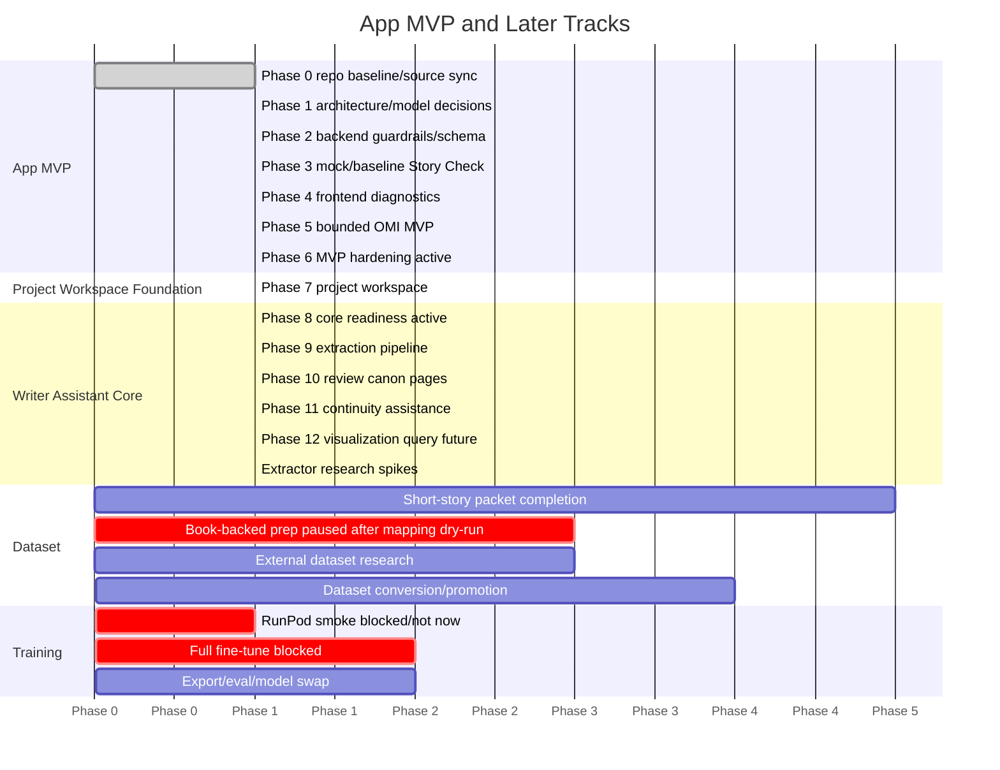

# PHASE8-UX-002-T004 Owner-Authored Source UI

- `PHASE8-UX-002` remains active as the MVP-first UX parent for missing browser-testable owner-acceptance UI/workflow surfaces.
- `PHASE8-UX-002-T004` is complete/PASS and implements owner-authored source/scene create/import/select UI with project-scoped selected source state.
- `UX2-SOURCE-001` focused test passes: `.venv-unsloth-clean/bin/python -m pytest tests/test_phase8_ux002_mvp_ui_acceptance_expected_red.py -q -k ux2_source_001` -> `1 passed, 6 deselected in 0.03s`.
- Full expected-red file after T004 remains expected-red for T005/T006 surfaces only: `1 passed, 6 failed`.
- T005 remains next for Story Check diagnostic-only/no-prose evidence UI; T006 remains planned for Notes/Materials plus runtime/review evidence UI.
- Owner acceptance remains pending and MVP is not complete. External SaaS investigation remains post-MVP/deferred. No backend route/API changes, package changes, context tool output, model calls, generated prose, canon/memory mutation, apply-promotion shortcut, staging, commit, or push occurred.

# PHASE8-UX-002-T003 Expected-Red UI Contract Tests

- `PHASE8-UX-002` remains active as the MVP-first UX parent for missing browser-testable owner-acceptance UI/workflow surfaces.
- `PHASE8-UX-002-T003` is complete/PASS as tests-first expected-red only.
- Expected-red test file: `tests/test_phase8_ux002_mvp_ui_acceptance_expected_red.py`.
- Targeted expected-red command: `.venv-unsloth-clean/bin/python -m pytest tests/test_phase8_ux002_mvp_ui_acceptance_expected_red.py -q`.
- Expected-red result: `7 failed in 0.12s`; all seven failures are intended assertion failures for missing UX2 UI contract markers.
- System `python3` lacks `pytest`, but that is not a T003 blocker because the repo virtualenv is the validated interpreter.
- T004 remains next for owner-authored source/scene create/import/select UI; T005 remains planned for Story Check diagnostic-only/no-prose evidence UI; T006 remains planned for Notes/Materials plus runtime/review evidence UI.
- Owner acceptance remains pending and MVP is not complete.
- External SaaS investigation, Dramatica/current-platform investigation, controlled external experiments, Browsertrix, Crawlee, Stagehand, Playwright against external SaaS, and authorized non-black-box external reference collection remain post-MVP/deferred.
- No frontend/backend implementation, route/API changes, product behavior changes, package changes, context tools, model calls, generated prose, canon/memory mutation, candidate creation, apply-promotion shortcut, staging, commit, or push occurred in T003.

# PHASE8-UX-002-T002 UI Acceptance Matrix + Route/Workflow Decision

- `PHASE8-UX-002` remains active as the MVP-first UX parent for missing browser-testable owner-acceptance UI/workflow surfaces.
- `PHASE8-UX-002-T002` is complete/PASS as docs/decision/planning only.
- Decision: `docs/roadmap/decisions/PHASE8-UX-002-ui-acceptance-matrix-route-workflow-decision.md`.
- Matrix: `docs/roadmap/ux/PHASE8-UX-002-ui-acceptance-matrix.md`.
- T003 is next for expected-red tests; T004/T005/T006 remain planned implementation slices.
- Owner acceptance remains pending and MVP is not complete.
- External SaaS investigation, Dramatica/current-platform investigation, controlled external experiments, Browsertrix, Crawlee, Stagehand, Playwright against external SaaS, and authorized non-black-box external reference collection remain post-MVP/deferred.
- No frontend/backend/tests/package changes, route/API changes, product behavior changes, context tools, model calls, generated prose, canon/memory mutation, candidate creation, apply-promotion shortcut, staging, commit, or push occurred in T002.

# PHASE8-IMPL-022-T004 Minimal MVP Smoke Harness Implementation

- `PHASE8-IMPL-022` remains active: End-to-end MVP usability validation.
- `PHASE8-IMPL-022-T004` is complete/PASS. It adds `backend/story_knowledge/mvp_usability_smoke.py` and turns `tests/test_writer_assistant_core_mvp_usability_smoke_contract.py` green.
- `PHASE8-IMPL-022-T005` is ready/active next; `PHASE8-IMPL-022-T006` and `PHASE8-IMPL-022-T007` remain planned.
- T004 records the minimal pure in-memory smoke harness APIs and covers runtime extraction, BookNLP, spaCy, raw artifact persistence, candidate review, frontend owner-action execution, apply-promotion, approved memory/canon, model-assisted evidence-backed extraction, analysis-only NCP/Subtxt/dramatica-flow, candidate-first, owner review required, confidence is not truth, tool output is not canon, model output is not canon, no model output as truth, no automatic canon, no training artifacts, no generated prose, no rewrite, no continuation, no outline, fail closed, no silent fallback, queue presence is not approval, and candidate persistence is not canon.
- T004 adds no routes, frontend, package/dependency files, real runtime extraction, BookNLP/spaCy execution, NCP/Subtxt/dramatica-flow execution, model/Ollama calls, network/subprocess behavior, persistence, candidate/review queue writes, apply-promotion changes, approved memory/canon mutation, training artifacts, or generated prose. Fine-tuning remains deferred after MVP. Generated prose/prose-production paths remain permanently forbidden.

# PHASE8-IMPL-022-T002 Validation Matrix Decision

- `PHASE8-IMPL-022` is active: End-to-end MVP usability validation.
- `PHASE8-IMPL-022-T001` is complete/PASS as docs/status/planning publication only.
- `PHASE8-IMPL-022-T002` is complete/PASS as docs/decision/planning only; decision record: `docs/roadmap/decisions/PHASE8-IMPL-022-mvp-usability-validation-matrix-decision.md`.
- `PHASE8-IMPL-022-T003` is ready/active next for expected-red end-to-end MVP smoke/contract tests and should not implement the smoke harness.
- `PHASE8-IMPL-022-T004` through `PHASE8-IMPL-022-T007` are planned.
- Parent goal: validate whether the Writer Assistant Core MVP is actually usable end-to-end after `PHASE8-IMPL-014` through `PHASE8-IMPL-021` delivered runtime extraction, raw artifact persistence, candidate review, frontend owner-action execution, apply-promotion, approved memory/canon, model-assisted extraction, and analysis-only runtime integration parts.
- Validation path: owner-authored or owner-provided project text; runtime extraction availability and guarded failure behavior; raw artifact persistence; candidate creation/review handoff; review queue/read-only review surface; frontend owner-action execution; explicit audited apply-promotion; approved memory/canon mutation only through owner-approved workflow; model-assisted evidence-backed extraction; analysis-only NCP/Subtxt/dramatica-flow runtime integration; safe unavailable/quarantine/fail-closed states; no generated prose/prose-production behavior.
- Boundary: validation/orchestration/smoke planning first, not feature expansion by default; candidate-first; owner review required; evidence/provenance/source-locator backed when available; confidence is not truth; tool output is not canon; no model output as truth; no automatic canon; no apply-promotion outside explicit audited owner-confirmed path; no memory/canon mutation outside owner-approved workflow; no training artifacts; no generated prose; no rewrite; no continuation; no outline; fail closed; no silent fallback; queue presence is not approval; candidate persistence is not canon.
- MVP scope preservation: fine-tuning remains deferred after MVP; generated prose/prose-production paths remain permanently forbidden; T002 does not mark MVP complete and does not record an end-to-end usability pass yet.

# PHASE8-IMPL-022-T003 Expected-Red MVP Smoke/Contract Tests

- `PHASE8-IMPL-022` is active: End-to-end MVP usability validation.
- `PHASE8-IMPL-022-T001` is complete/PASS as docs/status/planning publication only.
- `PHASE8-IMPL-022-T002` is complete/PASS as docs/decision/planning only; decision record: `docs/roadmap/decisions/PHASE8-IMPL-022-mvp-usability-validation-matrix-decision.md`.
- `PHASE8-IMPL-022-T003` is complete/PASS as expected-red end-to-end MVP smoke/contract tests only; final test artifact is `tests/test_writer_assistant_core_mvp_usability_smoke_contract.py` covering the future public APIs `validate_mvp_usability_smoke_matrix`, `validate_mvp_usability_smoke_request`, `build_mvp_usability_smoke_plan`, `validate_mvp_usability_smoke_result`, `build_mvp_usability_evidence_packet`, `classify_mvp_usability_blockers`, and `run_guarded_mvp_usability_smoke` for the future `backend.story_knowledge.mvp_usability_smoke` module; the future module is intentionally absent and the target pytest fails at collection with `ModuleNotFoundError`; the smoke harness implementation is deferred to `PHASE8-IMPL-022-T004`.
- `PHASE8-IMPL-022-T004` is ready/active next for the minimal MVP smoke harness implementation.
- `PHASE8-IMPL-022-T005` through `PHASE8-IMPL-022-T007` remain planned.
- Parent goal: validate whether the Writer Assistant Core MVP is actually usable end-to-end after `PHASE8-IMPL-014` through `PHASE8-IMPL-021` delivered runtime extraction, raw artifact persistence, candidate review, frontend owner-action execution, apply-promotion, approved memory/canon, model-assisted extraction, and analysis-only runtime integration parts.
- Validation path: owner-authored or owner-provided project text; runtime extraction availability and guarded failure behavior; raw artifact persistence; candidate creation/review handoff; review queue/read-only review surface; frontend owner-action execution; explicit audited apply-promotion; approved memory/canon mutation only through owner-approved workflow; model-assisted evidence-backed extraction; analysis-only NCP/Subtxt/dramatica-flow runtime integration; safe unavailable/quarantine/fail-closed states; no generated prose/prose-production behavior.
- Boundary: validation/orchestration/smoke planning first, not feature expansion by default; candidate-first; owner review required; evidence/provenance/source-locator backed when available; confidence is not truth; tool output is not canon; no model output as truth; no automatic canon; no apply-promotion outside explicit audited owner-confirmed path; no memory/canon mutation outside owner-approved workflow; no training artifacts; no generated prose; no rewrite; no continuation; no outline; fail closed; no silent fallback; queue presence is not approval; candidate persistence is not canon.
- MVP scope preservation: fine-tuning remains deferred after MVP; generated prose/prose-production paths remain permanently forbidden; T003 does not mark MVP complete and does not record an end-to-end usability pass yet.

# PHASE8-IMPL-019-T007 Parent Closeout

- `PHASE8-IMPL-019` is complete/PASS: Guarded runtime extraction: real BookNLP/spaCy install/run/import and candidate-first extraction pipeline.
- `PHASE8-IMPL-019-T001` is complete/PASS as docs/status publication only.
- `PHASE8-IMPL-019-T002` is complete/PASS for the Guarded runtime extraction boundary and environment model decision at `docs/roadmap/decisions/PHASE8-IMPL-019-guarded-runtime-extraction-boundary-environment-model-decision.md`.
- `PHASE8-IMPL-019-T003` is complete/PASS as expected-red guarded runtime extraction contract tests only at `tests/test_writer_assistant_core_runtime_extraction_contract.py`.
- `PHASE8-IMPL-019-T004` is complete/PASS for minimal guarded dependency availability and import/run probe implementation at `backend/story_knowledge/runtime_extraction.py`.
- `PHASE8-IMPL-019-T005` is complete/PASS for guarded runtime extraction request and raw artifact handoff implementation.
- `PHASE8-IMPL-019-T006` is complete/PASS for runtime extraction safety regression.
- `PHASE8-IMPL-019-T007` is complete/PASS for parent closeout.
- Parent goal: Deliver real BookNLP/spaCy install/run/import checks and guarded runtime extraction from owner-authored or owner-provided project text into raw artifact bundles and candidate-first review handoff, without canon mutation, model calls, automatic apply-promotion, training artifacts, or generated prose.
- Boundary: Runtime extraction in PHASE8-IMPL-019 may be introduced only through explicitly scoped children after T001 and may run only over owner-authored or owner-provided project text/materials. Output is candidate-first and owner-review-gated; runtime extraction output is never canon by itself, raw tool output is never authoritative by itself, extractor confidence is not truth, and extractor output cannot mutate approved memory/canon, apply promotion, create training data, or generate prose. Raw artifacts must be persisted through PHASE8-IMPL-018 helpers. Candidate persistence/review queue handoff may use existing candidate/review infrastructure only when explicitly scoped. Apply-promotion remains the separate PHASE8-IMPL-017 owner-confirmed path. Missing tools, missing models, unsafe paths, missing source/evidence/provenance, invalid source locators, malformed tool outputs, or unavailable environment must fail-closed or return explicit unavailable/quarantined state. No silent fallback may claim extraction succeeded.
- T002 decision summary: BookNLP and spaCy are MVP-required for PHASE8-IMPL-019, but T002 performed no dependency install/import/run and made no package changes. Future install/import/run availability checks must be explicit, test-covered, environment-gated, and fail closed with statuses such as disabled, unavailable, dependency_missing, model_missing, configuration_invalid, probe_failed, runtime_failed, malformed_output, unsafe_path, missing_source_refs, missing_evidence_refs, missing_provenance_refs, missing_source_locator_refs, quarantined, rejected, and valid. Future environment guards may include `WRITER_ASSISTANT_RUNTIME_EXTRACTION_ENABLED`, `WRITER_ASSISTANT_BOOKNLP_ENABLED`, and `WRITER_ASSISTANT_SPACY_ENABLED`.
- T005 implementation: adds `persist_runtime_extraction_raw_artifacts` to the guarded helper APIs, preserving the T004 request/environment/probe/handoff APIs; persists valid support-data-only raw artifact bundles through PHASE8-IMPL-018 helpers; preserves source/evidence/provenance/source-locator refs; fails closed or quarantines malformed, unsafe, incomplete, or unsupported output; no dependency install, package edit, route, UI, model call, canon mutation, candidate/review persistence, training artifact, full runtime extraction over project text, or generated prose.
- T006 safety regression: adds focused runtime extraction safety regression coverage and minimal helper hardening for unsafe source paths, unsafe ids, unsupported/non-owner source claims, missing refs, invalid source locators, forbidden artifact/action types, forbidden raw artifact destinations, forbidden payload markers, malformed output, unavailable/quarantine states, no silent success, and raw artifact persistence failure handling.
- T007 closeout: closes the parent as docs/status/governance only; final artifacts are `backend/story_knowledge/runtime_extraction.py`, runtime extraction contract/raw artifact handoff/safety regression tests, and the guarded runtime extraction boundary decision.
- Future sequence: `PHASE8-IMPL-020` is complete/PASS through `PHASE8-IMPL-020-T007`; `PHASE8-IMPL-020-T001` through `PHASE8-IMPL-020-T007` are complete/PASS; `PHASE8-IMPL-021` is the recommended next MVP-required parent after review; `PHASE8-IMPL-022` remains future MVP-required; fine-tuning remains deferred after MVP; generated prose/prose-production paths remain permanently forbidden.
- UX reference: PHASE8-UX-001 was used only as a read-only terminology/boundary reference for labels such as review, candidate, evidence, provenance, source locator, raw artifact, approved memory/canon, owner action, unavailable/quarantined state, and no automatic canon. PHASE8-UX-001 is not roadmap truth, does not override master_plan, implementation_status, roadmap_index, or PHASE8-IMPL parent boundaries, and was not edited.

# Phase Map

## App MVP Track

### Phase 0: Repo Baseline and Source-of-Truth Sync

- Inputs: Git setup reports, safe baseline commit, current roadmap docs.
- Outputs: synced master plan/roadmap docs.
- Status: Git initialized/repaired on `main`; `origin` is `https://github.com/telesjr90/writingassistant`; safe metadata exists; first safe local baseline commit is `25ef64d chore: initialize safe project baseline`.
- Remaining exit: push safe baseline to GitHub and keep planning docs current.

### Phase 1: App Architecture Audit and Project Model Decisions

- Inputs: current FastAPI/React/Ollama app, NCP schema, sample project, OMI product boundary.
- Outputs: architecture audit report, source-of-truth cleanup, NCP/storyform MVP subset, project storage model, OMI MVP design schema, sample project alignment decision.
- Status note: App-1 architecture audit completed in `docs/roadmap/app_mvp_architecture_audit.md`.
- Status note: App-2 project file model completed in `docs/roadmap/project_file_model.md`.
- Status note: App-3 NCP compatibility subset completed in `docs/roadmap/ncp_compatibility_subset.md`.
- Status note: App-3a / OMI-001 schema and lifecycle completed in `docs/roadmap/omi_mvp_schema_lifecycle.md`.
- Status note: Owner-created sample project alignment spec completed in `docs/roadmap/sample_project_alignment_spec.md`.
- Status note: Local ignored `projects/example` fixture aligned from public-domain scene source; previous Elena/Ember Crown mismatch and owner-idea/source mix-up replaced, with unsupported MC/IC/RS/CIPS/dynamics left unresolved.
- Exit: core app gaps and project truth/candidate storage boundaries are documented.

### Phase 2: Backend Safety and Schema Foundation

- Inputs: Story Check schema, refusal schema, no-prose policy, analysis mode decision.
- Outputs: runtime no-prose guardrails, refusal response schema, Story Check normalizer, minimal-to-rich compatibility, insufficient-evidence handling, analysis mode config.
- Status note: GUARD-001 shared runtime no-prose guard completed in `backend/guardrails.py` with tests in `tests/test_guardrails.py`; integrated only into Story Check suggestion filtering where safe.
- Status note: GUARD-002 request-path policy completed; `backend/guardrails.py` now exposes freeform request helpers and field policy helpers, current routes are audited, and tests verify owner-authored scene/bible/storyform content is not blocked as request intent.
- Status note: GUARD-003 output policy completed for Story Check; `analysis_engine.py` applies `sanitize_story_check_output` after normalization, removing unsafe model-authored text from warnings, suggestions, reasons, concerns, and raw diagnostics while preserving evidence arrays.
- Status note: BE-002 Story Check normalizer completed in `backend/analysis_normalizer.py` with tests in `tests/test_analysis_normalizer.py`; `analysis_engine.py` now delegates model-output parsing and fallback behavior to the reusable normalizer.
- Status note: BE-001 analysis mode config completed in `backend/analysis_modes.py` and `.env.example`; missing/empty `ANALYSIS_MODE` defaults to `ollama_baseline`, `ANALYSIS_MODE=mock` selects deterministic fixtures, and invalid modes follow a stable error path.
- Status note: SC-001 rich Story Check prompt alignment completed in `backend/prompts/story_check.txt` with prompt checks in `tests/test_story_check_prompt.py`; route/UI compatibility remains future work.
- Status note: SC-002 minimal-to-rich compatibility checks completed with Story Check route tests in `tests/test_story_check_route.py`; FE-001 now renders rich Story Check diagnostics while preserving the compatibility cases, and frontend build validation passes.
- Exit: Story Check and OMI-relevant paths have clear no-prose and structured-output foundations before feature implementation expands; future non-Story Check model routes must reuse the guard pattern.

### Phase 3: Mock and Baseline Story Check

- Inputs: schema foundation, mock fixture requirements, Ollama baseline config.
- Outputs: mock analysis mode, Story Check route tests, Ollama baseline mode, qwen3 baseline verification, evaluation fixtures.
- Status note: App-7 mock Story Check mode completed with `backend/mock_responses/story_check.json` and tests covering schema compatibility, no Ollama calls, unresolved MC/IC/RS/CIPS/dynamics, route behavior, and no project-file mutation.
- Status note: App-8 verified locally as of 2026-06-01: `OLLAMA_BASE_URL` lets WSL reach Windows Ollama and `qwen3:8b`; the live Story Check smoke returned normalized, schema-valid rich Story Check JSON through the baseline path.
- Status note: App-12 app-level evaluation fixtures completed under `tests/fixtures/story_check/`; fixtures cover valid rich, minimal, malformed, refusal, insufficient-evidence, and unsafe-output guard behavior without creating training data.
- Status note: App-13 offline baseline harness completed in `training/scripts/run_story_check_baseline_eval.py`; it evaluates App-12 fixtures through the normalizer/output guard and reports JSON validity, schema compliance, refusal exactness, no-prose violations, insufficient-evidence preservation, output-guard behavior, and evidence preservation. Live Ollama evaluation is explicit opt-in only.
- Exit: Story Check works without fine-tuning in mock and qwen3 baseline modes.

### Phase 4: Frontend MVP Diagnostics

- Inputs: normalized Story Check response, mode metadata, editor state.
- Outputs: rich diagnostics sidebar, mock/baseline visibility, error and malformed-output display, scene editor dirty-state handling, empty scene behavior, owner-controlled bible/storyform editing.
- Status note: FE-001 rich Story Check diagnostics sidebar completed; `AnalysisSidebar.jsx` now renders coherence score, warnings, diagnostic suggestions, throughline alignment, theme drift, character consistency, insufficient evidence, compact diagnostics, and collapsible raw JSON while preserving minimal/fallback/error compatibility.
- Status note: App-4 scene editor hardening completed; the editor tracks dirty state against the last saved scene content, confirms before discarding unsaved edits on scene switch/unload, keeps user text after save failures, and supports loading/saving empty scenes.
- Status note: App-5 bible/storyform read/write completed; raw JSON routes and the Project Context UI support explicit owner saves, storyform validation before write, visible parse/save errors, and no automatic promotion from analysis output.
- Exit: UI displays bounded analysis clearly and does not expose prose-generation paths.

### Phase 5: OMI MVP Implementation

- Inputs: OMI schema/lifecycle design, project storage model, no-prose guardrails, schema foundation.
- Outputs: OMI storage design, candidate lifecycle, owner decision flow, destination handling, provenance/status display.
- Status note: OMI-002 storage design completed in `docs/roadmap/omi_storage_model.md`; it defines project-local OMI ideas, candidates, promotions, index records, status transitions, destinations, provenance, promotion gates, storage safety rules, guardrail implications, and future test categories without creating runtime OMI files.
- Status note: OMI-003 candidate creation flow completed; backend helpers and routes create/list/load owner-authored raw ideas and structured candidate records under project-local `omi/` storage, and the frontend OMI panel exposes create/list UI without model generation or promotion.
- Status note: OMI-004 owner decision and destination selection completed; backend helpers and routes update explicit owner decisions, status transitions, approval confirmation, notes, and candidate destinations without writing durable project truth, and the frontend OMI panel exposes review controls without a promotion action.
- Status note: OMI-005 promotion gate enforcement completed; backend helpers and routes create promotion audit records only when approval, confirmation, destination, provenance, source snapshot, structured candidate content, and safe target labels are present, and no route applies those records to durable project truth.
- Status note: OMI-006 fuller UI/status/provenance workflow completed; the OMI panel now surfaces raw idea metadata, selected candidate lifecycle details, owner decision state, status, destination, provenance rows, evidence summaries, promotion readiness requirements, blockers, and promotion records without any apply-promotion behavior.
- Status note: OMI-007 no-prose/no-silent-promotion tests completed; focused tests cover blocked prose destinations/types, owner-authored content overblocking, no silent durable truth mutation, record-only promotion creation, promotion blocker enforcement, UI boundary copy, no model path, owner sample isolation, and path traversal safety.
- Exit: OMI captures raw ideas and structured candidate planning material without writing story prose or mutating owner-approved truth automatically.

OMI must remain analysis-only, candidate-output-first, and owner-controlled. Promotion requires explicit owner approval, destination, provenance, and status. Suggested design statuses are `draft`, `candidate`, `owner_review`, `approved`, `rejected`, `promoted`, and `archived`. Suggested destinations are `planning_notes`, `project_bible_candidate`, `storyform_context_candidate`, `scene_prompt_context_candidate`, `template_starter_candidate`, and `discard`.

### Phase 6: MVP Hardening

- Inputs: working Story Check and bounded OMI MVP paths.
- Outputs: project navigation reliability, save/reload testing, app smoke tests, documentation cleanup, manual local run checklist, and completed MVP exit test matrix.
- Status note: `docs/roadmap/mvp_completion_test_matrix.md` defines the formal MVP exit gate across repo safety, backend tests, frontend build, Story Check modes, guardrails, context, OMI, evaluation harness, and manual acceptance.
- Status note: MVP exit preflight executed on 2026-06-05. Automated backend tests, focused groups, frontend build, offline baseline harness, mock Story Check smoke, guardrail checks, OMI boundary checks, and short server smokes passed; live qwen3 smoke was deferred by design.
- Status note: Phase 6 Step 1 refresh on 2026-06-06 found no dirty tracked `projects/example` fixture files. Tracked fixture files are clean in `HEAD`; ignored local `projects/example/omi/` artifacts remain local-only. Phase 6 remains active: record owner fixture-state acceptance and re-run/record the MVP exit matrix rather than starting JSONL conversion, RunPod smoke, or training.
- Status note: Phase 6 Step 2 refresh on 2026-06-06 passed in-process mock backend route smoke and source/boundary inspection, but true backend/frontend localhost server smokes are blocked in this sandbox by socket/listen restrictions. Browser-rendered checks remain owner-manual, and live qwen3/Ollama remains deferred by design.
- Exit: App MVP is locally usable and documented without depending on RunPod, book-backed workflow, fine-tuning, or optional extractors after the current committed fixture state is owner-accepted/documented and the remaining MVP exit checks are recorded.

## Project Workspace Foundation Track

This is the next product direction after owner acceptance of the Phase 6 MVP foundation. It shifts the roadmap from Dramatica-first analyzer work to a usable writing-project workspace before advanced analysis expands.

### Phase 7: Project Workspace Foundation

- Inputs: current project file model, OMI storage/lifecycle docs, no-prose guardrails, sample project alignment, MVP foundation.
- Outputs: project creation, project selector/library, OMI-guided project creation and idea capture, chapters/scenes/notes/materials organization, owner-authored prose editor, project overview, chapters/scenes pages, notes/materials pages, OMI ideas/candidates page, approved-memory/canon page structure, and the approved-only category pages (Characters, Locations/Settings, Objects/Items, Timeline, Plot Threads, Continuity/Consistency, Approved Contradictions, Approved Scene / Event / Causality Review, Open Questions, Relationships, Organizations/Groups, Annotations/Evidence/Provenance).
- Status: COMPLETE (published parent sequence). `PHASE7-IMPL-001` through `PHASE7-IMPL-010` are complete, covering safe project metadata creation, selector/library support, frontend project switching, chapter/scene metadata compatibility, notes/materials storage/routes/API/minimal shell, shared owner-authored scene/note/material editor behavior, the deterministic Project Overview shell, the frontend-transient OMI-guided staged creation shell, the read-only Memory / Canon shell with approved-only empty states, and workspace validation/browser smoke with automated regression pass plus PARTIAL browser/manual smoke due to environment tooling limits. `PHASE7-IMPL-010` validated the foundation without adding runtime feature scope; T005 found no product defect and no runtime repair; interactive UI browser validation remains deferred to owner/environment rerun when Playwright deps or browser MCP are available. `PHASE8-IMPL-001` and `PHASE8-IMPL-002` are complete as the first two Writer Assistant Core parents. Extractor logic, dataset files, training records, model calls, and package installs remain out of scope unless explicitly started by a later published task.
- Exit: owner can create/select a project, write and save owner-authored material, organize chapters/scenes/notes/materials, and see project-specific workspace pages without any AI prose-generation path.

Workspace layer order:

1. Owner-authored prose storage and editing.
2. AI-assisted analysis of owner-authored material.
3. Candidate extraction.
4. Owner approval.
5. Approved project memory/canon.
6. Future Dramatica-specific analysis.

## Writer Assistant Core Track

This follows the Project Workspace Foundation. It identifies, organizes, connects, annotates, and reviews story knowledge from owner-authored text. All outputs remain analysis-only, candidate-first, evidence/provenance-backed where practical, and owner-controlled through OMI.

### Phase 8: Writer Assistant Core MVP Runtime, Review, Promotion, Memory/Canon, and Analysis Integration

- Inputs: usable Project Workspace Foundation, current project file model, OMI storage/lifecycle docs, no-prose guardrails, sample project alignment, Writer Assistant Core product pivot.
- Outputs: story knowledge candidate schema alignment, evidence/provenance boundaries, raw artifact lifecycle, review queue and API surfaces, frontend owner-action execution, explicit apply-promotion, approved memory/canon mutation, real BookNLP/spaCy runtime extraction, model-assisted extraction, and analysis-only NCP/Subtxt/dramatica-flow runtime integration.
- Status: TWENTY-SECOND PARENT COMPLETE/PASS (MVP-REQUIRED). `PHASE8-IMPL-001` through `PHASE8-IMPL-022` are complete/PASS. `PHASE8-IMPL-022 - End-to-end MVP usability validation` is complete/PASS through `PHASE8-IMPL-022-T007`; T007 is docs/status/governance closeout only. Final artifacts are `docs/roadmap/decisions/PHASE8-IMPL-022-mvp-usability-validation-matrix-decision.md`, `backend/story_knowledge/mvp_usability_smoke.py`, `tests/test_writer_assistant_core_mvp_usability_smoke_contract.py`, `tests/test_writer_assistant_core_mvp_usability_smoke_workflow_contract.py`, and `tests/test_writer_assistant_core_mvp_usability_smoke_safety_regression.py`. T001 published the parent and MVP usability validation scope. T002 created the MVP end-to-end usability validation matrix and acceptance gates decision. T003 added expected-red MVP smoke/contract tests. T004 implemented the minimal pure in-memory MVP smoke harness and made T003 green. T005 added workflow fixture and owner-action validation coverage. T006 added safety regression/no-prose/no-canon/no-training/no-silent-fallback coverage and minimal helper hardening. T007 closes the parent as docs/status/governance only. PHASE8-IMPL-022 validates the complete MVP path through a deterministic in-memory smoke harness and tests covering project/workspace load, owner-authored or owner-provided source confirmation, source_refs, evidence_refs, provenance_refs, source_locator_refs, runtime extraction availability and guarded failure behavior, BookNLP/spaCy availability/import/run signals as scoped by earlier parents, raw artifact persistence expectations, candidate creation/review handoff expectations, review queue/read-only review surface expectations, frontend owner-action execution expectations, explicit audited apply-promotion expectation, approved memory/canon mutation only through owner-approved workflow expectation, model-assisted evidence-backed extraction expectation, analysis-only NCP/Subtxt/dramatica-flow integration expectation, unavailable/quarantine/fail_closed/fail closed behavior, no generated prose/no rewrite/no continuation/no outline/no training artifacts/no silent fallback, blocker triage, evidence packet preservation, and support-data-only evidence behavior. PHASE8-IMPL-022 preserved candidate-first, owner review required, evidence/provenance/source-locator backed when available, confidence is not truth, tool output is not canon, model output is not canon, no model output as truth, no automatic canon, no apply-promotion outside explicit audited owner-confirmed path, no memory/canon mutation outside owner-approved workflow, no training artifacts, no generated prose, no rewrite, no continuation, no outline, fail closed, no silent fallback, queue presence is not approval, candidate persistence is not canon, MVP is not complete unless explicitly authorized by an existing roadmap file, and end-to-end usability has not passed unless explicitly authorized by an existing roadmap file. PHASE8-IMPL-022 added no routes, frontend code, package/dependency changes, real runtime extraction execution, BookNLP/spaCy execution, NCP/Subtxt/dramatica-flow execution, model/Ollama calls, network/subprocess behavior, runtime project file writes, candidate persistence writes, review queue writes, apply-promotion behavior changes, approved memory/canon mutation, training/JSONL/dataset/model artifacts, generated prose, or prose-production behavior. No active child remains. Active parent is none / pending owner roadmap decision because no explicit next parent exists in current roadmap truth; do not invent `PHASE8-IMPL-023`. PHASE8-IMPL-022 is complete/PASS as the end-to-end MVP usability validation parent. This closeout does not by itself declare the whole MVP complete or record an end-to-end usability pass for production use. MVP readiness/completion requires the next explicit owner/roadmap gate. Fine-tuning remains outside the MVP critical path. Generated prose/prose-production paths remain permanently forbidden and are not future roadmap features.
- Exit: usable/testable MVP with owner-authored prose storage/editing, runtime extraction over owner-authored or owner-provided text, raw artifact persistence, candidate review, frontend owner-action execution, apply-promotion, approved memory/canon mutation, model-assisted evidence-backed extraction, and analysis-only NCP/Subtxt/dramatica-flow integration. Generated prose, rewrite, continuation, imitation, polish, improvement, expansion, outline generation, chapter generation, write/revise flows, and prose-production paths remain permanently forbidden.

### Phase 9: Post-MVP Visualization and Query Assistance

- Inputs: approved memory/canon records, reliable review UI, stable evidence/provenance, and the completed Phase 8 MVP-required runtime.
- Outputs: optional graph, timeline, map, relationship, and project-memory query views.
- Status: PLANNED/FUTURE after MVP.
- Exit: visuals help navigation and review without implying pending candidates are approved truth.

Future internal flow:

```text
owner-authored scene/chapter/note text
  -> stable source maps / Evidence Ledger
  -> mocked BookNLP adapter contract implementation completed in PHASE8-IMPL-007
  -> BookNLP-ready or simple local baseline adapters after contracts exist
  -> normalized CORE candidate schemas
  -> evidence/provenance attachment
  -> OMI candidate records
  -> owner review
  -> promotion record
  -> future apply-promotion
  -> memory/*.json canon records
```

### Later Phase: Fine-Tuning / Dramatica Analyst Model

- Inputs: resumed evidence extraction, validated review JSONL, promoted records, ready manifest, GPU/cloud plan.
- Outputs: evaluated `dramatica-analyst` model candidate.
- Status: BLOCKED/PAUSED. Dataset gate remains blocked and fine-tuning prep is paused.
- Exit: non-smoke model passes evaluation before any app default swap.

### Phase 8 MVP-Required Extraction Runtime Notes

- Inputs: owner scene/project context, OMI candidate workflow, no-prose guardrails, extractor license review.
- Outputs: candidate entity/action/relationship/timeline extraction pipeline with real BookNLP/spaCy runtime, raw refs, evidence/provenance, owner review, and candidate-only persistence.
- Status note: `docs/roadmap/optional_analysis_extractors.md` and `docs/roadmap/decisions/PHASE8-IMPL-005-nlp-extraction-adapter-strategy-decision.md` predate this MVP scope revision where they describe extractors as optional or later. The current roadmap reclassifies real BookNLP/spaCy install/run/import and runtime extraction as MVP-required through `PHASE8-IMPL-019`. Other extraction references remain replaceable adapters around the app-owned pipeline. Generation-heavy tools remain blocked or documentation-only.
- Exit: any extractor output remains candidate-only, routes through OMI, preserves provenance, and cannot directly mutate durable project truth, OMI promotions, training data, or `dataset_manifest.json`.

## Dataset and Training Tracks

These tracks are outside the App MVP critical path.

## Phase C: Short-Story Packet Completion

- Inputs: packets 003-020, reports, owner decisions.
- Outputs: review candidates and promoted records where approved.
- Exit: manifest moves toward task mix and 500 eligible records.

## Phase D: Book-Backed Cross-Book Review

- Inputs: Books 1-3 completed workflow artifacts from WSL-mounted folders.
- Outputs: coverage matrix, owner decision extraction, owner-answer implementation, and review JSONL mapping dry-run.
- Status: PAUSED after Book 1-3 mapping dry-run. Dataset gate audit, coverage matrix, owner decision extraction worksheet, owner answers implementation, and mapping dry-run are complete as local prep artifacts. Next step when resumed is P0 evidence extraction/verification, not JSONL drafting or training.
- Exit: excerpt-backed candidate evidence triaged for SFT review candidates after evidence extraction/verification.

## Phase E: External Dataset Research

- Inputs: external dataset reports and registry.
- Outputs: licensed/provenance-reviewed candidates for allowed auxiliary tasks.
- Exit: no external dataset supplies positive Dramatica truth without review.

## Phase F: Dataset Conversion and Promotion

- Inputs: approved packets, book-backed evidence, external candidates.
- Outputs: review JSONL, promoted JSONL, manifest updates.
- Status: BLOCKED/PAUSED. No review JSONL should be created while fine-tuning prep is paused, and evidence extraction is still required before any Book 1-3 review JSONL drafting.
- Exit: 500+ eligible records, target task mix, no unresolved-source train records.

## Phase G: RunPod Smoke

- Inputs: configs, synced repo, environment.
- Outputs: smoke-only training report/artifact.
- Status: BLOCKED/NOT NOW while dataset gate remains blocked and fine-tuning prep is paused.
- Exit: environment validated; smoke artifact explicitly blocked from production.

## Phase H: Full Fine-Tune

- Inputs: ready manifest and RunPod GPU.
- Outputs: QLoRA adapter/checkpoints.
- Status: BLOCKED by dataset gate and paused fine-tuning prep.
- Exit: non-smoke training complete.

## Phase I: Export, Eval, Model Swap

- Inputs: trained adapter, eval harness.
- Outputs: GGUF q4_k_m/q8_0, Ollama import, eval report, rollback plan.
- Exit: `dramatica-analyst:8b` becomes app default only after gates pass.

## Mermaid Gantt


```mermaid
gantt
    title App MVP and Later Tracks
    dateFormat  X
    axisFormat  Phase %s
    section App MVP
    Phase 0 repo baseline/source sync :done, p0, 0, 1
    Phase 1 architecture/model decisions :p1, after p0, 1
    Phase 2 backend guardrails/schema :p2, after p1, 1
    Phase 3 mock/baseline Story Check :p3, after p2, 1
    Phase 4 frontend diagnostics :p4, after p3, 1
    Phase 5 bounded OMI MVP :p5, after p4, 1
    Phase 6 MVP hardening active :active, p6, after p5, 1
    section Project Workspace Foundation
    Phase 7 project workspace :workspace7, after p6, 1
    section Writer Assistant Core
    Phase 8 core readiness active :active, core8, after workspace7, 1
    Phase 9 extraction pipeline :core9, after core8, 1
    Phase 10 review canon pages :core10, after core9, 1
    Phase 11 continuity assistance :core11, after core10, 1
    Phase 12 visualization query future :core12, after core11, 1
    Extractor research spikes :extractors, after core8, 1
    section Dataset
    Short-story packet completion :packets, 1, 5
    Book-backed prep paused after mapping dry-run :crit, books, 2, 3
    External dataset research :external, 2, 3
    Dataset conversion/promotion :promotion, 4, 4
    section Training
    RunPod smoke blocked/not now :crit, smoke, 7, 1
    Full fine-tune blocked :crit, train, 8, 2
    Export/eval/model swap :deploy, 10, 2
```
# PHASE8-UX-002 MVP Acceptance UI Parent

- Parent: `PHASE8-UX-002 - MVP acceptance UI completion and route wiring`.
- Status: active after `PHASE8-UX-002-T001` publication.
- Purpose: complete missing browser-testable UI/workflow surfaces required for MVP owner acceptance.
- Current readiness: owner acceptance pending; MVP not complete; latest owner acceptance evidence remains `MANUAL_REVIEW_REQUIRED`.
- Active child sequence: T001 parent publication; T002 UI acceptance matrix + route/workflow decision; T003 expected-red source/Story Check/no-prose UI tests; T004 owner-authored source/scene create/import/select UI; T005 Story Check diagnostic-only/no-prose evidence UI; T006 Notes/Materials + runtime/review evidence UI; T007 closeout + owner acceptance harness rerun.
- Deferred: `PHASE8-UX-002-T002A`, external SaaS investigation, Dramatica/current-platform investigation, controlled external experiments, and authorized non-black-box external reference collection.
- Boundaries: no generated prose, no canon/memory mutation, no apply-promotion shortcut, raw artifacts support data only, confidence is not truth, queue presence is not approval.
