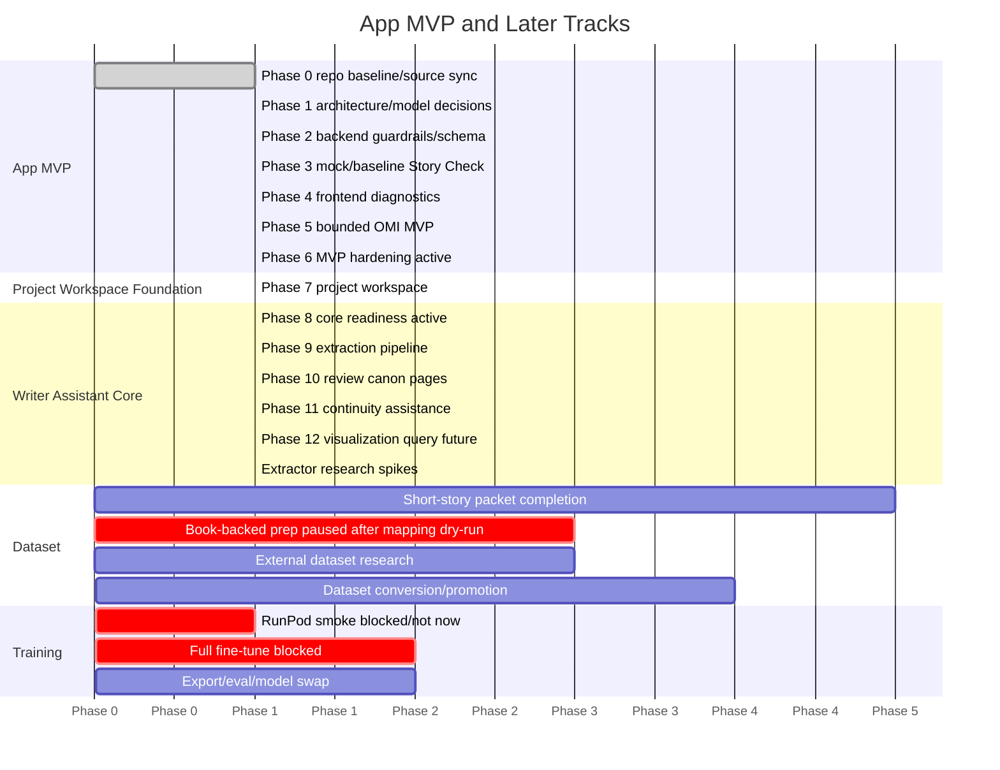

# PHASE8 Owner Override: AI Tool-Assisted OMI Analysis Required Before MVP Closeout

- Decision record: `docs/roadmap/decisions/PHASE8-IMPL-023-owner-override-ai-tool-assisted-omi-analysis-required.md`.
- Prior owner override record: `docs/roadmap/decisions/PHASE8-owner-override-block-full-mvp-closeout-omi-extraction-required.md`.
- Full MVP completion closeout: BLOCKED.
- Superseded decision: `docs/roadmap/decisions/PHASE8-post-accepted-owner-gate-next-readiness-step-decision.md`.
- Blocked/superseded closeout task: `PHASE8-MVP-COMPLETE-CLOSEOUT-001 - Full MVP completion closeout and post-MVP readiness publication`.
- Active parent: `PHASE8-IMPL-023 - OMI AI Tool-Assisted Analysis Candidate Review MVP`.
- Latest completed phase-map item: `PHASE8-IMPL-023-T016C1 - Tighten Story Check live converter sanitizer boundary` is complete/PASS.
- T015D-rerun-after-T015F result: `PHASE8-IMPL-023-T015D-rerun-after-T015F - Rerun manual real Ollama qwen3:8b validation after T015F` is complete/PASS. Decision record: `docs/roadmap/decisions/PHASE8-IMPL-023-T015D-manual-real-ollama-qwen3-validation.md` (this rerun is documented in the same file as a T015D rerun history section). T015D was rerun after T015E added top-level `"think": false` to the live `/api/chat` request body and T015F narrowed the orchestrator-level no-prose guard scope and added the `OMI_LIVE_OLLAMA_TIMEOUT_SECONDS` env var (default `180`). T015D rerun #2 confirmed: Ollama HTTP API reachable from WSL at `http://172.25.144.1:11434` (version 0.31.2); `qwen3:8b` confirmed available via `/api/tags`. Live Ollama adapter correctly reached behind env flags (`OMI_LIVE_TOOLS_ENABLED=1 OMI_LIVE_OLLAMA_ENABLED=1 OMI_LIVE_OLLAMA_MODEL=qwen3:8b OMI_LIVE_OLLAMA_TIMEOUT_SECONDS=180 OMI_LIVE_OLLAMA_BASE_URL=http://172.25.144.1:11434`) and the 35-word narrative test text suggested in the task brief was accepted at the orchestrator entrypoint (T015F owner-input prose guard repair exercised end-to-end) and reached the live adapter as a user message. The full live call completed in ~99 seconds (`time.monotonic()` measured `98.93s`), well within the 180s default timeout and well above the previous 30s hard-coded limit. The adapter received a valid `omi_ollama_structured_extraction.v1` JSON envelope in `message.content` with `done_reason: "stop"` and produced 3 evidence-backed candidate findings (1 timeline_event, 1 object, 1 organization) with `source_excerpt`, `source_locator`, `provenance.tool_source`, support-only labels, `owner_decision: pending`, and `review_status: "candidate_review_pending"`. `persist_candidates=False` was honored (`persistence_status: "not_requested"`, `new_candidate_ids: []`, `persisted_candidate_ids: []`). All 100 automated tests passed across the four contract test files. No Memory/Canon mutation, no automatic promotion records, no apply-promotion, and no story prose occurred; all 11 safety envelope flags returned `true`. T015E `think: false` payload is preserved at `backend/omi_analysis_orchestrator.py:4602-4608`; T015F `OMI_LIVE_OLLAMA_TIMEOUT_SECONDS` is read at `backend/omi_analysis_orchestrator.py:4589-4592` and applied at `4617`; T015F `validate_owner_raw_idea_input` helper is the documented owner-input boundary. No backend, frontend, package, or dependency files were changed during T015D rerun #2. T015D is now complete/PASS for real Ollama qwen3:8b validation; T015E and T015F code/test changes are pre-existing.
- T016A result: `PHASE8-IMPL-023-T016A - Story Check runtime surface and fixture contract inspection` is complete/PASS as inspect/docs only. Decision record: `docs/roadmap/decisions/PHASE8-IMPL-023-T016A-story-check-runtime-surface-and-fixture-contract-inspection.md`. T016A mapped the existing T008 `story_check` fixture/mock contract (`omi_story_check_diagnostic_handoff.v1`, 12 supported finding types, strict evidence/provenance/source-locator/no-prose/no-truth/no-final/no-operation/no-approval/no-Memory-Canon-mutation/no-promotion/no-apply-promotion guards, all 11 fixture/mock tests in `tests/test_omi_story_check_adapter_contract.py`) at `backend/omi_analysis_orchestrator.py:2550-3264`. T016A mapped the existing in-repo Story Check runtime surface as `backend/analysis_engine.run_story_check(project_name, scene_id)` at `backend/analysis_engine.py:46` invoked through the legacy `POST /api/projects/{project_name}/story-check/{scene_id}` route at `backend/main.py:327-332`; the legacy route is not gated by OMI live-tools env flags. T016A mapped the existing T013 preflight `story_check` probe as a file-existence-only probe on `backend/analysis_engine.py` at `backend/omi_runtime_preflight.py:280-283`. T016A documented three next slices: T016B (live Story Check preflight/config/availability with `requests`/`prompt`/`mock fixture`/`analysis_modes`/`Ollama reachability`/`timeout` probes), T016C (live Story Check adapter behind flags — bridge to `analysis_engine.run_story_check` or fresh orchestrator HTTP runner or refactor; convert rich Story Check response to T008-shaped findings; fail-closed on HTTP error, non-JSON, prose, truth, canon, missing evidence/source_locator/provenance), and T016D (manual real Story Check validation against live `qwen3:8b`). T016B is the recommended next task after T016A. No live Story Check runtime call, no adapter implementation, no model analysis, no candidates, no candidate persistence, no Memory/Canon mutation, no automatic promotion records, no automatic apply-promotion, no story prose, no backend/frontend/package/dependency file changes occurred. Existing Story Check tests remain scaffolding only and do not count as MVP completion.
- T016B result: `PHASE8-IMPL-023-T016B - Story Check runtime preflight/config/availability check` is complete/PASS. Decision record: `docs/roadmap/decisions/PHASE8-IMPL-023-T016B-story-check-runtime-preflight-config-availability.md`. T016B strengthens the T013 `story_check` preflight probe from a single file-existence check on `backend/analysis_engine.py` to a read-only multi-surface probe in `backend/omi_runtime_preflight.py` (`_story_check_runtime_probe` + `_dependency_probe` + `_tool_report`). The probe now reports the boolean availability of `backend/analysis_engine.py`, `backend/prompts/story_check.txt`, `backend/mock_responses/story_check.json`, `backend/analysis_modes.py`, `backend/storyform.py`, and the `requests` Python package, and surfaces the configured `OLLAMA_BASE_URL`/`OLLAMA_MODEL`/`OLLAMA_TIMEOUT_SECONDS`/`ANALYSIS_MODE` env vars as configuration only. T016B does not import `backend.analysis_engine`, does not call `analysis_engine.run_story_check`, does not call the legacy Story Check route, and does not call Ollama. T016B reuses the existing T013 status vocabulary and preserves the existing disabled-by-default and blocked-state behavior. 16 new mocked tests added to `tests/test_omi_live_runtime_preflight_contract.py`. All 39 preflight tests pass (23 existing + 16 new); all 46 fixture/orchestrator/persistence tests pass unchanged. T016C (live Story Check adapter behind flags) is the recommended next step.
- T015F result: `PHASE8-IMPL-023-T015F - Narrow no-prose guard scope and configure live Ollama timeout` is complete/PASS. Decision record: `docs/roadmap/decisions/PHASE8-IMPL-023-T015F-narrow-no-prose-guard-and-configure-ollama-timeout.md`. T015F repairs the two T015D-rerun blockers: (1) the orchestrator-entrypoint no-prose guard was incorrectly rejecting owner-authored raw idea input as prose-like, and (2) the live Ollama HTTP timeout was hard-coded at 30 seconds while `qwen3:8b` with the full T006 system prompt takes ~111s on the owner's hardware. T015F narrows the no-prose guard scope: strict prose guard preserved on AI/tool/model `extracted_claim` output and on forbidden envelope field names; NOT applied to owner-authored raw idea input (treated as untrusted data to analyze). T015F adds `validate_owner_raw_idea_input` helper to `backend/omi_analysis_orchestrator.py` and removes the `is_prose_like_text(raw_idea_text)` fail-closed block in `analyze_omi_raw_idea_with_tools`. T015F adds the `OMI_LIVE_OLLAMA_TIMEOUT_SECONDS` env var (default `180`, clamped to a finite positive range) and a `_env_positive_float` helper. `_build_ollama_model_live_runner` reads the configured timeout and passes it to `urllib.request.urlopen(..., timeout=...)`. T015E `think: false` payload preserved unchanged. 9 new mocked-HTTP tests in `tests/test_omi_ollama_model_adapter_contract.py` and 4 new tests in `tests/test_omi_tool_assisted_orchestrator_contract.py`; 1 existing test updated. All tests mock `urllib.request.urlopen`; no real Ollama/network call. `tests/test_omi_ollama_model_adapter_contract.py` -> `42 passed` (33 existing + 9 new T015F). `tests/test_omi_tool_assisted_orchestrator_contract.py` -> `30 passed` (26 existing + 4 new T015F; 1 existing test updated). Combined: `100 passed` across the four contract test files. `python3 -m py_compile backend/omi_analysis_orchestrator.py backend/omi_runtime_preflight.py backend/main.py` -> exit `0`. No frontend/package/dependency files changed. No candidate persistence, Memory/Canon mutation, automatic promotion records, automatic apply-promotion, or story prose. T015D must be rerun after T015F to validate real `qwen3:8b` output through the orchestrator path with the narrowed prose-guard scope and the 180s default timeout.
- T015E result: `PHASE8-IMPL-023-T015E - Disable Qwen thinking mode for live Ollama structured extraction` is complete/PASS. Decision record: `docs/roadmap/decisions/PHASE8-IMPL-023-T015E-disable-qwen-thinking-for-ollama-structured-extraction.md`. T015E is the focused T015C live Ollama adapter fix that disables Qwen3 thinking-mode output by adding top-level `"think": false` to the `/api/chat` request body built by `_build_ollama_model_live_runner` in `backend/omi_analysis_orchestrator.py`, alongside the existing `stream=false` and `options.num_predict=2048`. The change is intentionally not behind a new opt-in flag; for live structured extraction, thinking output must be disabled by default so the adapter receives JSON in `message.content`. The adapter continues to parse extraction JSON only from `message.content`; `message.thinking` is never read and is not treated as extraction output. 3 new tests in `tests/test_omi_ollama_model_adapter_contract.py` lock in (1) the request payload includes `think: false`, (2) the adapter extracts JSON only from `message.content` and ignores a valid-looking envelope embedded in `message.thinking`, and (3) the exact Qwen3 thinking-mode failure shape fails closed with no findings. All tests mock `urllib.request.urlopen`; no real Ollama/network call is required. `tests/test_omi_ollama_model_adapter_contract.py` -> `33 passed` (30 existing + 3 new T015E). T015D must be rerun after T015E to validate real `qwen3:8b` output with `think: false` enabled; T015D final result is NOT marked PASS in this task.
- T015D result: `PHASE8-IMPL-023-T015D - Manual real Ollama qwen3:8b validation` is complete/PASS-SAFE-FAIL-CLOSED. Decision record: `docs/roadmap/decisions/PHASE8-IMPL-023-T015D-manual-real-ollama-qwen3-validation.md`. T015D ran manual real Ollama `qwen3:8b` validation from WSL. Ollama API reachable; `qwen3:8b` confirmed; live adapter reached but model failed to load (HTTP 500, missing `llama-server.exe`). Adapter correctly fail-closed. All 84 tests passed. The owner has since repaired the Windows Ollama installation (ollama 0.31.2; `qwen3:8b` present; WSL reachability re-confirmed) and confirmed the remaining issue is Qwen3 thinking-mode output consuming the response budget; T015E is the focused fix on top of T015C, and T015D must be rerun after T015E.
- T015D-rerun result: `PHASE8-IMPL-023-T015D-rerun - Rerun manual real Ollama qwen3:8b validation after T015E` is complete/PASS-SAFE-FAIL-CLOSED. T015D was rerun after Windows Ollama repair (0.31.2) and T015E `think: false` fix. Ollama API reachable (version 0.31.2); `qwen3:8b` confirmed available with `completion`, `tools`, `thinking` capabilities. T015E payload confirmed via direct `/api/chat` smoke test (trivial "ping" 3.7s; full T006 system prompt 111.3s, valid JSON in `message.content` with `done_reason: "stop"`). Live adapter correctly reached behind env flags but fail-closed at finite `urllib.request.urlopen(timeout=30)` boundary because `qwen3:8b` with full T006 system prompt takes ~111s on this hardware. Adapter correctly failed closed with no findings, no persistence, no Memory/Canon mutation, no promotion records, no apply-promotion, no story prose. `persist_candidates=False` honored. All 87 automated tests passed. Prose guard blocked task's suggested 35-word narrative text (same as original T015D); shorter non-prose input reached live adapter. No backend/frontend/package/dependency files changed during T015D rerun. Timeout tuning and prose guard review are separate future concerns. T015D original was PASS-SAFE-FAIL-CLOSED (missing `llama-server.exe`); T015D rerun is PASS-SAFE-FAIL-CLOSED (finite adapter timeout < `qwen3:8b` inference time); T015E `think: false` fix confirmed working end-to-end via direct API test.
- T015C result: `PHASE8-IMPL-023-T015C - Live Ollama structured extraction adapter behind flags` is complete/PASS. Decision record: `docs/roadmap/decisions/PHASE8-IMPL-023-T015C-live-ollama-structured-extraction-adapter-behind-flags.md`. T015C adds `_build_ollama_model_live_runner` to `backend/omi_analysis_orchestrator.py` using `urllib.request` only. Calls Ollama `/api/chat` behind `OMI_LIVE_TOOLS_ENABLED` + `OMI_LIVE_OLLAMA_ENABLED` + not `OMI_LIVE_OLLAMA_BLOCKED` env flags. Uses `OMI_LIVE_OLLAMA_BASE_URL` and `OMI_LIVE_OLLAMA_MODEL` env vars. 11 new tests (all mock `urllib.request.urlopen`; no real Ollama). `tests/test_omi_ollama_model_adapter_contract.py` -> `30 passed`. No frontend/package changes. T015E is the focused Qwen thinking-mode fix on top of T015C.
- T016C result: `PHASE8-IMPL-023-T016C - Live Story Check adapter behind flags` is complete/PASS. Decision record: `docs/roadmap/decisions/PHASE8-IMPL-023-T016C-live-story-check-adapter-behind-flags.md`. T016C adds `_build_story_check_live_runner` to `backend/omi_analysis_orchestrator.py`, which imports `backend.analysis_engine.run_story_check` lazily and bridges the OMI orchestrator to the existing in-repo `run_story_check(project_name, scene_id)` callable surface. The live path is gated behind `OMI_LIVE_TOOLS_ENABLED` + `OMI_LIVE_STORY_CHECK_ENABLED` + not `OMI_LIVE_STORY_CHECK_BLOCKED` env flags and is disabled by default. The orchestrator entrypoint `analyze_omi_raw_idea_with_tools` gains a new optional kwarg `story_check_scene_id: str | None = None` that wins over the new `OMI_LIVE_STORY_CHECK_SCENE_ID` env var when both are present; missing both returns `unavailable` with no live call and never invents a `scene_id`. The runner converts the legacy rich-Story-Check response (warnings/concerns/suggestions/insufficient_evidence/throughline_alignment/theme_drift/character_consistency) into the existing T008 `omi_story_check_diagnostic_handoff.v1` envelope shape through `_story_check_result_to_envelope` and sanitizes forbidden `truth|canon|final|approved|promoted` labels in legacy text via `_story_check_sanitize_truth_final_labels` so the existing T008 `validate_story_check_fixture_envelope` validator (authoritative) accepts the converted envelope. Fail-closed on `ImportError`, runtime exceptions, missing context, blocked flag, malformed legacy output, unsafe converted envelope, and free-form/prose-only legacy output. 14 new mocked tests in `tests/test_omi_story_check_adapter_contract.py`. `tests/test_omi_story_check_adapter_contract.py` -> `25 passed` (11 existing T008 + 14 new T016C). `tests/test_omi_tool_assisted_orchestrator_contract.py` -> `30 passed`. `tests/test_omi_tool_assisted_persistence_contract.py` -> `5 passed`. `tests/test_omi_live_runtime_preflight_contract.py` -> `39 passed`. Combined T016C validation: `99 passed` across the four contract test files. T016C does not call the legacy route, does not call Ollama directly, does not mutate Memory/Canon, does not create promotion records, does not run apply-promotion, does not persist candidates, and does not generate story prose. No frontend/package/dependency file was changed. T016D (manual real Story Check validation against a live `qwen3:8b` instance behind the new env flags) is the recommended next step. T016C bridges option (A) from the T016A decision record.
- T015A result: `PHASE8-IMPL-023-T015A - Ollama runtime and fixture contract inspection` is complete/PASS. Decision record: `docs/roadmap/decisions/PHASE8-IMPL-023-T015A-ollama-runtime-and-fixture-contract-inspection.md`. T015A confirms Ollama CLI unavailable in WSL, Windows Ollama service reachable from WSL at Windows host IP. Ollama 0.31.1, models include qwen3:8b (selected MVP candidate). Fixture contract and preflight flags mapped. No live adapter, model analysis, or backend/frontend/package changes.
- T004 deterministic status: `PHASE8-IMPL-023-T004 - Deterministic/rule-based MVP extractor` remains historically complete/PASS but is fallback/safety baseline only.
- T014A result: `PHASE8-IMPL-023-T014A - spaCy fixture contract and T013 preflight inspection` is complete/PASS as inspect/docs only. Decision record: `docs/roadmap/decisions/PHASE8-IMPL-023-T014A-spacy-fixture-contract-and-preflight-inspection.md`.
- T014B result: `PHASE8-IMPL-023-T014B - spaCy runtime availability check` is complete/PASS. Decision record: `docs/roadmap/decisions/PHASE8-IMPL-023-T014B-spacy-runtime-availability-check.md`. Adds read-only spaCy package and model availability probe to T013 preflight. Tests report `14 passed`.
- T014C result: `PHASE8-IMPL-023-T014C - Live spaCy adapter behind flags` is complete/PASS. Decision record: `docs/roadmap/decisions/PHASE8-IMPL-023-T014C-live-spacy-adapter-behind-flags.md`. Adds live spaCy runner to orchestrator behind env flags. Tests report `17 passed` (10 existing fixture + 7 new). All tests mock spaCy and do not require real spaCy. No spaCy package/model install/download performed.
- T014D result: `PHASE8-IMPL-023-T014D - Live spaCy manual validation` is complete/PASS (rerun after owner-installed spaCy). Decision record: `docs/roadmap/decisions/PHASE8-IMPL-023-T014D-manual-local-spacy-validation.md`. spaCy and `en_core_web_sm` installed, live adapter run succeeded with 4 evidence-backed candidate-only findings. No candidate persistence, Memory/Canon mutation, promotion records, apply-promotion, or story prose occurred.
- T014E result: `PHASE8-IMPL-023-T014E - Live runtime tool installation inventory` is complete/PASS. Decision record: `docs/roadmap/decisions/PHASE8-IMPL-023-T014E-live-runtime-tool-installation-inventory.md`. All seven tools inventoried: spaCy (NOT installed), Ollama (NOT installed in WSL; installed on Windows per owner confirmation; T015A verified reachability), Story Check (in-repo module), BookNLP (NOT installed), NCP (needs decision), Subtxt (needs decision), dramatica-flow (reference-only). No installs occurred.
- Next phase-map step: Owner installs spaCy + model and re-runs T014D, or proceeds to T015 (live Ollama integration) after installing Ollama. NCP/Subtxt/dramatica-flow owner decisions needed before T018-T020.
- Required path: OMI raw idea input must flow through real local/runtime AI/tool-assisted analysis in OMI and analysis for every selected tool unless a tool is explicitly documented as BLOCKED by owner decision, and produce structured, evidence/provenance-backed review candidates before full MVP closeout can proceed.
- Boundary: analysis-only, candidate-first, owner-controlled, no automatic Memory/Canon mutation, no automatic apply-promotion, no generated story prose, confidence/support is not truth, and tool/model output is not canon.
- T001 decision: `docs/roadmap/decisions/PHASE8-IMPL-023-T001-omi-extraction-gap-audit-architecture-decision.md` is superseded only where it selected deterministic/rule-based extraction as the first MVP target; safety boundaries remain valid.
- T002 decision: `docs/roadmap/decisions/PHASE8-IMPL-023-T002-omi-extraction-expected-red-tests.md` adds expected-red backend and frontend/source tests for the future extraction contract and UI surfaces.
- T003 decision: `docs/roadmap/decisions/PHASE8-IMPL-023-T003-backend-extraction-contract-schema.md` adds the backend extraction contract/schema and fail-closed result behavior.
- T004 decision: `docs/roadmap/decisions/PHASE8-IMPL-023-T004-deterministic-rule-based-mvp-extractor.md` adds backend deterministic marker extraction for explicit owner-authored raw idea markers; now fallback/safety baseline only.
- T004A decision: `docs/roadmap/decisions/PHASE8-IMPL-023-owner-override-ai-tool-assisted-omi-analysis-required.md` records the corrected AI/tool-assisted OMI architecture.
- T005 decision: `docs/roadmap/decisions/PHASE8-IMPL-023-T005-tool-assisted-orchestrator-contract-adapter-boundaries.md` records the orchestrator contract and adapter-boundary scaffold.
- T006 decision: `docs/roadmap/decisions/PHASE8-IMPL-023-T006-ollama-model-structured-extraction-contract.md` records fixture-only Ollama/model structured extraction validation with no live model calls and no AI/tool persistence.
- T007 decision: `docs/roadmap/decisions/PHASE8-IMPL-023-T007-booknlp-spacy-local-nlp-candidate-extraction-adapters.md` records fixture-only BookNLP/spaCy local NLP extraction validation with no live runtime calls, no dependency changes, and no AI/tool persistence.
- T008 decision: `docs/roadmap/decisions/PHASE8-IMPL-023-T008-story-check-diagnostic-only-omi-handoff.md` records fixture-only Story Check diagnostic handoff validation with no live Story Check calls, no candidate persistence, no Memory/Canon mutation, no promotion/apply-promotion, and no story prose.
- T009 decision: `docs/roadmap/decisions/PHASE8-IMPL-023-T009-ncp-subtxt-dramatica-flow-diagnostic-context-adapters.md` records fixture-only NCP/Subtxt/dramatica-flow diagnostic/context validation with no live runtime calls, no candidate persistence, no Memory/Canon mutation, no promotion/apply-promotion, and no story prose.
- T010 decision: `docs/roadmap/decisions/PHASE8-IMPL-023-T010-fusion-dedupe-conflict-uncertainty-contract.md` records deterministic backend-only fusion/dedupe/conflict/uncertainty annotations with no candidate persistence, no Memory/Canon mutation, no promotion/apply-promotion, no live runtime calls, no frontend UI, and no story prose.
- T011 decision: `docs/roadmap/decisions/PHASE8-IMPL-023-T011-candidate-only-persistence-for-fused-ai-tool-findings.md` records candidate-only persistence for fused AI/tool findings with safe source context requirements, duplicate-safe reruns, pending owner decisions, no Memory/Canon mutation, no promotion/apply-promotion, no live runtime calls, no frontend UI, and no story prose.
- T012A decision: `docs/roadmap/decisions/PHASE8-IMPL-023-T012A-real-local-runtime-tools-required-for-omi-mvp.md` records that fixture/mock adapter contracts prove safety/schema compatibility only, do not prove live analysis, and do not count as MVP completion.
- T013 decision: `docs/roadmap/decisions/PHASE8-IMPL-023-T013-runtime-preflight-health-checks-and-feature-flags.md` records the read-only runtime preflight foundation and disabled-by-default feature flags for live OMI/analysis tools.
- Model-routing platform: OpenCode Go with model routing per `docs/roadmap/decisions/PHASE8-IMPL-023-opencode-go-model-routing-and-small-task-execution.md`. Cheap models (deepseek-v4-flash) for small scoped tasks; escalate for runtime/debugging/closeout.
- T014–T026 subtask structure: each task splits into inspect/docs, expected-red tests, implementation, manual validation, and closeout, per the decision record.
- Corrected next sequence: `PHASE8-IMPL-023-T012A` real local/runtime tools required for OMI MVP roadmap reset; `PHASE8-IMPL-023-T013` runtime configuration, preflight, health checks, and feature flags; `PHASE8-IMPL-023-T014` live spaCy integration in OMI and analysis; `PHASE8-IMPL-023-T015` live Ollama/local model integration in OMI and analysis; `PHASE8-IMPL-023-T016A` Story Check runtime surface and fixture contract inspection (complete/PASS, inspect/docs only); `PHASE8-IMPL-023-T016B` Story Check runtime preflight/config/availability check (complete/PASS, recommended next after T016A); `PHASE8-IMPL-023-T016C` live Story Check adapter behind flags (planned, recommended next after T016B); `PHASE8-IMPL-023-T016D` manual real Story Check validation (planned); `PHASE8-IMPL-023-T016` live Story Check integration in OMI and analysis (planned, parent); `PHASE8-IMPL-023-T017` live BookNLP integration in OMI and analysis; `PHASE8-IMPL-023-T018` live NCP integration in OMI and analysis; `PHASE8-IMPL-023-T019` live Subtxt integration in OMI and analysis; `PHASE8-IMPL-023-T020` live dramatica-flow integration in OMI and analysis; `PHASE8-IMPL-023-T021` cross-tool fusion validation using real runtime outputs; `PHASE8-IMPL-023-T022` candidate-only persistence validation using real runtime outputs; `PHASE8-IMPL-023-T023` grouped owner-review UI for real runtime findings; `PHASE8-IMPL-023-T024` automated end-to-end live OMI test; `PHASE8-IMPL-023-T025` manual Cyber Detective Story live OMI test; `PHASE8-IMPL-023-T026` closeout only after live runtime tools are connected/tested or explicitly owner-blocked.

# PHASE8 Post-Accepted Owner Gate Next Readiness Step Decision

- Decision record: `docs/roadmap/decisions/PHASE8-post-accepted-owner-gate-next-readiness-step-decision.md`.
- Status: superseded by `docs/roadmap/decisions/PHASE8-owner-override-block-full-mvp-closeout-omi-extraction-required.md`.
- Historical phase-map step: `PHASE8-MVP-COMPLETE-CLOSEOUT-001 - Full MVP completion closeout and post-MVP readiness publication`.
- Task type: docs/status/readiness only.
- Full MVP completion closeout required separately: yes, because the roadmap distinguishes MVP owner gate accepted from full MVP complete.
- New implementation parent/task selected now: `PHASE8-IMPL-023`; T005, T006, T007, T008, T009, T010, and T011 are complete/PASS as scaffolding and T012A is ready/active.
- Corrected next implementation work is the live local/runtime integration reset followed by runtime configuration, live tool connection, real-output fusion/persistence validation, grouped owner-review UI, and automated/manual live OMI validation. Memory/Canon mutation, apply-promotion implementation, promotion records, and story prose remain forbidden unless a separate owner-approved task explicitly authorizes a future audited path.
- Accepted limitations remain visible: Cyber Story Check diagnostic output remains `MANUAL_REVIEW_REQUIRED` on missing `storyform.json`; deterministic-marker-only OMI extraction is fallback-only; OMI approval is lifecycle/status metadata only; approval does not mutate Memory/Canon; promotion remains separate/guarded.

# PHASE8 Final Owner Accepted Gate Decision

- Owner gate decision: ACCEPTED.
- Decision record: `docs/roadmap/decisions/PHASE8-final-owner-accepted-gate-decision.md`.
- Owner acceptance: PASS by explicit owner decision.
- MVP owner gate is accepted for the next manual-test/readiness step according to roadmap conventions.
- `PHASE8-UX-003` remains complete/PARTIAL historically, with `PHASE8-UX-003-C-CYBER` still `MANUAL_REVIEW_REQUIRED` because selected-source Story Check diagnostic output was unavailable/fail-closed on missing `storyform.json`.
- `PHASE8-UX-004` remains complete/PASS for OMI manual workflow repair only; OMI manual screen still does not automatically extract characters, locations, timeline, or story facts; OMI approval remains lifecycle/status metadata only; approval does not mutate Memory/Canon; promotion remains separate/guarded.
- Next phase-map step: `PHASE8-IMPL-023-T012A - Real local/runtime tools required for OMI MVP roadmap reset`, while preserving the distinction between accepted owner gate and full MVP completion closeout.

# PHASE8-UX-004 Owner Manual Test Approval

- Owner manual test result: APPROVED for the PHASE8-UX-004 OMI manual workflow repair only.
- Approval record: `docs/roadmap/decisions/PHASE8-UX-004-owner-manual-test-approval.md`.
- Approved expected behavior: no extraction yet; empty/manual shell warning is correct; automatic extraction is unavailable from the OMI manual screen; approval is lifecycle/status metadata only; approval does not mutate Memory/Canon; promotion remains separate/guarded.
- This does not mark final MVP owner acceptance PASS or MVP complete.
- Historical next step was explicit owner Accepted/Blocked gate decision. Current next step is `PHASE8-IMPL-023-T012A - Real local/runtime tools required for OMI MVP roadmap reset` after the T005 orchestrator scaffold, T006 Ollama fixture contract, T007 BookNLP/spaCy fixture contract, T008 Story Check diagnostic handoff contract, T009 NCP/Subtxt/dramatica-flow fixture contract, T010 fusion/dedupe/conflict/uncertainty contract, and T011 candidate-only persistence contract.

# PHASE8-UX-003-T007 Closeout and Owner Accepted/Blocked Gate Preparation

- `PHASE8-UX-003-T007` is complete/PARTIAL for docs/status/governance closeout and owner gate preparation.
- `PHASE8-UX-003` is complete/PARTIAL as the owner acceptance harness route/workflow evidence follow-up.
- T001 through T004 are complete/PASS, T005 is complete/PARTIAL, T006 is complete/PASS, and T007 is complete/PARTIAL.
- T006 owner harness rerun source remains `node scripts/mvp-owner-acceptance-browser-smoke.mjs` -> exit `0`, final automated decision `MANUAL_REVIEW_REQUIRED`.
- `PHASE8-UX-003-B` is PASS.
- `PHASE8-UX-003-C-NON-CYBER` is PASS.
- `PHASE8-UX-003-C-CYBER` remains `MANUAL_REVIEW_REQUIRED` because selected-source Story Check reached the safe route but diagnostic output was unavailable/fail-closed on missing `storyform.json`.
- A-category blockers and final owner Accepted/Blocked decision remain manual owner review only.
- No active child remains under `PHASE8-UX-003`; next step is explicit owner Accepted/Blocked decision.
- Owner acceptance remains pending; MVP is not complete.

# PHASE8-UX-003-T006 Owner Acceptance Harness Rerun and Remaining Manual Classification

- `PHASE8-UX-003-T006` is complete/PASS for validation/classification.
- B route marker is PASS.
- Non-Cyber C route marker is PASS.
- Cyber C route marker remains `MANUAL_REVIEW_REQUIRED`: selected-source owner-authored source import/select is covered and no-prose refusal/fail-closed evidence is covered, but Story Check output was unavailable/fail-closed and no diagnostic model output was claimed.
- A-category blockers remain manual owner review only.
- `PHASE8-UX-003-T007` is next for closeout and owner Accepted/Blocked gate preparation.
- Owner acceptance remains pending; MVP is not complete.

# PHASE8-UX-003-T005 Cyber Fixture Route Evidence

- `PHASE8-UX-003-T005` is complete/PARTIAL for Cyber selected-source Story Check and no-prose evidence routing.
- B route marker remains PASS.
- Non-Cyber C route marker remains PASS.
- Cyber C route marker remains `MANUAL_REVIEW_REQUIRED`: selected-source owner-authored source import/select is covered and no-prose refusal/fail-closed evidence is covered, but Story Check output was unavailable/fail-closed and no diagnostic model output was claimed.
- `PHASE8-UX-003-T006` is next for remaining manual item classification.
- Owner acceptance remains pending; MVP is not complete.

# PHASE8-UX-003-T004 Owner Harness Route Wiring

- `PHASE8-UX-003` is active as the separate owner acceptance harness route/workflow evidence follow-up after `PHASE8-UX-002-T007`.
- `PHASE8-UX-003-T001` is complete/PASS as docs/status/planning publication only.
- `PHASE8-UX-003-T002` is complete/PASS as docs/decision/planning only; decision record: `docs/roadmap/decisions/PHASE8-UX-003-harness-route-workflow-mapping-decision.md`.
- `PHASE8-UX-003-T003` is complete/PASS as tests-first expected-red coverage only.
- `PHASE8-UX-003-T004` is complete/PASS for owner harness route wiring to existing Notes/Materials, OMI review, OMI apply-promotion, and analysis-runtime label surfaces.
- T004 expected-red/green coverage: `.venv-unsloth-clean/bin/python -m pytest tests/test_phase8_ux003_owner_harness_expected_red.py -q` -> `6 passed in 0.05s`.
- Owner harness source guards: `.venv-unsloth-clean/bin/python -m pytest tests/test_mvp_owner_acceptance_browser_smoke_source.py -q` -> `24 passed in 0.12s`.
- Owner acceptance harness: `node scripts/mvp-owner-acceptance-browser-smoke.mjs` -> exit `0`, final automated decision `MANUAL_REVIEW_REQUIRED`.
- `PHASE8-UX-003-B` is wired to existing OMI Dashboard, Candidate Detail, Evidence Drawer, and Apply-Promotion Confirmation PASS evidence.
- `PHASE8-UX-003-C-NON-CYBER` is wired to existing Notes/Materials save/reload proof and analysis-runtime label/status evidence.
- `PHASE8-UX-003-C-CYBER` remains `MANUAL_REVIEW_REQUIRED`; `PHASE8-UX-003-T005` remains planned for Cyber fixture selected-source Story Check and no-prose evidence routing using existing owner-authored source UI.
- A-category blockers remain manual owner review only.
- `PHASE8-UX-002` is not reopened. Owner acceptance remains pending and MVP is not complete.
- No frontend/backend product code changed, no new product UI was added, Memory/Canon was not mutated, apply-promotion was not enabled or run, runtime extraction was not executed, and no generated prose controls were added.

# PHASE8-UX-003-T003 Expected-Red Owner Harness Coverage

- `PHASE8-UX-003` is active as the separate owner acceptance harness route/workflow evidence follow-up after `PHASE8-UX-002-T007`.
- `PHASE8-UX-003-T001` is complete/PASS as docs/status/planning publication only.
- `PHASE8-UX-003-T002` is complete/PASS as docs/decision/planning only; decision record: `docs/roadmap/decisions/PHASE8-UX-003-harness-route-workflow-mapping-decision.md`.
- `PHASE8-UX-003-T003` is complete/PASS as tests-first expected-red coverage only.
- Expected-red test file: `tests/test_phase8_ux003_owner_harness_expected_red.py`.
- Expected-red command/result: `.venv-unsloth-clean/bin/python -m pytest tests/test_phase8_ux003_owner_harness_expected_red.py -q` -> `2 failed, 3 passed in 0.07s`.
- Intended failures are limited to missing `PHASE8-UX-003-B` and `PHASE8-UX-003-C` owner harness coverage markers.
- `PHASE8-UX-003-T004` is next for owner harness route wiring to existing Notes/Materials, OMI review, OMI apply-promotion, and analysis-runtime label surfaces.
- `PHASE8-UX-003-T005` remains planned for Cyber fixture selected-source Story Check and no-prose evidence routing using existing owner-authored source UI.
- Target B blockers are candidate/review and apply-promotion items already covered by OMI PASS evidence but not wired into owner harness.
- Target C blockers are Notes/Materials project-scoped proof, NCP/Subtxt/dramatica-flow label surfaces, Cyber selected-source Story Check path, and Cyber no-prose evidence path.
- A-category blockers remain manual owner review only.
- `PHASE8-UX-002` is not reopened. Owner acceptance remains pending and MVP is not complete.
- No frontend/backend/browser harness code changed in T003, no owner harness route wiring was implemented, no candidates were created, Memory/Canon was not mutated, apply-promotion was not enabled or run, and no generated prose controls were added.

# PHASE8-UX-002-T005 Story Check Diagnostic-Only / No-Prose Evidence UI

- `PHASE8-UX-002` remains active as the MVP-first UX parent for missing browser-testable owner-acceptance UI/workflow surfaces.
- `PHASE8-UX-002-T005` is complete/PASS and implements selected-source Story Check diagnostic-only labels plus no-prose refusal/fail-closed evidence UI.
- `UX2-STORYCHECK-001` and `UX2-NOPROSE-001` focused tests pass: `.venv-unsloth-clean/bin/python -m pytest tests/test_phase8_ux002_mvp_ui_acceptance_expected_red.py -q -k "ux2_storycheck_001 or ux2_noprose_001"` -> `2 passed, 5 deselected in 0.03s`.
- `UX2-SOURCE-001` remains passing: `.venv-unsloth-clean/bin/python -m pytest tests/test_phase8_ux002_mvp_ui_acceptance_expected_red.py -q -k ux2_source_001` -> `1 passed, 6 deselected in 0.03s`.
- Full expected-red file after T005 remains expected-red for T006 surfaces only: `3 passed, 4 failed`.
- T006 is next for Notes/Materials plus runtime/review evidence UI.
- Owner acceptance remains pending and MVP is not complete. External SaaS investigation remains post-MVP/deferred. No backend route/API changes, package changes, context tool output, model calls, generated prose, canon/memory mutation, apply-promotion shortcut, staging, commit, or push occurred.

# PHASE8-UX-002-T004 Owner-Authored Source UI

- `PHASE8-UX-002` remains active as the MVP-first UX parent for missing browser-testable owner-acceptance UI/workflow surfaces.
- `PHASE8-UX-002-T004` is complete/PASS and implements owner-authored source/scene create/import/select UI with project-scoped selected source state.
- `UX2-SOURCE-001` focused test passes: `.venv-unsloth-clean/bin/python -m pytest tests/test_phase8_ux002_mvp_ui_acceptance_expected_red.py -q -k ux2_source_001` -> `1 passed, 6 deselected in 0.03s`.
- Full expected-red file after T004 remains expected-red for T005/T006 surfaces only: `1 passed, 6 failed`.
- T005 remains next for Story Check diagnostic-only/no-prose evidence UI; T006 remains planned for Notes/Materials plus runtime/review evidence UI.
- Owner acceptance remains pending and MVP is not complete. External SaaS investigation remains post-MVP/deferred. No backend route/API changes, package changes, context tool output, model calls, generated prose, canon/memory mutation, apply-promotion shortcut, staging, commit, or push occurred.

# PHASE8-UX-002-T003 Expected-Red UI Contract Tests

- `PHASE8-UX-002` remains active as the MVP-first UX parent for missing browser-testable owner-acceptance UI/workflow surfaces.
- `PHASE8-UX-002-T003` is complete/PASS as tests-first expected-red only.
- Expected-red test file: `tests/test_phase8_ux002_mvp_ui_acceptance_expected_red.py`.
- Targeted expected-red command: `.venv-unsloth-clean/bin/python -m pytest tests/test_phase8_ux002_mvp_ui_acceptance_expected_red.py -q`.
- Expected-red result: `7 failed in 0.12s`; all seven failures are intended assertion failures for missing UX2 UI contract markers.
- System `python3` lacks `pytest`, but that is not a T003 blocker because the repo virtualenv is the validated interpreter.
- T004 remains next for owner-authored source/scene create/import/select UI; T005 remains planned for Story Check diagnostic-only/no-prose evidence UI; T006 remains planned for Notes/Materials plus runtime/review evidence UI.
- Owner acceptance remains pending and MVP is not complete.
- External SaaS investigation, Dramatica/current-platform investigation, controlled external experiments, Browsertrix, Crawlee, Stagehand, Playwright against external SaaS, and authorized non-black-box external reference collection remain post-MVP/deferred.
- No frontend/backend implementation, route/API changes, product behavior changes, package changes, context tools, model calls, generated prose, canon/memory mutation, candidate creation, apply-promotion shortcut, staging, commit, or push occurred in T003.

# PHASE8-UX-002-T002 UI Acceptance Matrix + Route/Workflow Decision

- `PHASE8-UX-002` remains active as the MVP-first UX parent for missing browser-testable owner-acceptance UI/workflow surfaces.
- `PHASE8-UX-002-T002` is complete/PASS as docs/decision/planning only.
- Decision: `docs/roadmap/decisions/PHASE8-UX-002-ui-acceptance-matrix-route-workflow-decision.md`.
- Matrix: `docs/roadmap/ux/PHASE8-UX-002-ui-acceptance-matrix.md`.
- T003 is next for expected-red tests; T004/T005/T006 remain planned implementation slices.
- Owner acceptance remains pending and MVP is not complete.
- External SaaS investigation, Dramatica/current-platform investigation, controlled external experiments, Browsertrix, Crawlee, Stagehand, Playwright against external SaaS, and authorized non-black-box external reference collection remain post-MVP/deferred.
- No frontend/backend/tests/package changes, route/API changes, product behavior changes, context tools, model calls, generated prose, canon/memory mutation, candidate creation, apply-promotion shortcut, staging, commit, or push occurred in T002.

# PHASE8-IMPL-022-T004 Minimal MVP Smoke Harness Implementation

- `PHASE8-IMPL-022` remains active: End-to-end MVP usability validation.
- `PHASE8-IMPL-022-T004` is complete/PASS. It adds `backend/story_knowledge/mvp_usability_smoke.py` and turns `tests/test_writer_assistant_core_mvp_usability_smoke_contract.py` green.
- `PHASE8-IMPL-022-T005` is ready/active next; `PHASE8-IMPL-022-T006` and `PHASE8-IMPL-022-T007` remain planned.
- T004 records the minimal pure in-memory smoke harness APIs and covers runtime extraction, BookNLP, spaCy, raw artifact persistence, candidate review, frontend owner-action execution, apply-promotion, approved memory/canon, model-assisted evidence-backed extraction, analysis-only NCP/Subtxt/dramatica-flow, candidate-first, owner review required, confidence is not truth, tool output is not canon, model output is not canon, no model output as truth, no automatic canon, no training artifacts, no generated prose, no rewrite, no continuation, no outline, fail closed, no silent fallback, queue presence is not approval, and candidate persistence is not canon.
- T004 adds no routes, frontend, package/dependency files, real runtime extraction, BookNLP/spaCy execution, NCP/Subtxt/dramatica-flow execution, model/Ollama calls, network/subprocess behavior, persistence, candidate/review queue writes, apply-promotion changes, approved memory/canon mutation, training artifacts, or generated prose. Fine-tuning remains deferred after MVP. Generated prose/prose-production paths remain permanently forbidden.

# PHASE8-IMPL-022-T002 Validation Matrix Decision

- `PHASE8-IMPL-022` is active: End-to-end MVP usability validation.
- `PHASE8-IMPL-022-T001` is complete/PASS as docs/status/planning publication only.
- `PHASE8-IMPL-022-T002` is complete/PASS as docs/decision/planning only; decision record: `docs/roadmap/decisions/PHASE8-IMPL-022-mvp-usability-validation-matrix-decision.md`.
- `PHASE8-IMPL-022-T003` is ready/active next for expected-red end-to-end MVP smoke/contract tests and should not implement the smoke harness.
- `PHASE8-IMPL-022-T004` through `PHASE8-IMPL-022-T007` are planned.
- Parent goal: validate whether the Writer Assistant Core MVP is actually usable end-to-end after `PHASE8-IMPL-014` through `PHASE8-IMPL-021` delivered runtime extraction, raw artifact persistence, candidate review, frontend owner-action execution, apply-promotion, approved memory/canon, model-assisted extraction, and analysis-only runtime integration parts.
- Validation path: owner-authored or owner-provided project text; runtime extraction availability and guarded failure behavior; raw artifact persistence; candidate creation/review handoff; review queue/read-only review surface; frontend owner-action execution; explicit audited apply-promotion; approved memory/canon mutation only through owner-approved workflow; model-assisted evidence-backed extraction; analysis-only NCP/Subtxt/dramatica-flow runtime integration; safe unavailable/quarantine/fail-closed states; no generated prose/prose-production behavior.
- Boundary: validation/orchestration/smoke planning first, not feature expansion by default; candidate-first; owner review required; evidence/provenance/source-locator backed when available; confidence is not truth; tool output is not canon; no model output as truth; no automatic canon; no apply-promotion outside explicit audited owner-confirmed path; no memory/canon mutation outside owner-approved workflow; no training artifacts; no generated prose; no rewrite; no continuation; no outline; fail closed; no silent fallback; queue presence is not approval; candidate persistence is not canon.
- MVP scope preservation: fine-tuning remains deferred after MVP; generated prose/prose-production paths remain permanently forbidden; T002 does not mark MVP complete and does not record an end-to-end usability pass yet.

# PHASE8-IMPL-022-T003 Expected-Red MVP Smoke/Contract Tests

- `PHASE8-IMPL-022` is active: End-to-end MVP usability validation.
- `PHASE8-IMPL-022-T001` is complete/PASS as docs/status/planning publication only.
- `PHASE8-IMPL-022-T002` is complete/PASS as docs/decision/planning only; decision record: `docs/roadmap/decisions/PHASE8-IMPL-022-mvp-usability-validation-matrix-decision.md`.
- `PHASE8-IMPL-022-T003` is complete/PASS as expected-red end-to-end MVP smoke/contract tests only; final test artifact is `tests/test_writer_assistant_core_mvp_usability_smoke_contract.py` covering the future public APIs `validate_mvp_usability_smoke_matrix`, `validate_mvp_usability_smoke_request`, `build_mvp_usability_smoke_plan`, `validate_mvp_usability_smoke_result`, `build_mvp_usability_evidence_packet`, `classify_mvp_usability_blockers`, and `run_guarded_mvp_usability_smoke` for the future `backend.story_knowledge.mvp_usability_smoke` module; the future module is intentionally absent and the target pytest fails at collection with `ModuleNotFoundError`; the smoke harness implementation is deferred to `PHASE8-IMPL-022-T004`.
- `PHASE8-IMPL-022-T004` is ready/active next for the minimal MVP smoke harness implementation.
- `PHASE8-IMPL-022-T005` through `PHASE8-IMPL-022-T007` remain planned.
- Parent goal: validate whether the Writer Assistant Core MVP is actually usable end-to-end after `PHASE8-IMPL-014` through `PHASE8-IMPL-021` delivered runtime extraction, raw artifact persistence, candidate review, frontend owner-action execution, apply-promotion, approved memory/canon, model-assisted extraction, and analysis-only runtime integration parts.
- Validation path: owner-authored or owner-provided project text; runtime extraction availability and guarded failure behavior; raw artifact persistence; candidate creation/review handoff; review queue/read-only review surface; frontend owner-action execution; explicit audited apply-promotion; approved memory/canon mutation only through owner-approved workflow; model-assisted evidence-backed extraction; analysis-only NCP/Subtxt/dramatica-flow runtime integration; safe unavailable/quarantine/fail-closed states; no generated prose/prose-production behavior.
- Boundary: validation/orchestration/smoke planning first, not feature expansion by default; candidate-first; owner review required; evidence/provenance/source-locator backed when available; confidence is not truth; tool output is not canon; no model output as truth; no automatic canon; no apply-promotion outside explicit audited owner-confirmed path; no memory/canon mutation outside owner-approved workflow; no training artifacts; no generated prose; no rewrite; no continuation; no outline; fail closed; no silent fallback; queue presence is not approval; candidate persistence is not canon.
- MVP scope preservation: fine-tuning remains deferred after MVP; generated prose/prose-production paths remain permanently forbidden; T003 does not mark MVP complete and does not record an end-to-end usability pass yet.

# PHASE8-IMPL-019-T007 Parent Closeout

- `PHASE8-IMPL-019` is complete/PASS: Guarded runtime extraction: real BookNLP/spaCy install/run/import and candidate-first extraction pipeline.
- `PHASE8-IMPL-019-T001` is complete/PASS as docs/status publication only.
- `PHASE8-IMPL-019-T002` is complete/PASS for the Guarded runtime extraction boundary and environment model decision at `docs/roadmap/decisions/PHASE8-IMPL-019-guarded-runtime-extraction-boundary-environment-model-decision.md`.
- `PHASE8-IMPL-019-T003` is complete/PASS as expected-red guarded runtime extraction contract tests only at `tests/test_writer_assistant_core_runtime_extraction_contract.py`.
- `PHASE8-IMPL-019-T004` is complete/PASS for minimal guarded dependency availability and import/run probe implementation at `backend/story_knowledge/runtime_extraction.py`.
- `PHASE8-IMPL-019-T005` is complete/PASS for guarded runtime extraction request and raw artifact handoff implementation.
- `PHASE8-IMPL-019-T006` is complete/PASS for runtime extraction safety regression.
- `PHASE8-IMPL-019-T007` is complete/PASS for parent closeout.
- Parent goal: Deliver real BookNLP/spaCy install/run/import checks and guarded runtime extraction from owner-authored or owner-provided project text into raw artifact bundles and candidate-first review handoff, without canon mutation, model calls, automatic apply-promotion, training artifacts, or generated prose.
- Boundary: Runtime extraction in PHASE8-IMPL-019 may be introduced only through explicitly scoped children after T001 and may run only over owner-authored or owner-provided project text/materials. Output is candidate-first and owner-review-gated; runtime extraction output is never canon by itself, raw tool output is never authoritative by itself, extractor confidence is not truth, and extractor output cannot mutate approved memory/canon, apply promotion, create training data, or generate prose. Raw artifacts must be persisted through PHASE8-IMPL-018 helpers. Candidate persistence/review queue handoff may use existing candidate/review infrastructure only when explicitly scoped. Apply-promotion remains the separate PHASE8-IMPL-017 owner-confirmed path. Missing tools, missing models, unsafe paths, missing source/evidence/provenance, invalid source locators, malformed tool outputs, or unavailable environment must fail-closed or return explicit unavailable/quarantined state. No silent fallback may claim extraction succeeded.
- T002 decision summary: BookNLP and spaCy are MVP-required for PHASE8-IMPL-019, but T002 performed no dependency install/import/run and made no package changes. Future install/import/run availability checks must be explicit, test-covered, environment-gated, and fail closed with statuses such as disabled, unavailable, dependency_missing, model_missing, configuration_invalid, probe_failed, runtime_failed, malformed_output, unsafe_path, missing_source_refs, missing_evidence_refs, missing_provenance_refs, missing_source_locator_refs, quarantined, rejected, and valid. Future environment guards may include `WRITER_ASSISTANT_RUNTIME_EXTRACTION_ENABLED`, `WRITER_ASSISTANT_BOOKNLP_ENABLED`, and `WRITER_ASSISTANT_SPACY_ENABLED`.
- T005 implementation: adds `persist_runtime_extraction_raw_artifacts` to the guarded helper APIs, preserving the T004 request/environment/probe/handoff APIs; persists valid support-data-only raw artifact bundles through PHASE8-IMPL-018 helpers; preserves source/evidence/provenance/source-locator refs; fails closed or quarantines malformed, unsafe, incomplete, or unsupported output; no dependency install, package edit, route, UI, model call, canon mutation, candidate/review persistence, training artifact, full runtime extraction over project text, or generated prose.
- T006 safety regression: adds focused runtime extraction safety regression coverage and minimal helper hardening for unsafe source paths, unsafe ids, unsupported/non-owner source claims, missing refs, invalid source locators, forbidden artifact/action types, forbidden raw artifact destinations, forbidden payload markers, malformed output, unavailable/quarantine states, no silent success, and raw artifact persistence failure handling.
- T007 closeout: closes the parent as docs/status/governance only; final artifacts are `backend/story_knowledge/runtime_extraction.py`, runtime extraction contract/raw artifact handoff/safety regression tests, and the guarded runtime extraction boundary decision.
- Future sequence: `PHASE8-IMPL-020` is complete/PASS through `PHASE8-IMPL-020-T007`; `PHASE8-IMPL-020-T001` through `PHASE8-IMPL-020-T007` are complete/PASS; `PHASE8-IMPL-021` is the recommended next MVP-required parent after review; `PHASE8-IMPL-022` remains future MVP-required; fine-tuning remains deferred after MVP; generated prose/prose-production paths remain permanently forbidden.
- UX reference: PHASE8-UX-001 was used only as a read-only terminology/boundary reference for labels such as review, candidate, evidence, provenance, source locator, raw artifact, approved memory/canon, owner action, unavailable/quarantined state, and no automatic canon. PHASE8-UX-001 is not roadmap truth, does not override master_plan, implementation_status, roadmap_index, or PHASE8-IMPL parent boundaries, and was not edited.

# Phase Map

## App MVP Track

### Phase 0: Repo Baseline and Source-of-Truth Sync

- Inputs: Git setup reports, safe baseline commit, current roadmap docs.
- Outputs: synced master plan/roadmap docs.
- Status: Git initialized/repaired on `main`; `origin` is `https://github.com/telesjr90/writingassistant`; safe metadata exists; first safe local baseline commit is `25ef64d chore: initialize safe project baseline`.
- Remaining exit: push safe baseline to GitHub and keep planning docs current.

### Phase 1: App Architecture Audit and Project Model Decisions

- Inputs: current FastAPI/React/Ollama app, NCP schema, sample project, OMI product boundary.
- Outputs: architecture audit report, source-of-truth cleanup, NCP/storyform MVP subset, project storage model, OMI MVP design schema, sample project alignment decision.
- Status note: App-1 architecture audit completed in `docs/roadmap/app_mvp_architecture_audit.md`.
- Status note: App-2 project file model completed in `docs/roadmap/project_file_model.md`.
- Status note: App-3 NCP compatibility subset completed in `docs/roadmap/ncp_compatibility_subset.md`.
- Status note: App-3a / OMI-001 schema and lifecycle completed in `docs/roadmap/omi_mvp_schema_lifecycle.md`.
- Status note: Owner-created sample project alignment spec completed in `docs/roadmap/sample_project_alignment_spec.md`.
- Status note: Local ignored `projects/example` fixture aligned from public-domain scene source; previous Elena/Ember Crown mismatch and owner-idea/source mix-up replaced, with unsupported MC/IC/RS/CIPS/dynamics left unresolved.
- Exit: core app gaps and project truth/candidate storage boundaries are documented.

### Phase 2: Backend Safety and Schema Foundation

- Inputs: Story Check schema, refusal schema, no-prose policy, analysis mode decision.
- Outputs: runtime no-prose guardrails, refusal response schema, Story Check normalizer, minimal-to-rich compatibility, insufficient-evidence handling, analysis mode config.
- Status note: GUARD-001 shared runtime no-prose guard completed in `backend/guardrails.py` with tests in `tests/test_guardrails.py`; integrated only into Story Check suggestion filtering where safe.
- Status note: GUARD-002 request-path policy completed; `backend/guardrails.py` now exposes freeform request helpers and field policy helpers, current routes are audited, and tests verify owner-authored scene/bible/storyform content is not blocked as request intent.
- Status note: GUARD-003 output policy completed for Story Check; `analysis_engine.py` applies `sanitize_story_check_output` after normalization, removing unsafe model-authored text from warnings, suggestions, reasons, concerns, and raw diagnostics while preserving evidence arrays.
- Status note: BE-002 Story Check normalizer completed in `backend/analysis_normalizer.py` with tests in `tests/test_analysis_normalizer.py`; `analysis_engine.py` now delegates model-output parsing and fallback behavior to the reusable normalizer.
- Status note: BE-001 analysis mode config completed in `backend/analysis_modes.py` and `.env.example`; missing/empty `ANALYSIS_MODE` defaults to `ollama_baseline`, `ANALYSIS_MODE=mock` selects deterministic fixtures, and invalid modes follow a stable error path.
- Status note: SC-001 rich Story Check prompt alignment completed in `backend/prompts/story_check.txt` with prompt checks in `tests/test_story_check_prompt.py`; route/UI compatibility remains future work.
- Status note: SC-002 minimal-to-rich compatibility checks completed with Story Check route tests in `tests/test_story_check_route.py`; FE-001 now renders rich Story Check diagnostics while preserving the compatibility cases, and frontend build validation passes.
- Exit: Story Check and OMI-relevant paths have clear no-prose and structured-output foundations before feature implementation expands; future non-Story Check model routes must reuse the guard pattern.

### Phase 3: Mock and Baseline Story Check

- Inputs: schema foundation, mock fixture requirements, Ollama baseline config.
- Outputs: mock analysis mode, Story Check route tests, Ollama baseline mode, qwen3 baseline verification, evaluation fixtures.
- Status note: App-7 mock Story Check mode completed with `backend/mock_responses/story_check.json` and tests covering schema compatibility, no Ollama calls, unresolved MC/IC/RS/CIPS/dynamics, route behavior, and no project-file mutation.
- Status note: App-8 verified locally as of 2026-06-01: `OLLAMA_BASE_URL` lets WSL reach Windows Ollama and `qwen3:8b`; the live Story Check smoke returned normalized, schema-valid rich Story Check JSON through the baseline path.
- Status note: App-12 app-level evaluation fixtures completed under `tests/fixtures/story_check/`; fixtures cover valid rich, minimal, malformed, refusal, insufficient-evidence, and unsafe-output guard behavior without creating training data.
- Status note: App-13 offline baseline harness completed in `training/scripts/run_story_check_baseline_eval.py`; it evaluates App-12 fixtures through the normalizer/output guard and reports JSON validity, schema compliance, refusal exactness, no-prose violations, insufficient-evidence preservation, output-guard behavior, and evidence preservation. Live Ollama evaluation is explicit opt-in only.
- Exit: Story Check works without fine-tuning in mock and qwen3 baseline modes.

### Phase 4: Frontend MVP Diagnostics

- Inputs: normalized Story Check response, mode metadata, editor state.
- Outputs: rich diagnostics sidebar, mock/baseline visibility, error and malformed-output display, scene editor dirty-state handling, empty scene behavior, owner-controlled bible/storyform editing.
- Status note: FE-001 rich Story Check diagnostics sidebar completed; `AnalysisSidebar.jsx` now renders coherence score, warnings, diagnostic suggestions, throughline alignment, theme drift, character consistency, insufficient evidence, compact diagnostics, and collapsible raw JSON while preserving minimal/fallback/error compatibility.
- Status note: App-4 scene editor hardening completed; the editor tracks dirty state against the last saved scene content, confirms before discarding unsaved edits on scene switch/unload, keeps user text after save failures, and supports loading/saving empty scenes.
- Status note: App-5 bible/storyform read/write completed; raw JSON routes and the Project Context UI support explicit owner saves, storyform validation before write, visible parse/save errors, and no automatic promotion from analysis output.
- Exit: UI displays bounded analysis clearly and does not expose prose-generation paths.

### Phase 5: OMI MVP Implementation

- Inputs: OMI schema/lifecycle design, project storage model, no-prose guardrails, schema foundation.
- Outputs: OMI storage design, candidate lifecycle, owner decision flow, destination handling, provenance/status display.
- Status note: OMI-002 storage design completed in `docs/roadmap/omi_storage_model.md`; it defines project-local OMI ideas, candidates, promotions, index records, status transitions, destinations, provenance, promotion gates, storage safety rules, guardrail implications, and future test categories without creating runtime OMI files.
- Status note: OMI-003 candidate creation flow completed; backend helpers and routes create/list/load owner-authored raw ideas and structured candidate records under project-local `omi/` storage, and the frontend OMI panel exposes create/list UI without model generation or promotion.
- Status note: OMI-004 owner decision and destination selection completed; backend helpers and routes update explicit owner decisions, status transitions, approval confirmation, notes, and candidate destinations without writing durable project truth, and the frontend OMI panel exposes review controls without a promotion action.
- Status note: OMI-005 promotion gate enforcement completed; backend helpers and routes create promotion audit records only when approval, confirmation, destination, provenance, source snapshot, structured candidate content, and safe target labels are present, and no route applies those records to durable project truth.
- Status note: OMI-006 fuller UI/status/provenance workflow completed; the OMI panel now surfaces raw idea metadata, selected candidate lifecycle details, owner decision state, status, destination, provenance rows, evidence summaries, promotion readiness requirements, blockers, and promotion records without any apply-promotion behavior.
- Status note: OMI-007 no-prose/no-silent-promotion tests completed; focused tests cover blocked prose destinations/types, owner-authored content overblocking, no silent durable truth mutation, record-only promotion creation, promotion blocker enforcement, UI boundary copy, no model path, owner sample isolation, and path traversal safety.
- Exit: OMI captures raw ideas and structured candidate planning material without writing story prose or mutating owner-approved truth automatically.

OMI must remain analysis-only, candidate-output-first, and owner-controlled. Promotion requires explicit owner approval, destination, provenance, and status. Suggested design statuses are `draft`, `candidate`, `owner_review`, `approved`, `rejected`, `promoted`, and `archived`. Suggested destinations are `planning_notes`, `project_bible_candidate`, `storyform_context_candidate`, `scene_prompt_context_candidate`, `template_starter_candidate`, and `discard`.

### Phase 6: MVP Hardening

- Inputs: working Story Check and bounded OMI MVP paths.
- Outputs: project navigation reliability, save/reload testing, app smoke tests, documentation cleanup, manual local run checklist, and completed MVP exit test matrix.
- Status note: `docs/roadmap/mvp_completion_test_matrix.md` defines the formal MVP exit gate across repo safety, backend tests, frontend build, Story Check modes, guardrails, context, OMI, evaluation harness, and manual acceptance.
- Status note: MVP exit preflight executed on 2026-06-05. Automated backend tests, focused groups, frontend build, offline baseline harness, mock Story Check smoke, guardrail checks, OMI boundary checks, and short server smokes passed; live qwen3 smoke was deferred by design.
- Status note: Phase 6 Step 1 refresh on 2026-06-06 found no dirty tracked `projects/example` fixture files. Tracked fixture files are clean in `HEAD`; ignored local `projects/example/omi/` artifacts remain local-only. Phase 6 remains active: record owner fixture-state acceptance and re-run/record the MVP exit matrix rather than starting JSONL conversion, RunPod smoke, or training.
- Status note: Phase 6 Step 2 refresh on 2026-06-06 passed in-process mock backend route smoke and source/boundary inspection, but true backend/frontend localhost server smokes are blocked in this sandbox by socket/listen restrictions. Browser-rendered checks remain owner-manual, and live qwen3/Ollama remains deferred by design.
- Exit: App MVP is locally usable and documented without depending on RunPod, book-backed workflow, fine-tuning, or optional extractors after the current committed fixture state is owner-accepted/documented and the remaining MVP exit checks are recorded.

## Project Workspace Foundation Track

This is the next product direction after owner acceptance of the Phase 6 MVP foundation. It shifts the roadmap from Dramatica-first analyzer work to a usable writing-project workspace before advanced analysis expands.

### Phase 7: Project Workspace Foundation

- Inputs: current project file model, OMI storage/lifecycle docs, no-prose guardrails, sample project alignment, MVP foundation.
- Outputs: project creation, project selector/library, OMI-guided project creation and idea capture, chapters/scenes/notes/materials organization, owner-authored prose editor, project overview, chapters/scenes pages, notes/materials pages, OMI ideas/candidates page, approved-memory/canon page structure, and the approved-only category pages (Characters, Locations/Settings, Objects/Items, Timeline, Plot Threads, Continuity/Consistency, Approved Contradictions, Approved Scene / Event / Causality Review, Open Questions, Relationships, Organizations/Groups, Annotations/Evidence/Provenance).
- Status: COMPLETE (published parent sequence). `PHASE7-IMPL-001` through `PHASE7-IMPL-010` are complete, covering safe project metadata creation, selector/library support, frontend project switching, chapter/scene metadata compatibility, notes/materials storage/routes/API/minimal shell, shared owner-authored scene/note/material editor behavior, the deterministic Project Overview shell, the frontend-transient OMI-guided staged creation shell, the read-only Memory / Canon shell with approved-only empty states, and workspace validation/browser smoke with automated regression pass plus PARTIAL browser/manual smoke due to environment tooling limits. `PHASE7-IMPL-010` validated the foundation without adding runtime feature scope; T005 found no product defect and no runtime repair; interactive UI browser validation remains deferred to owner/environment rerun when Playwright deps or browser MCP are available. `PHASE8-IMPL-001` and `PHASE8-IMPL-002` are complete as the first two Writer Assistant Core parents. Extractor logic, dataset files, training records, model calls, and package installs remain out of scope unless explicitly started by a later published task.
- Exit: owner can create/select a project, write and save owner-authored material, organize chapters/scenes/notes/materials, and see project-specific workspace pages without any AI prose-generation path.

Workspace layer order:

1. Owner-authored prose storage and editing.
2. AI-assisted analysis of owner-authored material.
3. Candidate extraction.
4. Owner approval.
5. Approved project memory/canon.
6. Future Dramatica-specific analysis.

## Writer Assistant Core Track

This follows the Project Workspace Foundation. It identifies, organizes, connects, annotates, and reviews story knowledge from owner-authored text. All outputs remain analysis-only, candidate-first, evidence/provenance-backed where practical, and owner-controlled through OMI.

### Phase 8: Writer Assistant Core MVP Runtime, Review, Promotion, Memory/Canon, and Analysis Integration

Status note: `PHASE8-UX-003` is complete/PARTIAL as the separate owner acceptance harness route/workflow evidence follow-up after `PHASE8-UX-002-T007`. `PHASE8-UX-003-T001` is complete/PASS as docs/status/planning publication only. `PHASE8-UX-003-T002` is complete/PASS as docs/decision/planning only and maps target B/C blockers to existing UI/evidence surfaces while keeping A-category blockers manual review only. `PHASE8-UX-003-T003` is complete/PASS as tests-first expected-red coverage only. `PHASE8-UX-003-T004` is complete/PASS for B and non-Cyber C owner harness route wiring. `PHASE8-UX-003-T005` is complete/PARTIAL for Cyber selected-source Story Check and no-prose evidence routing. `PHASE8-UX-003-T006` is complete/PASS for owner harness rerun and manual classification. `PHASE8-UX-003-T007` is complete/PARTIAL for closeout and owner gate preparation. T006 owner acceptance harness exited `0`, but final automated decision remains `MANUAL_REVIEW_REQUIRED`; `PHASE8-UX-003-B` is PASS, `PHASE8-UX-003-C-NON-CYBER` is PASS, and `PHASE8-UX-003-C-CYBER` remains `MANUAL_REVIEW_REQUIRED` because selected-source Story Check diagnostic output was unavailable/fail-closed on missing `storyform.json`. No active child remains under `PHASE8-UX-003`; the later final owner gate is ACCEPTED by explicit owner decision, and owner acceptance is PASS by explicit owner decision without converting the automated manual-review item into automated PASS.

- Inputs: usable Project Workspace Foundation, current project file model, OMI storage/lifecycle docs, no-prose guardrails, sample project alignment, Writer Assistant Core product pivot.
- Outputs: story knowledge candidate schema alignment, evidence/provenance boundaries, raw artifact lifecycle, review queue and API surfaces, frontend owner-action execution, explicit apply-promotion, approved memory/canon mutation, real BookNLP/spaCy runtime extraction, model-assisted extraction, and analysis-only NCP/Subtxt/dramatica-flow runtime integration.
- Status: TWENTY-SECOND IMPL PARENT COMPLETE/PASS (MVP-REQUIRED); UX follow-up `PHASE8-UX-003` is complete/PARTIAL and the owner gate is now ACCEPTED by explicit owner decision. `PHASE8-IMPL-001` through `PHASE8-IMPL-022` are complete/PASS. `PHASE8-IMPL-022 - End-to-end MVP usability validation` is complete/PASS through `PHASE8-IMPL-022-T007`; T007 is docs/status/governance closeout only. Final artifacts are `docs/roadmap/decisions/PHASE8-IMPL-022-mvp-usability-validation-matrix-decision.md`, `backend/story_knowledge/mvp_usability_smoke.py`, `tests/test_writer_assistant_core_mvp_usability_smoke_contract.py`, `tests/test_writer_assistant_core_mvp_usability_smoke_workflow_contract.py`, and `tests/test_writer_assistant_core_mvp_usability_smoke_safety_regression.py`. PHASE8-IMPL-022 validates the complete MVP path through a deterministic in-memory smoke harness and tests covering project/workspace load, owner-authored or owner-provided source confirmation, runtime extraction availability and guarded failure behavior, raw artifact persistence expectations, candidate creation/review handoff expectations, review queue/read-only review surface expectations, frontend owner-action execution expectations, explicit audited apply-promotion expectation, approved memory/canon mutation only through owner-approved workflow expectation, model-assisted evidence-backed extraction expectation, analysis-only NCP/Subtxt/dramatica-flow integration expectation, unavailable/quarantine/fail_closed behavior, no generated prose/no rewrite/no continuation/no outline/no training artifacts/no silent fallback, blocker triage, evidence packet preservation, and support-data-only evidence behavior. `PHASE8-UX-002` is complete/PARTIAL through T007 with final automated decision `MANUAL_REVIEW_REQUIRED`. `PHASE8-UX-003` is complete/PARTIAL and the owner gate acceptance does not by itself mark full MVP complete if a separate closeout remains required. Fine-tuning remains outside the MVP critical path. Generated prose/prose-production paths remain permanently forbidden and are not future roadmap features.
- Exit: usable/testable MVP with owner-authored prose storage/editing, runtime extraction over owner-authored or owner-provided text, raw artifact persistence, candidate review, frontend owner-action execution, apply-promotion, approved memory/canon mutation, model-assisted evidence-backed extraction, and analysis-only NCP/Subtxt/dramatica-flow integration. Generated prose, rewrite, continuation, imitation, polish, improvement, expansion, outline generation, chapter generation, write/revise flows, and prose-production paths remain permanently forbidden.

### Phase 9: Post-MVP Visualization and Query Assistance

- Inputs: approved memory/canon records, reliable review UI, stable evidence/provenance, and the completed Phase 8 MVP-required runtime.
- Outputs: optional graph, timeline, map, relationship, and project-memory query views.
- Status: PLANNED/FUTURE after MVP.
- Exit: visuals help navigation and review without implying pending candidates are approved truth.

Future internal flow:

```text
owner-authored scene/chapter/note text
  -> stable source maps / Evidence Ledger
  -> mocked BookNLP adapter contract implementation completed in PHASE8-IMPL-007
  -> BookNLP-ready or simple local baseline adapters after contracts exist
  -> normalized CORE candidate schemas
  -> evidence/provenance attachment
  -> OMI candidate records
  -> owner review
  -> promotion record
  -> future apply-promotion
  -> memory/*.json canon records
```

### Later Phase: Fine-Tuning / Dramatica Analyst Model

- Inputs: resumed evidence extraction, validated review JSONL, promoted records, ready manifest, GPU/cloud plan.
- Outputs: evaluated `dramatica-analyst` model candidate.
- Status: BLOCKED/PAUSED. Dataset gate remains blocked and fine-tuning prep is paused.
- Exit: non-smoke model passes evaluation before any app default swap.

### Phase 8 MVP-Required Extraction Runtime Notes

- Inputs: owner scene/project context, OMI candidate workflow, no-prose guardrails, extractor license review.
- Outputs: candidate entity/action/relationship/timeline extraction pipeline with real BookNLP/spaCy runtime, raw refs, evidence/provenance, owner review, and candidate-only persistence.
- Status note: `docs/roadmap/optional_analysis_extractors.md` and `docs/roadmap/decisions/PHASE8-IMPL-005-nlp-extraction-adapter-strategy-decision.md` predate this MVP scope revision where they describe extractors as optional or later. The current roadmap reclassifies real BookNLP/spaCy install/run/import and runtime extraction as MVP-required through `PHASE8-IMPL-019`. Other extraction references remain replaceable adapters around the app-owned pipeline. Generation-heavy tools remain blocked or documentation-only.
- Exit: any extractor output remains candidate-only, routes through OMI, preserves provenance, and cannot directly mutate durable project truth, OMI promotions, training data, or `dataset_manifest.json`.

## Dataset and Training Tracks

These tracks are outside the App MVP critical path.

## Phase C: Short-Story Packet Completion

- Inputs: packets 003-020, reports, owner decisions.
- Outputs: review candidates and promoted records where approved.
- Exit: manifest moves toward task mix and 500 eligible records.

## Phase D: Book-Backed Cross-Book Review

- Inputs: Books 1-3 completed workflow artifacts from WSL-mounted folders.
- Outputs: coverage matrix, owner decision extraction, owner-answer implementation, and review JSONL mapping dry-run.
- Status: PAUSED after Book 1-3 mapping dry-run. Dataset gate audit, coverage matrix, owner decision extraction worksheet, owner answers implementation, and mapping dry-run are complete as local prep artifacts. Next step when resumed is P0 evidence extraction/verification, not JSONL drafting or training.
- Exit: excerpt-backed candidate evidence triaged for SFT review candidates after evidence extraction/verification.

## Phase E: External Dataset Research

- Inputs: external dataset reports and registry.
- Outputs: licensed/provenance-reviewed candidates for allowed auxiliary tasks.
- Exit: no external dataset supplies positive Dramatica truth without review.

## Phase F: Dataset Conversion and Promotion

- Inputs: approved packets, book-backed evidence, external candidates.
- Outputs: review JSONL, promoted JSONL, manifest updates.
- Status: BLOCKED/PAUSED. No review JSONL should be created while fine-tuning prep is paused, and evidence extraction is still required before any Book 1-3 review JSONL drafting.
- Exit: 500+ eligible records, target task mix, no unresolved-source train records.

## Phase G: RunPod Smoke

- Inputs: configs, synced repo, environment.
- Outputs: smoke-only training report/artifact.
- Status: BLOCKED/NOT NOW while dataset gate remains blocked and fine-tuning prep is paused.
- Exit: environment validated; smoke artifact explicitly blocked from production.

## Phase H: Full Fine-Tune

- Inputs: ready manifest and RunPod GPU.
- Outputs: QLoRA adapter/checkpoints.
- Status: BLOCKED by dataset gate and paused fine-tuning prep.
- Exit: non-smoke training complete.

## Phase I: Export, Eval, Model Swap

- Inputs: trained adapter, eval harness.
- Outputs: GGUF q4_k_m/q8_0, Ollama import, eval report, rollback plan.
- Exit: `dramatica-analyst:8b` becomes app default only after gates pass.

## Mermaid Gantt


```mermaid
gantt
    title App MVP and Later Tracks
    dateFormat  X
    axisFormat  Phase %s
    section App MVP
    Phase 0 repo baseline/source sync :done, p0, 0, 1
    Phase 1 architecture/model decisions :p1, after p0, 1
    Phase 2 backend guardrails/schema :p2, after p1, 1
    Phase 3 mock/baseline Story Check :p3, after p2, 1
    Phase 4 frontend diagnostics :p4, after p3, 1
    Phase 5 bounded OMI MVP :p5, after p4, 1
    Phase 6 MVP hardening active :active, p6, after p5, 1
    section Project Workspace Foundation
    Phase 7 project workspace :workspace7, after p6, 1
    section Writer Assistant Core
    Phase 8 core readiness active :active, core8, after workspace7, 1
    Phase 9 extraction pipeline :core9, after core8, 1
    Phase 10 review canon pages :core10, after core9, 1
    Phase 11 continuity assistance :core11, after core10, 1
    Phase 12 visualization query future :core12, after core11, 1
    Extractor research spikes :extractors, after core8, 1
    section Dataset
    Short-story packet completion :packets, 1, 5
    Book-backed prep paused after mapping dry-run :crit, books, 2, 3
    External dataset research :external, 2, 3
    Dataset conversion/promotion :promotion, 4, 4
    section Training
    RunPod smoke blocked/not now :crit, smoke, 7, 1
    Full fine-tune blocked :crit, train, 8, 2
    Export/eval/model swap :deploy, 10, 2
```
# PHASE8-UX-002 MVP Acceptance UI Parent

- Parent: `PHASE8-UX-002 - MVP acceptance UI completion and route wiring`.
- Status: complete/PARTIAL through `PHASE8-UX-002-T007`; superseded by active follow-up `PHASE8-UX-003`.
- Purpose: complete missing browser-testable UI/workflow surfaces required for MVP owner acceptance.
- Current readiness: owner acceptance pending; MVP not complete; latest owner acceptance evidence remains `MANUAL_REVIEW_REQUIRED`.
- Active child sequence: T001 parent publication; T002 UI acceptance matrix + route/workflow decision; T003 expected-red source/Story Check/no-prose UI tests; T004 owner-authored source/scene create/import/select UI; T005 Story Check diagnostic-only/no-prose evidence UI; T006 Notes/Materials + runtime/review evidence UI; T007 closeout + owner acceptance harness rerun.
- Deferred: `PHASE8-UX-002-T002A`, external SaaS investigation, Dramatica/current-platform investigation, controlled external experiments, and authorized non-black-box external reference collection.
- Boundaries: no generated prose, no canon/memory mutation, no apply-promotion shortcut, raw artifacts support data only, confidence is not truth, queue presence is not approval.

# PHASE8-UX-003 Owner Acceptance Harness Route/Workflow Evidence Follow-up

- Parent: `PHASE8-UX-003 - Owner Acceptance Harness Route/Workflow Evidence Follow-up`.
- Status: active after `PHASE8-UX-003-T001` publication.
- Purpose: wire owner acceptance harness route/workflow evidence to existing PASS surfaces for target B/C blockers without reopening `PHASE8-UX-002` and without adding new product UI by default.
- Current readiness: owner acceptance pending; MVP not complete.
- Planned child sequence: T001 publication complete/PASS; T002 route/workflow mapping; T003 expected-red harness coverage; T004 owner harness wiring to existing Notes/Materials, OMI review, OMI apply-promotion, and analysis-runtime label surfaces; T005 Cyber fixture selected-source Story Check and no-prose evidence routing; T006 harness rerun/classification; T007 closeout and owner Accepted/Blocked gate preparation.
- Boundaries: A blockers remain manual review, generated prose permanently forbidden, apply-promotion guarded/disabled in browser smoke evidence unless separately authorized, no Memory/Canon mutation, no model/Ollama calls, no extraction, and no owner acceptance PASS from automation.
- T016C1 result: `PHASE8-IMPL-023-T016C1 - Tighten Story Check live converter sanitizer boundary` is complete/PASS. Decision record: `docs/roadmap/decisions/PHASE8-IMPL-023-T016C1-tighten-story-check-live-converter-sanitizer-boundary.md`. T016C1 repairs the T016C converter boundary before T016D manual real Story Check validation. T016C1 found that T016C's `_story_check_sanitize_truth_final_labels` helper was rewriting unsafe AI/tool/model output text (approved -> owner-backed, canon -> diagnostic context, final -> candidate, promoted -> candidate-only, apply-promotion -> owner-confirmed apply) so the converted finding could pass T008 validation; this is not an acceptable safety boundary. T016C1 removes the broad text-rewriting sanitizer and replaces it with a strict safety checker + skip-on-unsafe policy. Added `_story_check_legacy_text_is_safe(value)` that reuses the same T008 forbidden patterns. Updated `_story_check_warning_label` to return ONLY generic converter-owned labels (Story Check warning/concern/question/insufficient evidence/throughline diagnostic/storyform diagnostic/character consistency diagnostic/diagnostic) without legacy text. The converter no longer rewrites or sanitizes legacy text and no longer synthesizes placeholder text from present/status/reason flags alone; unsafe items are SKIPPED at the item level and the envelope fails closed if every item is unsafe. The T008 `validate_story_check_fixture_envelope` validator is unchanged and remains authoritative. 15 new mocked tests in `tests/test_omi_story_check_adapter_contract.py`. `tests/test_omi_story_check_adapter_contract.py` -> `40 passed` (25 existing T008/T016C + 15 new T016C1). `tests/test_omi_tool_assisted_orchestrator_contract.py` -> `30 passed`. `tests/test_omi_tool_assisted_persistence_contract.py` -> `5 passed`. `tests/test_omi_live_runtime_preflight_contract.py` -> `39 passed`. Combined T016C1 validation: `114 passed` across the four contract test files. T016C1 does not call real Story Check, real Ollama, the legacy route, or any network; does not mutate Memory/Canon, create promotion records, run apply-promotion, persist candidates, or generate story prose. T016D is the next step.
