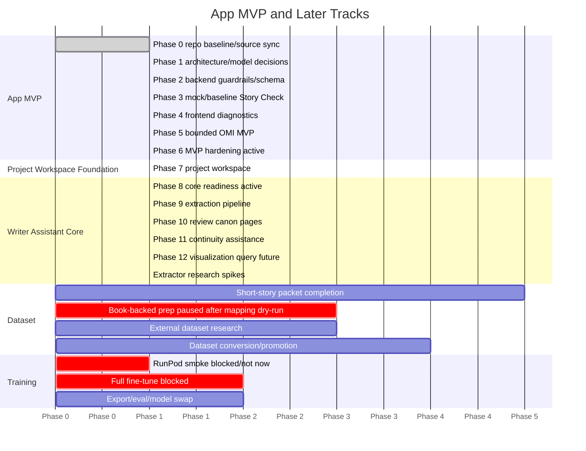

# Phase Map

## App MVP Track

### Phase 0: Repo Baseline and Source-of-Truth Sync

- Inputs: Git setup reports, safe baseline commit, current roadmap docs.
- Outputs: synced master plan/roadmap docs.
- Status: Git initialized/repaired on `main`; `origin` is `https://github.com/telesjr90/writingassistant`; safe metadata exists; first safe local baseline commit is `25ef64d chore: initialize safe project baseline`.
- Remaining exit: push safe baseline to GitHub and keep planning docs current.

### Phase 1: App Architecture Audit and Project Model Decisions

- Inputs: current FastAPI/React/Ollama app, NCP schema, sample project, OMI product boundary.
- Outputs: architecture audit report, source-of-truth cleanup, NCP/storyform MVP subset, project storage model, OMI MVP design schema, sample project alignment decision.
- Status note: App-1 architecture audit completed in `docs/roadmap/app_mvp_architecture_audit.md`.
- Status note: App-2 project file model completed in `docs/roadmap/project_file_model.md`.
- Status note: App-3 NCP compatibility subset completed in `docs/roadmap/ncp_compatibility_subset.md`.
- Status note: App-3a / OMI-001 schema and lifecycle completed in `docs/roadmap/omi_mvp_schema_lifecycle.md`.
- Status note: Owner-created sample project alignment spec completed in `docs/roadmap/sample_project_alignment_spec.md`.
- Status note: Local ignored `projects/example` fixture aligned from public-domain scene source; previous Elena/Ember Crown mismatch and owner-idea/source mix-up replaced, with unsupported MC/IC/RS/CIPS/dynamics left unresolved.
- Exit: core app gaps and project truth/candidate storage boundaries are documented.

### Phase 2: Backend Safety and Schema Foundation

- Inputs: Story Check schema, refusal schema, no-prose policy, analysis mode decision.
- Outputs: runtime no-prose guardrails, refusal response schema, Story Check normalizer, minimal-to-rich compatibility, insufficient-evidence handling, analysis mode config.
- Status note: GUARD-001 shared runtime no-prose guard completed in `backend/guardrails.py` with tests in `tests/test_guardrails.py`; integrated only into Story Check suggestion filtering where safe.
- Status note: GUARD-002 request-path policy completed; `backend/guardrails.py` now exposes freeform request helpers and field policy helpers, current routes are audited, and tests verify owner-authored scene/bible/storyform content is not blocked as request intent.
- Status note: GUARD-003 output policy completed for Story Check; `analysis_engine.py` applies `sanitize_story_check_output` after normalization, removing unsafe model-authored text from warnings, suggestions, reasons, concerns, and raw diagnostics while preserving evidence arrays.
- Status note: BE-002 Story Check normalizer completed in `backend/analysis_normalizer.py` with tests in `tests/test_analysis_normalizer.py`; `analysis_engine.py` now delegates model-output parsing and fallback behavior to the reusable normalizer.
- Status note: BE-001 analysis mode config completed in `backend/analysis_modes.py` and `.env.example`; missing/empty `ANALYSIS_MODE` defaults to `ollama_baseline`, `ANALYSIS_MODE=mock` selects deterministic fixtures, and invalid modes follow a stable error path.
- Status note: SC-001 rich Story Check prompt alignment completed in `backend/prompts/story_check.txt` with prompt checks in `tests/test_story_check_prompt.py`; route/UI compatibility remains future work.
- Status note: SC-002 minimal-to-rich compatibility checks completed with Story Check route tests in `tests/test_story_check_route.py`; FE-001 now renders rich Story Check diagnostics while preserving the compatibility cases, and frontend build validation passes.
- Exit: Story Check and OMI-relevant paths have clear no-prose and structured-output foundations before feature implementation expands; future non-Story Check model routes must reuse the guard pattern.

### Phase 3: Mock and Baseline Story Check

- Inputs: schema foundation, mock fixture requirements, Ollama baseline config.
- Outputs: mock analysis mode, Story Check route tests, Ollama baseline mode, qwen3 baseline verification, evaluation fixtures.
- Status note: App-7 mock Story Check mode completed with `backend/mock_responses/story_check.json` and tests covering schema compatibility, no Ollama calls, unresolved MC/IC/RS/CIPS/dynamics, route behavior, and no project-file mutation.
- Status note: App-8 verified locally as of 2026-06-01: `OLLAMA_BASE_URL` lets WSL reach Windows Ollama and `qwen3:8b`; the live Story Check smoke returned normalized, schema-valid rich Story Check JSON through the baseline path.
- Status note: App-12 app-level evaluation fixtures completed under `tests/fixtures/story_check/`; fixtures cover valid rich, minimal, malformed, refusal, insufficient-evidence, and unsafe-output guard behavior without creating training data.
- Status note: App-13 offline baseline harness completed in `training/scripts/run_story_check_baseline_eval.py`; it evaluates App-12 fixtures through the normalizer/output guard and reports JSON validity, schema compliance, refusal exactness, no-prose violations, insufficient-evidence preservation, output-guard behavior, and evidence preservation. Live Ollama evaluation is explicit opt-in only.
- Exit: Story Check works without fine-tuning in mock and qwen3 baseline modes.

### Phase 4: Frontend MVP Diagnostics

- Inputs: normalized Story Check response, mode metadata, editor state.
- Outputs: rich diagnostics sidebar, mock/baseline visibility, error and malformed-output display, scene editor dirty-state handling, empty scene behavior, owner-controlled bible/storyform editing.
- Status note: FE-001 rich Story Check diagnostics sidebar completed; `AnalysisSidebar.jsx` now renders coherence score, warnings, diagnostic suggestions, throughline alignment, theme drift, character consistency, insufficient evidence, compact diagnostics, and collapsible raw JSON while preserving minimal/fallback/error compatibility.
- Status note: App-4 scene editor hardening completed; the editor tracks dirty state against the last saved scene content, confirms before discarding unsaved edits on scene switch/unload, keeps user text after save failures, and supports loading/saving empty scenes.
- Status note: App-5 bible/storyform read/write completed; raw JSON routes and the Project Context UI support explicit owner saves, storyform validation before write, visible parse/save errors, and no automatic promotion from analysis output.
- Exit: UI displays bounded analysis clearly and does not expose prose-generation paths.

### Phase 5: OMI MVP Implementation

- Inputs: OMI schema/lifecycle design, project storage model, no-prose guardrails, schema foundation.
- Outputs: OMI storage design, candidate lifecycle, owner decision flow, destination handling, provenance/status display.
- Status note: OMI-002 storage design completed in `docs/roadmap/omi_storage_model.md`; it defines project-local OMI ideas, candidates, promotions, index records, status transitions, destinations, provenance, promotion gates, storage safety rules, guardrail implications, and future test categories without creating runtime OMI files.
- Status note: OMI-003 candidate creation flow completed; backend helpers and routes create/list/load owner-authored raw ideas and structured candidate records under project-local `omi/` storage, and the frontend OMI panel exposes create/list UI without model generation or promotion.
- Status note: OMI-004 owner decision and destination selection completed; backend helpers and routes update explicit owner decisions, status transitions, approval confirmation, notes, and candidate destinations without writing durable project truth, and the frontend OMI panel exposes review controls without a promotion action.
- Status note: OMI-005 promotion gate enforcement completed; backend helpers and routes create promotion audit records only when approval, confirmation, destination, provenance, source snapshot, structured candidate content, and safe target labels are present, and no route applies those records to durable project truth.
- Status note: OMI-006 fuller UI/status/provenance workflow completed; the OMI panel now surfaces raw idea metadata, selected candidate lifecycle details, owner decision state, status, destination, provenance rows, evidence summaries, promotion readiness requirements, blockers, and promotion records without any apply-promotion behavior.
- Status note: OMI-007 no-prose/no-silent-promotion tests completed; focused tests cover blocked prose destinations/types, owner-authored content overblocking, no silent durable truth mutation, record-only promotion creation, promotion blocker enforcement, UI boundary copy, no model path, owner sample isolation, and path traversal safety.
- Exit: OMI captures raw ideas and structured candidate planning material without writing story prose or mutating owner-approved truth automatically.

OMI must remain analysis-only, candidate-output-first, and owner-controlled. Promotion requires explicit owner approval, destination, provenance, and status. Suggested design statuses are `draft`, `candidate`, `owner_review`, `approved`, `rejected`, `promoted`, and `archived`. Suggested destinations are `planning_notes`, `project_bible_candidate`, `storyform_context_candidate`, `scene_prompt_context_candidate`, `template_starter_candidate`, and `discard`.

### Phase 6: MVP Hardening

- Inputs: working Story Check and bounded OMI MVP paths.
- Outputs: project navigation reliability, save/reload testing, app smoke tests, documentation cleanup, manual local run checklist, and completed MVP exit test matrix.
- Status note: `docs/roadmap/mvp_completion_test_matrix.md` defines the formal MVP exit gate across repo safety, backend tests, frontend build, Story Check modes, guardrails, context, OMI, evaluation harness, and manual acceptance.
- Status note: MVP exit preflight executed on 2026-06-05. Automated backend tests, focused groups, frontend build, offline baseline harness, mock Story Check smoke, guardrail checks, OMI boundary checks, and short server smokes passed; live qwen3 smoke was deferred by design.
- Status note: Phase 6 Step 1 refresh on 2026-06-06 found no dirty tracked `projects/example` fixture files. Tracked fixture files are clean in `HEAD`; ignored local `projects/example/omi/` artifacts remain local-only. Phase 6 remains active: record owner fixture-state acceptance and re-run/record the MVP exit matrix rather than starting JSONL conversion, RunPod smoke, or training.
- Status note: Phase 6 Step 2 refresh on 2026-06-06 passed in-process mock backend route smoke and source/boundary inspection, but true backend/frontend localhost server smokes are blocked in this sandbox by socket/listen restrictions. Browser-rendered checks remain owner-manual, and live qwen3/Ollama remains deferred by design.
- Exit: App MVP is locally usable and documented without depending on RunPod, book-backed workflow, fine-tuning, or optional extractors after the current committed fixture state is owner-accepted/documented and the remaining MVP exit checks are recorded.

## Project Workspace Foundation Track

This is the next product direction after owner acceptance of the Phase 6 MVP foundation. It shifts the roadmap from Dramatica-first analyzer work to a usable writing-project workspace before advanced analysis expands.

### Phase 7: Project Workspace Foundation

- Inputs: current project file model, OMI storage/lifecycle docs, no-prose guardrails, sample project alignment, MVP foundation.
- Outputs: project creation, project selector/library, OMI-guided project creation and idea capture, chapters/scenes/notes/materials organization, owner-authored prose editor, project overview, chapters/scenes pages, notes/materials pages, OMI ideas/candidates page, approved-memory/canon page structure, and the approved-only category pages (Characters, Locations/Settings, Objects/Items, Timeline, Plot Threads, Continuity/Consistency, Approved Contradictions, Approved Scene / Event / Causality Review, Open Questions, Relationships, Organizations/Groups, Annotations/Evidence/Provenance).
- Status: COMPLETE (published parent sequence). `PHASE7-IMPL-001` through `PHASE7-IMPL-010` are complete, covering safe project metadata creation, selector/library support, frontend project switching, chapter/scene metadata compatibility, notes/materials storage/routes/API/minimal shell, shared owner-authored scene/note/material editor behavior, the deterministic Project Overview shell, the frontend-transient OMI-guided staged creation shell, the read-only Memory / Canon shell with approved-only empty states, and workspace validation/browser smoke with automated regression pass plus PARTIAL browser/manual smoke due to environment tooling limits. `PHASE7-IMPL-010` validated the foundation without adding runtime feature scope; T005 found no product defect and no runtime repair; interactive UI browser validation remains deferred to owner/environment rerun when Playwright deps or browser MCP are available. `PHASE8-IMPL-001` and `PHASE8-IMPL-002` are complete as the first two Writer Assistant Core parents. Extractor logic, dataset files, training records, model calls, and package installs remain out of scope unless explicitly started by a later published task.
- Exit: owner can create/select a project, write and save owner-authored material, organize chapters/scenes/notes/materials, and see project-specific workspace pages without any AI prose-generation path.

Workspace layer order:

1. Owner-authored prose storage and editing.
2. AI-assisted analysis of owner-authored material.
3. Candidate extraction.
4. Owner approval.
5. Approved project memory/canon.
6. Future Dramatica-specific analysis.

## Writer Assistant Core Track

This follows the Project Workspace Foundation. It identifies, organizes, connects, annotates, and reviews story knowledge from owner-authored text. All outputs remain analysis-only, candidate-first, evidence/provenance-backed where practical, and owner-controlled through OMI.

### Phase 8: Writer Assistant Core MVP Runtime, Review, Promotion, Memory/Canon, and Analysis Integration

- Inputs: usable Project Workspace Foundation, current project file model, OMI storage/lifecycle docs, no-prose guardrails, sample project alignment, Writer Assistant Core product pivot.
- Outputs: story knowledge candidate schema alignment, evidence/provenance boundaries, raw artifact lifecycle, review queue and API surfaces, frontend owner-action execution, explicit apply-promotion, approved memory/canon mutation, real BookNLP/spaCy runtime extraction, model-assisted extraction, and analysis-only NCP/Subtxt/dramatica-flow runtime integration.
- Status: EIGHTEENTH PARENT ACTIVE (MVP-REQUIRED). `PHASE8-IMPL-001` through `PHASE8-IMPL-017` are complete. `PHASE8-IMPL-017 - Apply-promotion contract, audit log, and approved memory/canon mutation boundary` is complete through `PHASE8-IMPL-017-T007`. T001 published parent/inventory/enrichment/status alignment. T002 accepted `docs/roadmap/decisions/PHASE8-IMPL-017-apply-promotion-boundary-audit-model-decision.md` as docs/decision/status only. T003 added contract tests at `tests/test_writer_assistant_core_apply_promotion_contract.py`. T004 implemented `backend/story_knowledge/apply_promotion.py`, `backend/routes/apply_promotion.py`, route inclusion in `backend/main.py`, and `POST /api/projects/{project_id}/apply-promotion`; the apply-promotion contract is green. T005 implemented `submitApplyPromotion(projectId, payload)` in `frontend/src/api.js` and the frontend confirmation surface at `frontend/src/components/ApplyPromotionConfirmation.jsx`, with source tests at `tests/test_frontend_apply_promotion_workflow_source.py`. T006 added approved memory/canon mutation safety regression coverage at `tests/test_apply_promotion_memory_canon_safety_regression.py` plus minimal backend source marker hardening. T007 closed the parent as docs/status only. `PHASE8-IMPL-017` owns explicit owner-confirmed apply-promotion, audited promotion records, and approved memory/canon mutation only after explicit owner action. Apply-promotion must not automatically promote from confidence, queue status, model output, extraction, candidate persistence, or raw artifact presence. Candidate persistence is not canon; queue presence is not approval; confidence is not truth; raw artifacts are support data, not canon. Review queue actions do not mutate approved memory/canon. Frontend review commands remain separate from apply-promotion. Plan-building/validation performs no approved memory/canon mutation. Failed validation performs no partial mutation. Successful apply writes approved memory/canon plus applied audit record. T007 added no backend implementation code, frontend implementation code, product tests, package/dependency changes, raw artifact persistence, runtime extraction, BookNLP/spaCy install/run/import, model/Ollama calls, NCP/Subtxt/dramatica-flow runtime, generated prose, or training/JSONL/dataset/model artifacts. `PHASE8-IMPL-018 - Raw artifact persistence implementation and project-local extraction artifact lifecycle` is active, with `PHASE8-IMPL-018-T001` complete/PASS, `PHASE8-IMPL-018-T002` complete/PASS, `PHASE8-IMPL-018-T003` complete/PASS as expected-red contract handoff at `tests/test_writer_assistant_core_raw_artifacts_contract.py`, and `PHASE8-IMPL-018-T004` complete/PASS after adding the minimal backend helper at `backend/story_knowledge/raw_artifacts.py`. `PHASE8-IMPL-018-T005` is ready/active next. `PHASE8-IMPL-018-T002` accepted `docs/roadmap/decisions/PHASE8-IMPL-018-raw-artifact-persistence-boundary-manifest-model-decision.md` as docs/status decision only. `PHASE8-IMPL-018` owns raw artifact persistence lifecycle only: raw artifacts are project-local support data only, not canon, not approved memory, not candidates by themselves, and not training data; persistence is manifest-backed by `manifest.json` with `artifact_files`, `artifact_file_id`, `relative_path`, `sha256`, `bundle_hash`, `source_refs`, `evidence_refs`, `provenance_refs`, and `source_locator_refs`; persistence must be evidence/provenance-linked, path-safe, fail-closed, quarantine-aware, and separated from apply-promotion, approved memory/canon mutation, extraction execution, model calls, BookNLP/spaCy runtime, NCP/Subtxt/dramatica-flow runtime, and generated prose. Implemented contract APIs include `validate_raw_artifact_manifest`, `build_raw_artifact_manifest`, `validate_raw_artifact_file_ref`, `raw_artifact_bundle_storage_dir`, `raw_artifact_manifest_path`, `raw_artifact_index_path`, `write_raw_artifact_bundle`, `read_raw_artifact_manifest`, `read_raw_artifact_file`, `list_raw_artifact_bundles`, `rebuild_raw_artifact_index`, `quarantine_raw_artifact_bundle`, and `compute_raw_artifact_bundle_hash`. `PHASE8-IMPL-018-T006` through `PHASE8-IMPL-018-T007` remain planned. `PHASE8-IMPL-019` through `PHASE8-IMPL-022` remain future MVP-required parents for real BookNLP/spaCy install/run/import plus runtime extraction, model-assisted evidence-backed extraction, NCP/Subtxt/dramatica-flow analysis-only runtime integration, and end-to-end MVP usability validation. Fine-tuning remains outside the MVP critical path. Generated prose/prose-production paths remain permanently forbidden.
- Exit: usable/testable MVP with owner-authored prose storage/editing, runtime extraction over owner-authored or owner-provided text, raw artifact persistence, candidate review, frontend owner-action execution, apply-promotion, approved memory/canon mutation, model-assisted evidence-backed extraction, and analysis-only NCP/Subtxt/dramatica-flow integration. Generated prose, rewrite, continuation, imitation, polish, improvement, expansion, outline generation, chapter generation, write/revise flows, and prose-production paths remain permanently forbidden.

### Phase 9: Post-MVP Visualization and Query Assistance

- Inputs: approved memory/canon records, reliable review UI, stable evidence/provenance, and the completed Phase 8 MVP-required runtime.
- Outputs: optional graph, timeline, map, relationship, and project-memory query views.
- Status: PLANNED/FUTURE after MVP.
- Exit: visuals help navigation and review without implying pending candidates are approved truth.

Future internal flow:

```text
owner-authored scene/chapter/note text
  -> stable source maps / Evidence Ledger
  -> mocked BookNLP adapter contract implementation completed in PHASE8-IMPL-007
  -> BookNLP-ready or simple local baseline adapters after contracts exist
  -> normalized CORE candidate schemas
  -> evidence/provenance attachment
  -> OMI candidate records
  -> owner review
  -> promotion record
  -> future apply-promotion
  -> memory/*.json canon records
```

### Later Phase: Fine-Tuning / Dramatica Analyst Model

- Inputs: resumed evidence extraction, validated review JSONL, promoted records, ready manifest, GPU/cloud plan.
- Outputs: evaluated `dramatica-analyst` model candidate.
- Status: BLOCKED/PAUSED. Dataset gate remains blocked and fine-tuning prep is paused.
- Exit: non-smoke model passes evaluation before any app default swap.

### Phase 8 MVP-Required Extraction Runtime Notes

- Inputs: owner scene/project context, OMI candidate workflow, no-prose guardrails, extractor license review.
- Outputs: candidate entity/action/relationship/timeline extraction pipeline with real BookNLP/spaCy runtime, raw refs, evidence/provenance, owner review, and candidate-only persistence.
- Status note: `docs/roadmap/optional_analysis_extractors.md` and `docs/roadmap/decisions/PHASE8-IMPL-005-nlp-extraction-adapter-strategy-decision.md` predate this MVP scope revision where they describe extractors as optional or later. The current roadmap reclassifies real BookNLP/spaCy install/run/import and runtime extraction as MVP-required through `PHASE8-IMPL-019`. Other extraction references remain replaceable adapters around the app-owned pipeline. Generation-heavy tools remain blocked or documentation-only.
- Exit: any extractor output remains candidate-only, routes through OMI, preserves provenance, and cannot directly mutate durable project truth, OMI promotions, training data, or `dataset_manifest.json`.

## Dataset and Training Tracks

These tracks are outside the App MVP critical path.

## Phase C: Short-Story Packet Completion

- Inputs: packets 003-020, reports, owner decisions.
- Outputs: review candidates and promoted records where approved.
- Exit: manifest moves toward task mix and 500 eligible records.

## Phase D: Book-Backed Cross-Book Review

- Inputs: Books 1-3 completed workflow artifacts from WSL-mounted folders.
- Outputs: coverage matrix, owner decision extraction, owner-answer implementation, and review JSONL mapping dry-run.
- Status: PAUSED after Book 1-3 mapping dry-run. Dataset gate audit, coverage matrix, owner decision extraction worksheet, owner answers implementation, and mapping dry-run are complete as local prep artifacts. Next step when resumed is P0 evidence extraction/verification, not JSONL drafting or training.
- Exit: excerpt-backed candidate evidence triaged for SFT review candidates after evidence extraction/verification.

## Phase E: External Dataset Research

- Inputs: external dataset reports and registry.
- Outputs: licensed/provenance-reviewed candidates for allowed auxiliary tasks.
- Exit: no external dataset supplies positive Dramatica truth without review.

## Phase F: Dataset Conversion and Promotion

- Inputs: approved packets, book-backed evidence, external candidates.
- Outputs: review JSONL, promoted JSONL, manifest updates.
- Status: BLOCKED/PAUSED. No review JSONL should be created while fine-tuning prep is paused, and evidence extraction is still required before any Book 1-3 review JSONL drafting.
- Exit: 500+ eligible records, target task mix, no unresolved-source train records.

## Phase G: RunPod Smoke

- Inputs: configs, synced repo, environment.
- Outputs: smoke-only training report/artifact.
- Status: BLOCKED/NOT NOW while dataset gate remains blocked and fine-tuning prep is paused.
- Exit: environment validated; smoke artifact explicitly blocked from production.

## Phase H: Full Fine-Tune

- Inputs: ready manifest and RunPod GPU.
- Outputs: QLoRA adapter/checkpoints.
- Status: BLOCKED by dataset gate and paused fine-tuning prep.
- Exit: non-smoke training complete.

## Phase I: Export, Eval, Model Swap

- Inputs: trained adapter, eval harness.
- Outputs: GGUF q4_k_m/q8_0, Ollama import, eval report, rollback plan.
- Exit: `dramatica-analyst:8b` becomes app default only after gates pass.

## Mermaid Gantt


```mermaid
gantt
    title App MVP and Later Tracks
    dateFormat  X
    axisFormat  Phase %s
    section App MVP
    Phase 0 repo baseline/source sync :done, p0, 0, 1
    Phase 1 architecture/model decisions :p1, after p0, 1
    Phase 2 backend guardrails/schema :p2, after p1, 1
    Phase 3 mock/baseline Story Check :p3, after p2, 1
    Phase 4 frontend diagnostics :p4, after p3, 1
    Phase 5 bounded OMI MVP :p5, after p4, 1
    Phase 6 MVP hardening active :active, p6, after p5, 1
    section Project Workspace Foundation
    Phase 7 project workspace :workspace7, after p6, 1
    section Writer Assistant Core
    Phase 8 core readiness active :active, core8, after workspace7, 1
    Phase 9 extraction pipeline :core9, after core8, 1
    Phase 10 review canon pages :core10, after core9, 1
    Phase 11 continuity assistance :core11, after core10, 1
    Phase 12 visualization query future :core12, after core11, 1
    Extractor research spikes :extractors, after core8, 1
    section Dataset
    Short-story packet completion :packets, 1, 5
    Book-backed prep paused after mapping dry-run :crit, books, 2, 3
    External dataset research :external, 2, 3
    Dataset conversion/promotion :promotion, 4, 4
    section Training
    RunPod smoke blocked/not now :crit, smoke, 7, 1
    Full fine-tune blocked :crit, train, 8, 2
    Export/eval/model swap :deploy, 10, 2
```
